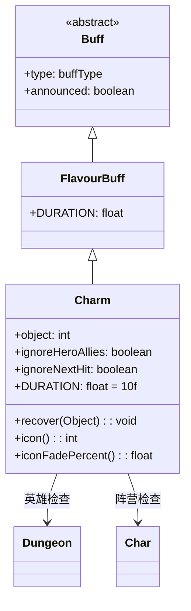

# Charm 类文档

## 1. 基本信息
| 属性 | 值 |
|------|-----|
| 文件路径 | core/src/main/java/com/shatteredpixel/shatteredpixeldungeon/actors/buffs/Charm.java |
| 包名 | com.shatteredpixel.shatteredpixeldungeon.actors.buffs |
| 类类型 | class |
| 继承关系 | extends FlavourBuff |
| 代码行数 | 86 |

## 2. 类职责说明
Charm（魅惑）是一个负面Buff，使受影响的角色被魅惑，无法攻击魅惑源目标。当受到魅惑源或其盟友攻击时，Buff持续时间会减少。主要用于魅魔攻击、魅惑药剂等场景。

## 4. 继承与协作关系


## 静态常量表
| 常量名 | 类型 | 值 | 说明 |
|--------|------|-----|------|
| DURATION | float | 10f | 默认持续时间（回合数） |
| OBJECT | String | "object" | Bundle存储键 - 魅惑源位置 |
| IGNORE_ALLIES | String | "ignore_allies" | Bundle存储键 - 忽略盟友标志 |

## 实例字段表
| 字段名 | 类型 | 修饰符 | 说明 |
|--------|------|--------|------|
| object | int | public | 魅惑源目标的位置 |
| ignoreHeroAllies | boolean | public | 是否忽略英雄盟友的攻击 |
| ignoreNextHit | boolean | public | 是否忽略下一次攻击 |
| type | buffType | - | 继承自Buff，设置为NEGATIVE（负面Buff） |
| announced | boolean | - | 继承自Buff，设置为true（会公告） |

## 7. 方法详解

### recover(Object src)
**签名**: `public void recover(Object src)`
**功能**: 处理受到攻击时的恢复逻辑，减少Buff持续时间。
**参数**:
- src: Object - 攻击来源
**返回值**: void
**实现逻辑**:
```java
// 如果设置了忽略英雄盟友且来源是盟友（非英雄）
if (ignoreHeroAllies && src instanceof Char) {
    if (src != Dungeon.hero && ((Char) src).alignment == Char.Alignment.ALLY) {
        return;  // 不减少持续时间
    }
}

// 如果标记忽略下一次攻击
if (ignoreNextHit) {
    ignoreNextHit = false;
    return;  // 不减少持续时间
}

// 减少5回合持续时间
spend(-5f);
if (cooldown() <= 0) {
    detach();  // 持续时间耗尽则移除
}
```

### icon()
**签名**: `public int icon()`
**功能**: 返回Buff图标的索引标识符。
**返回值**: int - 返回BuffIndicator.HEART（心形图标）。

### iconFadePercent()
**签名**: `public float iconFadePercent()`
**功能**: 计算Buff图标的淡出百分比，用于显示剩余时间。
**返回值**: float - 返回一个0到1之间的值，表示图标应显示的完整度。

## 11. 使用示例
```java
// 对敌人施加魅惑效果，记录魅惑源位置
Charm charm = Buff.affect(enemy, Charm.class, Charm.DURATION);
charm.object = hero.pos;

// 敌人被英雄攻击时，减少魅惑时间
if (enemy.buff(Charm.class) != null) {
    enemy.buff(Charm.class).recover(hero);
}

// 设置忽略英雄盟友的攻击
charm.ignoreHeroAllies = true;

// 忽略下一次攻击（用于特定技能）
charm.ignoreNextHit = true;
```

## 注意事项
1. object字段存储魅惑源的位置，用于判断攻击来源
2. 受到魅惑源攻击会减少5回合持续时间
3. ignoreHeroAllies可以设置英雄盟友攻击不减少时间
4. ignoreNextHit可以忽略下一次攻击的恢复效果
5. 是负面Buff，会被净化效果移除

## 最佳实践
1. 使用object字段记录魅惑源位置
2. 设置ignoreHeroAllies实现特定机制（如魅惑药剂对英雄）
3. 使用ignoreNextHit实现特殊技能效果
4. 注意魅惑时间会因受攻击而减少