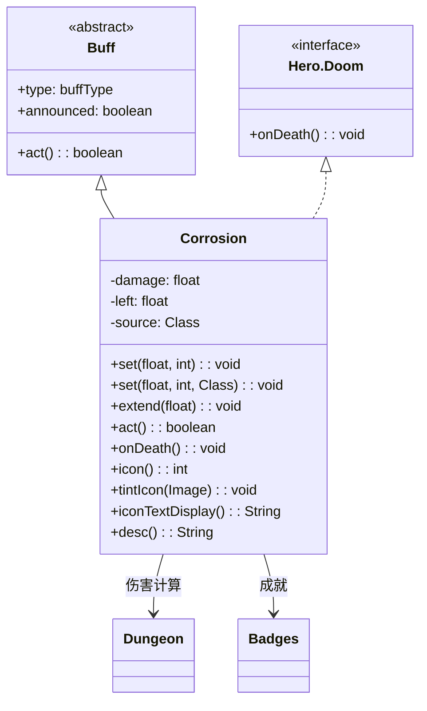

# Corrosion 类文档

## 1. 基本信息
| 属性 | 值 |
|------|-----|
| 文件路径 | core/src/main/java/com/shatteredpixel/shatteredpixeldungeon/actors/buffs/Corrosion.java |
| 包名 | com.shatteredpixel.shatteredpixeldungeon.actors.buffs |
| 类类型 | class |
| 继承关系 | extends Buff implements Hero.Doom |
| 代码行数 | 132 |

## 2. 类职责说明
Corrosion（腐蚀）是一个负面Buff，使受影响的角色受到持续腐蚀伤害。伤害值会随时间递增，每回合增加1点（达到上限后增加0.5点）。实现了Hero.Doom接口处理英雄死亡逻辑。主要用于腐蚀法杖、腐蚀陷阱等场景。

## 4. 继承与协作关系


## 静态常量表
| 常量名 | 类型 | 值 | 说明 |
|--------|------|-----|------|
| DAMAGE | String | "damage" | Bundle存储键 - 伤害值 |
| LEFT | String | "left" | Bundle存储键 - 剩余时间 |
| SOURCE | String | "source" | Bundle存储键 - 伤害来源 |

## 实例字段表
| 字段名 | 类型 | 修饰符 | 说明 |
|--------|------|--------|------|
| damage | float | private | 当前伤害值 |
| left | float | protected | 剩余持续时间 |
| source | Class | private | 伤害来源类 |
| type | buffType | - | NEGATIVE（负面Buff） |
| announced | boolean | - | true（会公告） |

## 7. 方法详解

### set(float duration, int damage)
**签名**: `public void set(float duration, int damage)`
**功能**: 设置腐蚀参数（无来源）。
**参数**:
- duration: float - 持续时间
- damage: int - 初始伤害值
**实现逻辑**:
```java
set(duration, damage, null);  // 调用完整版本
```

### set(float duration, int damage, Class source)
**签名**: `public void set(float duration, int damage, Class source)`
**功能**: 设置腐蚀参数和来源。
**参数**:
- duration: float - 持续时间
- damage: int - 初始伤害值
- source: Class - 伤害来源类
**实现逻辑**:
```java
this.left = Math.max(duration, left);    // 取较长的持续时间
if (this.damage < damage) this.damage = damage;  // 只在更高时更新伤害
this.source = source;
```

### extend(float duration)
**签名**: `public void extend(float duration)`
**功能**: 延长持续时间。
**参数**:
- duration: float - 要延长的回合数
**实现逻辑**:
```java
left += duration;  // 直接增加时间
```

### act()
**签名**: `public boolean act()`
**功能**: 每回合造成腐蚀伤害并增加伤害值。
**返回值**: boolean - 返回true表示成功执行。
**实现逻辑**:
```java
if (target.isAlive()) {
    target.damage((int)damage, this);  // 造成当前伤害
    
    // 伤害递增逻辑
    if (damage < (Dungeon.scalingDepth()/2)+2) {
        damage++;       // 低于上限时增加1
    } else {
        damage += 0.5f; // 达到上限后增加0.5
    }
    
    spend(TICK);
    if ((left -= TICK) <= 0) {  // 减少剩余时间
        detach();               // 时间耗尽则移除
    }
} else {
    detach();  // 目标死亡时移除
}
return true;
```

### onDeath()
**签名**: `public void onDeath()`
**功能**: Hero.Doom接口方法，处理英雄死亡逻辑。
**实现逻辑**:
```java
if (source == WandOfCorrosion.class) {
    Badges.validateDeathFromFriendlyMagic();  // 验证成就
}
Dungeon.fail(this);  // 记录死亡原因
GLog.n(Messages.get(this, "ondeath"));  // 显示死亡消息
```

### icon()
**签名**: `public int icon()`
**功能**: 返回Buff图标的索引标识符。
**返回值**: int - 返回BuffIndicator.POISON（毒药图标）。

### tintIcon(Image icon)
**签名**: `public void tintIcon(Image icon)`
**功能**: 为Buff图标设置颜色色调。
**参数**:
- icon: Image - 需要着色的图标图像
**实现逻辑**:
```java
icon.hardlight(1f, 0.5f, 0f);  // 设置橙色高光效果
```

### iconTextDisplay()
**签名**: `public String iconTextDisplay()`
**功能**: 返回图标上显示的文本（当前伤害值）。
**返回值**: String - 当前伤害值的字符串表示。

### desc()
**签名**: `public String desc()`
**功能**: 返回Buff的详细描述文本。
**返回值**: String - 包含剩余时间和伤害值的描述。

## 11. 使用示例
```java
// 添加腐蚀效果，持续10回合，初始伤害3
Corrosion corrosion = Buff.affect(enemy, Corrosion.class);
corrosion.set(10f, 3);

// 添加腐蚀效果并记录来源
corrosion.set(10f, 3, WandOfCorrosion.class);

// 延长腐蚀时间
if (enemy.buff(Corrosion.class) != null) {
    enemy.buff(Corrosion.class).extend(5f);
}
```

## 注意事项
1. 腐蚀伤害会随时间递增，越来越危险
2. 伤害上限与楼层深度相关：scalingDepth()/2 + 2
3. 达到上限后伤害仍会增加，但速度减半
4. 实现了Hero.Doom接口，会正确处理英雄死亡
5. 是负面Buff，会被净化效果移除

## 最佳实践
1. 使用set()设置初始参数
2. 注意伤害递增特性，尽快移除或治疗
3. 配合腐蚀法杖使用效果更佳
4. 高楼层时伤害上限更高