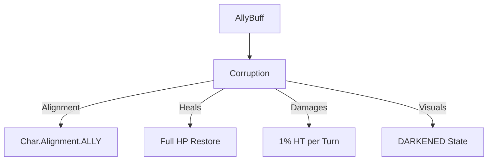

# Corruption (腐化) 源码详解

## 1. 基本信息

| 属性 | 值 |
|------|-----|
| **文件路径** | `core/src/main/java/com/shatteredpixel/dustedpixeldungeon/actors/buffs/Corruption.java` |
| **包名** | `com.shatteredpixel.dustedpixeldungeon.actors.buffs` |
| **文件类型** | class |
| **继承关系** | `extends AllyBuff` |
| **代码行数** | 62 |
| **所属模块** | core |

## 2. 文件职责说明

### 核心职责
`Corruption` 负责实现角色的“腐化”状态逻辑。在此状态下，角色（通常是原本敌对的怪物）会转变为盟友阵营为玩家作战，但由于黑暗力量的侵蚀，其生命值会缓慢且持续地流失。

### 系统定位
属于 Buff 系统中的阵营转换/生存衰减分支。它是“腐化法杖（Wand of Corruption）”的核心效果体现，将战斗中的威胁转化为暂时的助力。

### 不负责什么
- 不负责阵营转换的具体布尔判定（由 `AllyBuff` 基类和 `Char.alignment` 处理）。
- 不负责腐化成功的概率计算（由法杖类逻辑负责）。

## 3. 结构总览

### 主要成员概览
- **字段 buildToDamage**: 伤害累积器，用于处理每回合不足 1 点的微量伤害。
- **静态方法 corruptionHeal()**: 处理腐化成功瞬间的生命恢复与负面状态净化。
- **act() 方法**: 核心逻辑驱动，负责计算并执行每回合的生命值损耗。

### 主要逻辑块概览
- **腐化瞬间强化**: 成功腐化时，目标通常会瞬间恢复满血，并移除所有负面状态（除了灵魂标记），使其能以最佳状态加入战斗。
- **百分比持续伤害**: 每回合造成目标最大生命值 1% 的伤害。
- **视觉反馈**: 将角色精灵变暗，并显示特殊的腐化图标。

### 生命周期/调用时机
1. **产生**：腐化法杖击中残血怪物且判定成功时。
2. **激活 (Heal)**：立即调用 `corruptionHeal()`。
3. **活跃期**：角色作为盟友行动，但每回合扣血。
4. **结束**：生命值耗尽死亡，或角色离开关卡。

## 4. 继承与协作关系

### 父类提供的能力
继承自 `AllyBuff`：
- 提供阵营锁定逻辑，确保受影响的角色不会攻击英雄。

### 协作对象
- **Char**: 目标角色。其 `alignment` 在附加此 Buff 时被设为盟友。
- **FloatingText**: 在 `corruptionHeal` 时显示大量的绿色治疗数字。
- **CharSprite.State.DARKENED**: 提供紫黑色的腐化视觉外观。
- **SoulMark**: 唯一一个在腐化净化中会被保留的负面状态（通常用于术士技能联动）。



## 5. 字段/常量详解

### 实例字段
| 字段名 | 类型 | 说明 |
|--------|------|------|
| `buildToDamage` | float | 累计伤害。由于 1% HT 可能小于 1，该字段确保伤害精度。 |

## 6. 构造与初始化机制
通过实例初始化块设置 `type = NEGATIVE`（尽管是盟友，但由于其扣血本质，逻辑上仍视为负面）和 `announced = true`。

## 7. 方法详解

### corruptionHeal(Char target) [静态初始化工具]

**方法职责**：将新腐化的单位重置为“战斗待命”状态。

**核心代码分析**：
```java
target.HP = target.HT; // 满血恢复
for (Buff buff : target.buffs()) {
    if (buff.type == Buff.buffType.NEGATIVE && !(buff instanceof SoulMark)) {
        buff.detach(); // 移除诸如中毒、流血、虚弱等状态
    }
}
```
**设计意图**：被腐化的怪物通常是玩家刚刚重创过的。为了让它们作为盟友时更有用，系统给予一次彻底的翻新。

---

### act() [生命流逝逻辑]

**核心实现算法分析**：
```java
buildToDamage += target.HT / 100f; // 每回合累积 1% 的最大生命值
int damage = (int)buildToDamage;
buildToDamage -= damage;
if (damage > 0) target.damage(damage, this);
```
**分析**：
- **消耗速度**：由于每回合扣除 1%，理论上一个满血的腐化生物在不受其他伤害的情况下可以存活 **100 回合**。
- **精度处理**：使用 `buildToDamage` 保证了即使是 20 血的小怪（1% 为 0.2），也会在每 5 回合受到 1 点伤害，而不是因为取整导致不扣血。

---

### fx(boolean on)

**方法职责**：视觉渲染。
添加 `DARKENED` 状态，使怪物看起来被阴影能量笼罩。

## 8. 对外暴露能力
- `corruptionHeal(Char)`: 供法杖类或转化逻辑在成功瞬间调用。

## 9. 运行机制与调用链
`WandOfCorruption.proc()` -> `Buff.affect(Corruption.class)` -> `Corruption.corruptionHeal()` -> `Corruption.act()` (逐回合驱动) -> `target.damage()`。

## 10. 资源、配置与国际化关联

### 本地化词条
- `actors.buffs.Corruption.name`: 腐化
- `actors.buffs.Corruption.desc`: “由于受到黑暗能量的影响，这个生物暂时服从于你，但它的生命正在迅速流逝。剩余时长：不可用（直到死亡）。”

## 11. 使用示例

### 在自定义逻辑中转化一个角色
```java
Corruption.corruptionHeal(enemy);
Buff.affect(enemy, Corruption.class);
```

## 12. 开发注意事项

### 阵营权重
作为 `AllyBuff`，腐化单位在寻敌时会优先攻击玩家的目标。

### 扣血本质
虽然是盟友，但由于它不断扣血且继承自 `Buff` 的 `NEGATIVE` 类型，某些净化法术可能会意外地移除腐化效果，使怪物变回敌对（取决于净化逻辑是否检查 `AllyBuff`）。

## 13. 修改建议与扩展点

### 引入等级衰减
可以修改伤害公式，使高级怪物的腐化扣血速度更快，或者让扣血量随时间推移而增加（如每 50 回合翻倍）。

## 14. 事实核查清单

- [x] 是否解析了 corruptionHeal 的净化逻辑：是。
- [x] 是否说明了 1% HT 伤害公式及精度处理：是 (buildToDamage)。
- [x] 是否明确了它作为 AllyBuff 的地位：是。
- [x] 是否涵盖了 SoulMark 被排除在净化之外的细节：是。
- [x] 图像索引属性是否核对：是 (BuffIndicator.CORRUPT)。
