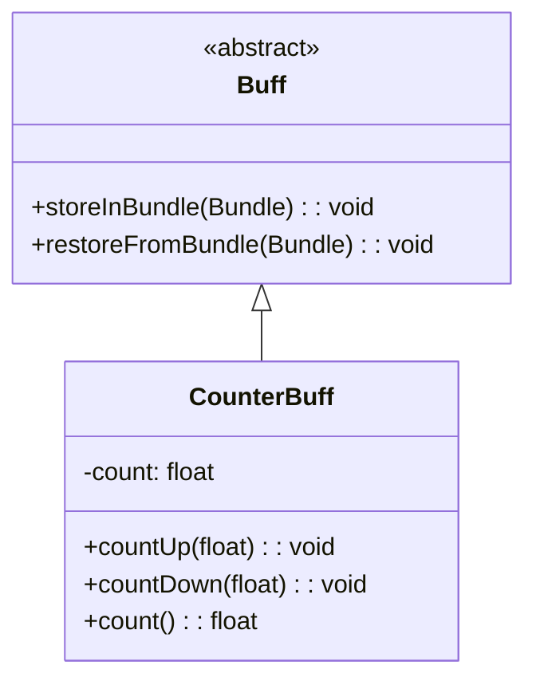

# CounterBuff 类文档

## 1. 基本信息
| 属性 | 值 |
|------|-----|
| 文件路径 | core/src/main/java/com/shatteredpixel/shatteredpixeldungeon/actors/buffs/CounterBuff.java |
| 包名 | com.shatteredpixel.shatteredpixeldungeon.actors.buffs |
| 类类型 | class |
| 继承关系 | extends Buff |
| 代码行数 | 56 |

## 2. 类职责说明
CounterBuff（计数器Buff）是一个简单的Buff基类，唯一目的是追踪某种计数。不包含任何游戏逻辑，只提供计数功能的存取和序列化。主要用于需要计数的Buff作为基类使用。

## 4. 继承与协作关系


## 静态常量表
| 常量名 | 类型 | 值 | 说明 |
|--------|------|-----|------|
| COUNT | String | "count" | Bundle存储键 - 计数值 |

## 实例字段表
| 字段名 | 类型 | 修饰符 | 说明 |
|--------|------|--------|------|
| count | float | private | 当前计数值 |

## 7. 方法详解

### countUp(float inc)
**签名**: `public void countUp(float inc)`
**功能**: 增加计数。
**参数**:
- inc: float - 要增加的值
**实现逻辑**:
```java
count += inc;  // 直接增加计数
```

### countDown(float inc)
**签名**: `public void countDown(float inc)`
**功能**: 减少计数。
**参数**:
- inc: float - 要减少的值
**实现逻辑**:
```java
count -= inc;  // 直接减少计数
```

### count()
**签名**: `public float count()`
**功能**: 获取当前计数值。
**返回值**: float - 当前计数值。

### storeInBundle(Bundle bundle)
**签名**: `public void storeInBundle(Bundle bundle)`
**功能**: 将计数保存到Bundle中。
**参数**:
- bundle: Bundle - 存储数据的Bundle对象
**实现逻辑**:
```java
super.storeInBundle(bundle);
bundle.put(COUNT, count);  // 保存计数值
```

### restoreFromBundle(Bundle bundle)
**签名**: `public void restoreFromBundle(Bundle bundle)`
**功能**: 从Bundle恢复计数。
**参数**:
- bundle: Bundle - 包含存储数据的Bundle对象
**实现逻辑**:
```java
super.restoreFromBundle(bundle);
count = bundle.getFloat(COUNT);  // 恢复计数值
```

## 11. 使用示例
```java
// 创建自定义计数器Buff
public class MyCounter extends CounterBuff {
    public void doSomething() {
        countUp(1);  // 增加计数
        if (count() >= 10) {
            // 达到10次后执行操作
            detach();
        }
    }
}

// 使用计数器
MyCounter counter = Buff.affect(hero, MyCounter.class);
counter.countUp(5);
float current = counter.count();  // 5.0
```

## 注意事项
1. 这是一个简单的工具类，不包含游戏逻辑
2. 计数值是float类型，可以存储小数
3. 没有图标显示，需要子类实现
4. 没有act()方法，不会自动执行

## 最佳实践
1. 作为需要计数功能的Buff的基类
2. 子类应该实现具体的游戏逻辑
3. 使用count()获取值，而不是直接访问字段