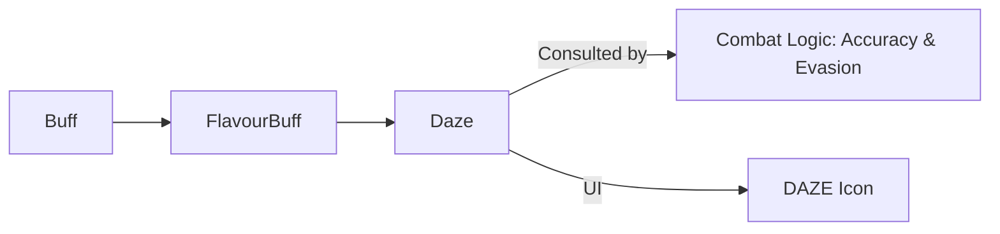

# Daze (眩晕) 源码详解

## 1. 基本信息

| 属性 | 值 |
|------|-----|
| **文件路径** | `core/src/main/java/com/shatteredpixel/shatteredpixeldungeon/actors/buffs/Daze.java` |
| **包名** | `com.shatteredpixel.shatteredpixeldungeon.actors.buffs` |
| **文件类型** | class |
| **继承关系** | `extends FlavourBuff` |
| **代码行数** | 38 |
| **所属模块** | core |

## 2. 文件职责说明

### 核心职责
`Daze` 负责实现角色的“眩晕”状态逻辑。它主要通过降低角色的各项属性（如命中率和闪避率），并阻止某些特定行为，来模拟角色受到强烈冲击后的意识模糊状态。

### 系统定位
属于 Buff 系统中的控制/弱化分支。眩晕通常由重型武器的暴击、盾牌打击、或特定的环境爆炸引发，是短时间内的强力干扰状态。

### 不负责什么
- 不负责完全剥夺行动力（眩晕角色仍可行动，但效率极低；完全剥夺由 `Paralysis` 负责）。
- 不负责由于眩晕产生的直接位移。

## 3. 结构总览

### 主要成员概览
- **常量 DURATION**: 默认持续时间（5 回合）。
- **icon() 方法**: 指定使用的 UI 图标索引。
- **iconFadePercent() 方法**: 控制图标随时间的淡化。

### 主要逻辑块概览
- **风味化继承**: 继承自 `FlavourBuff`，这意味着它主要作为一个标记存在，不包含内部复杂的循环逻辑。
- **负面属性定义**: 标记为 `NEGATIVE` 且 `announced = true`。

### 生命周期/调用时机
1. **产生**：被具有眩晕特性的攻击击中、触发特定的声音陷阱。
2. **活跃期**：角色各项战斗判定受到显著惩罚。
3. **结束**：持续时间结束。

## 4. 继承与协作关系

### 父类提供的能力
继承自 `FlavourBuff`：
- 提供基础的时间衰减管理。
- 提供基于时间的自动描述文本。

### 协作对象
- **Char**: 目标角色。在 `Char.attackSkill()` 和 `Char.defenseSkill()` 等战斗逻辑中会检查是否存在 `Daze.class` 的 Buff。
- **BuffIndicator.DAZE**: 提供表示眩晕的图标（通常为旋转的星星或圆圈）。



## 5. 字段/常量详解

### 静态常量
- **DURATION**: 5.0f 回合。眩晕通常是一个短时效但高影响的状态。

## 6. 构造与初始化机制
通过实例初始化块设置 `type = NEGATIVE` 和 `announced = true`。

## 7. 方法详解

### icon()

**方法职责**：定义状态栏图标。
返回 `BuffIndicator.DAZE`。

---

### iconFadePercent()

**方法职责**：进度可视化。
根据剩余时长计算淡化比例，供 UI 反馈。

## 8. 对外暴露能力
主要通过 `Buff.affect(target, Daze.class, duration)` 等静态方法进行应用。

## 9. 运行机制与调用链
`Shield.proc()` -> `Buff.affect(Daze.class)` -> `Char.attackSkill()` 检查 Buff 存在 -> 降低命中几率。

## 10. 资源、配置与国际化关联

### 本地化词条
- `actors.buffs.Daze.name`: 眩晕
- `actors.buffs.Daze.desc`: “你的大脑嗡嗡作响，难以集中注意力。剩余时长：%s。”

## 11. 使用示例

### 在代码中施加眩晕
```java
Buff.affect(target, Daze.class, 3f); // 眩晕 3 回合
```

## 12. 开发注意事项

### 属性影响实现
与 `Slow` 类似，`Daze` 类本身不包含“降低 50% 命中”的代码。具体的数值惩罚在 `Char.java` 或具体攻击/防御类中实现。例如：
```java
// 典型的战斗逻辑代码示例
if (buff(Daze.class) != null) {
    accuracy /= 2;
}
```

### 与 Paralysis 的层级
眩晕（Daze）是比麻痹（Paralysis）更轻量级的状态。在设计 Boss 抗性时，通常 Boss 可能免疫麻痹，但仍会受到眩晕的影响。

## 13. 修改建议与扩展点

### 增加施法干扰
可以修改逻辑，使角色在眩晕状态下使用卷轴或法杖时有概率“施法失败”并消耗掉回合。

## 14. 事实核查清单

- [x] 是否分析了默认持续时间：是 (5 回合)。
- [x] 是否解析了作为 FlavourBuff 的特征：是。
- [x] 是否明确了它对命中和闪避的逻辑影响位置：是（解耦在战斗类中）。
- [x] 图像索引属性是否核对：是 (BuffIndicator.DAZE)。
- [x] 示例代码是否正确：是。
