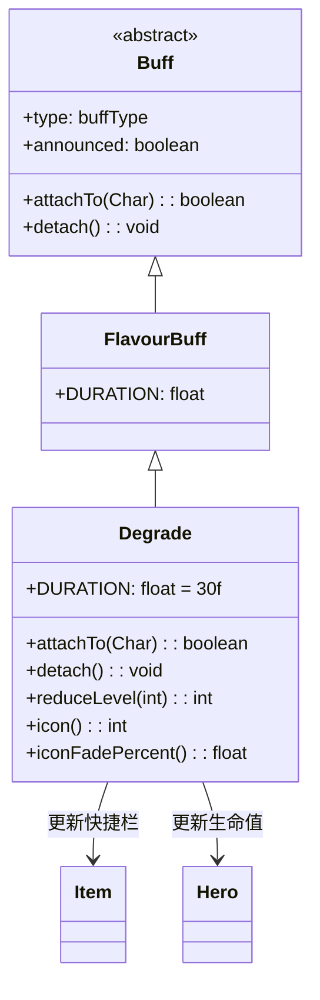

# Degrade 类文档

## 1. 基本信息
| 属性 | 值 |
|------|-----|
| 文件路径 | core/src/main/java/com/shatteredpixel/shatteredpixeldungeon/actors/buffs/Degrade.java |
| 包名 | com.shatteredpixel.shatteredpixeldungeon.actors.buffs |
| 类类型 | class |
| 继承关系 | extends FlavourBuff |
| 代码行数 | 80 |

## 2. 类职责说明
Degrade（降级）是一个负面Buff，使受影响的角色的装备等级暂时降低。使用特殊的降级公式计算新等级，影响武器伤害、护甲防御等。添加和移除时都会更新英雄状态和快捷栏。主要用于诅咒效果、特定敌人攻击等场景。

## 4. 继承与协作关系


## 静态常量表
| 常量名 | 类型 | 值 | 说明 |
|--------|------|-----|------|
| DURATION | float | 30f | 默认持续时间（回合数） |

## 实例字段表
| 字段名 | 类型 | 修饰符 | 说明 |
|--------|------|--------|------|
| type | buffType | - | NEGATIVE（负面Buff） |
| announced | boolean | - | true（会公告） |

## 7. 方法详解

### attachTo(Char target)
**签名**: `public boolean attachTo(Char target)`
**功能**: 重写附加方法，添加时更新英雄状态。
**参数**:
- target: Char - 目标角色
**返回值**: boolean - 是否成功附加。
**实现逻辑**:
```java
if (super.attachTo(target)) {
    Item.updateQuickslot();            // 更新快捷栏
    if (target == Dungeon.hero) {
        ((Hero) target).updateHT(false);  // 更新英雄生命值上限
    }
    return true;
}
return false;
```

### detach()
**签名**: `public void detach()`
**功能**: 重写移除方法，移除时更新英雄状态。
**实现逻辑**:
```java
super.detach();
if (target == Dungeon.hero) {
    ((Hero) target).updateHT(false);  // 更新英雄生命值上限
}
Item.updateQuickslot();               // 更新快捷栏
```

### reduceLevel(int level)
**签名**: `public static int reduceLevel(int level)`
**功能**: 静态方法，计算降级后的装备等级。
**参数**:
- level: int - 原始等级
**返回值**: int - 降级后的等级。
**实现逻辑**:
```java
if (level <= 0) {
    // 0或负等级不受影响
    return level;
} else {
    // 使用公式：round(sqrt(2*(lvl-1)) + 1)
    // 等级 1/2/3/4/5/6/7/8/9/10/11/12/...
    // 变为: 1/2/3/3/4/4/4/5/5/ 5/ 5/ 6/...
    // 从3级开始，每个等级比前一个多持续1级
    return (int)Math.round(Math.sqrt(2*(level-1)) + 1);
}
```

### icon()
**签名**: `public int icon()`
**功能**: 返回Buff图标的索引标识符。
**返回值**: int - 返回BuffIndicator.DEGRADE（降级图标）。

### iconFadePercent()
**签名**: `public float iconFadePercent()`
**功能**: 计算Buff图标的淡出百分比，用于显示剩余时间。
**返回值**: float - 返回一个0到1之间的值，表示图标应显示的完整度。
**实现逻辑**:
```java
return (DURATION - visualcooldown()) / DURATION;
// 注意：没有使用Math.max，可能在负数时返回负值
```

## 11. 使用示例
```java
// 对英雄施加降级效果，持续30回合
Buff.affect(hero, Degrade.class, Degrade.DURATION);

// 计算降级后的装备等级
int originalLevel = 10;
int reducedLevel = Degrade.reduceLevel(originalLevel);
// reducedLevel = 5

// 检查是否有降级Buff
if (hero.buff(Degrade.class) != null) {
    // 英雄装备等级降低
}
```

## 注意事项
1. 降级效果影响所有装备的等级
2. 降级公式使得高等级装备受影响更大
3. 0级和负等级装备不受影响
4. 添加和移除时都会更新英雄状态
5. 持续时间较长（30回合）
6. 是负面Buff，会被净化效果移除

## 最佳实践
1. 高等级装备受影响更大，低等级装备几乎不受影响
2. 使用净化道具尽快移除
3. 注意降级会影响武器伤害和护甲防御
4. 等级为0或负的装备（如某些诅咒装备）不受影响