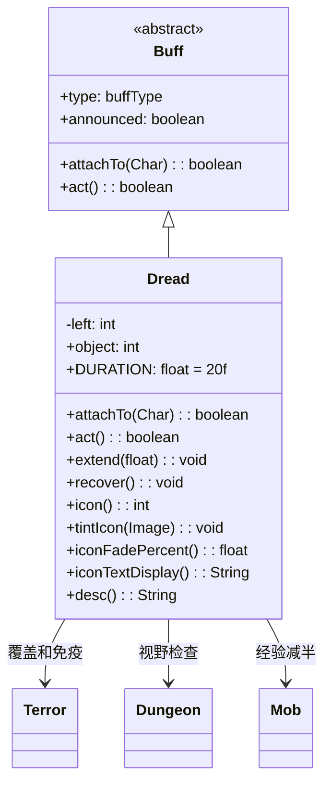

# Dread 类文档

## 1. 基本信息
| 属性 | 值 |
|------|-----|
| 文件路径 | core/src/main/java/com/shatteredpixel/shatteredpixeldungeon/actors/buffs/Dread.java |
| 包名 | com.shatteredpixel.shatteredpixeldungeon.actors.buffs |
| 类类型 | class |
| 继承关系 | extends Buff |
| 代码行数 | 134 |

## 2. 类职责说明
Dread（恐惧）是一个负面Buff，使受影响的敌人陷入极度恐惧状态，会逃跑并尝试离开英雄视野。如果敌人成功逃离英雄视野6格以上，会被永久移除（经验减半）。Dread会覆盖Terror效果，并对Terror免疫。受到攻击会减少持续时间。

## 4. 继承与协作关系


## 静态常量表
| 常量名 | 类型 | 值 | 说明 |
|--------|------|-----|------|
| DURATION | float | 20f | 默认持续时间（回合数） |
| LEFT | String | "left" | Bundle存储键 - 剩余时间 |
| OBJECT | String | "object" | Bundle存储键 - 恐惧源位置 |

## 实例字段表
| 字段名 | 类型 | 修饰符 | 说明 |
|--------|------|--------|------|
| left | int | protected | 剩余持续时间 |
| object | int | public | 恐惧源目标的位置 |
| type | buffType | - | NEGATIVE（负面Buff） |
| announced | boolean | - | true（会公告） |

## 7. 方法详解

### attachTo(Char target)
**签名**: `public boolean attachTo(Char target)`
**功能**: 重写附加方法，添加时移除Terror效果。
**参数**:
- target: Char - 目标角色
**返回值**: boolean - 是否成功附加。
**实现逻辑**:
```java
if (super.attachTo(target)) {
    Buff.detach(target, Terror.class);  // 移除Terror（Dread优先级更高）
    return true;
}
return false;
```

### act()
**签名**: `public boolean act()`
**功能**: 每回合检查敌人是否逃离，决定是否永久移除敌人。
**返回值**: boolean - 返回true表示成功执行。
**实现逻辑**:
```java
// 检查是否离开英雄视野且距离>=6格
if (!Dungeon.level.heroFOV[target.pos]
        && Dungeon.level.distance(target.pos, Dungeon.hero.pos) >= 6) {
    // 敌人成功逃离
    if (target instanceof Mob) {
        ((Mob) target).EXP /= 2;  // 经验减半
    }
    target.destroy();                    // 销毁敌人
    target.sprite.killAndErase();        // 移除精灵
    Dungeon.level.mobs.remove(target);   // 从列表移除
} else {
    left--;                              // 减少剩余时间
    if (left <= 0) {
        detach();                        // 时间耗尽则移除Buff
    }
}
spend(TICK);
return true;
```

### extend(float duration)
**签名**: `public void extend(float duration)`
**功能**: 延长持续时间。
**参数**:
- duration: float - 要延长的回合数
**实现逻辑**:
```java
left += duration;  // 直接增加时间
```

### recover()
**签名**: `public void recover()`
**功能**: 处理受到攻击时的恢复逻辑，减少5回合持续时间。
**实现逻辑**:
```java
left -= 5;
if (left <= 0) {
    detach();  // 时间耗尽则移除
}
```

### icon()
**签名**: `public int icon()`
**功能**: 返回Buff图标的索引标识符。
**返回值**: int - 返回BuffIndicator.TERROR（恐惧图标）。

### tintIcon(Image icon)
**签名**: `public void tintIcon(Image icon)`
**功能**: 为Buff图标设置颜色色调。
**参数**:
- icon: Image - 需要着色的图标图像
**实现逻辑**:
```java
icon.hardlight(1, 0, 0);  // 设置红色高光效果
```

### iconFadePercent()
**签名**: `public float iconFadePercent()`
**功能**: 计算Buff图标的淡出百分比。
**返回值**: float - 图标完整度比例。

### iconTextDisplay()
**签名**: `public String iconTextDisplay()`
**功能**: 返回图标上显示的文本（剩余时间）。
**返回值**: String - 剩余时间的字符串表示。

### desc()
**签名**: `public String desc()`
**功能**: 返回Buff的详细描述文本。
**返回值**: String - 包含剩余时间的描述。

## 11. 使用示例
```java
// 对敌人施加恐惧效果，持续20回合
Dread dread = Buff.affect(enemy, Dread.class);
dread.object = hero.pos;

// 检查是否有恐惧Buff
if (enemy.buff(Dread.class) != null) {
    // 敌人会逃跑，可能永久离开
}

// 受到攻击时减少时间
if (enemy.buff(Dread.class) != null) {
    enemy.buff(Dread.class).recover();
}
```

## 注意事项
1. Dread比Terror更强，会覆盖T效果
2. 敌人逃离视野6格以上会被永久移除
3. 被移除的敌人经验减半
4. 受到攻击会减少5回合持续时间
5. 对Terror免疫
6. 是负面Buff，会被净化效果移除

## 最佳实践
1. 用于快速清理敌人（不击杀）
2. 配合视野控制效果更佳
3. 注意敌人逃离后经验会减少
4. 可以用来分割敌人群体