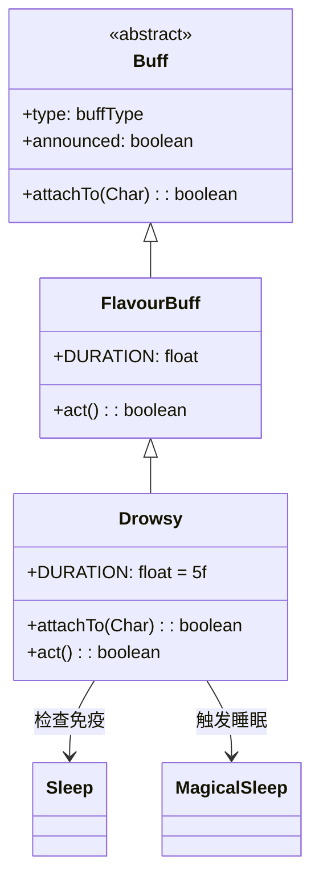

# Drowsy 类文档

## 1. 基本信息
| 属性 | 值 |
|------|-----|
| 文件路径 | core/src/main/java/com/shatteredpixel/shatteredpixeldungeon/actors/buffs/Drowsy.java |
| 包名 | com.shatteredpixel.shatteredpixeldungeon.actors.buffs |
| 类类型 | class |
| 继承关系 | extends FlavourBuff |
| 代码行数 | 60 |

## 2. 类职责说明
Drowsy（困倦）是一个中性Buff，作为入睡的前置状态。当Buff持续时间结束时，目标会进入MagicalSleep（魔法睡眠）状态。添加时会检查目标是否对Sleep免疫。主要用于睡眠药剂、特定技能效果等场景。

## 4. 继承与协作关系


## 静态常量表
| 常量名 | 类型 | 值 | 说明 |
|--------|------|-----|------|
| DURATION | float | 5f | 默认持续时间（回合数） |

## 实例字段表
| 字段名 | 类型 | 修饰符 | 说明 |
|--------|------|--------|------|
| type | buffType | - | NEUTRAL（中性Buff） |
| announced | boolean | - | true（会公告） |

## 7. 方法详解

### attachTo(Char target)
**签名**: `public boolean attachTo(Char target)`
**功能**: 重写附加方法，检查目标是否对Sleep免疫。
**参数**:
- target: Char - 目标角色
**返回值**: boolean - 是否成功附加。
**实现逻辑**:
```java
// 检查目标是否免疫睡眠，且父类attachTo成功
if (!target.isImmune(Sleep.class) && super.attachTo(target)) {
    return true;
}
return false;  // 免疫则无法附加
```

### act()
**签名**: `public boolean act()`
**功能**: 重写act方法，时间结束时施加MagicalSleep。
**返回值**: boolean - 返回父类结果。
**实现逻辑**:
```java
Buff.affect(target, MagicalSleep.class);  // 施加魔法睡眠
return super.act();  // 调用父类（会移除自身）
```

### icon()
**签名**: `public int icon()`
**功能**: 返回Buff图标的索引标识符。
**返回值**: int - 返回BuffIndicator.DROWSY（困倦图标）。

### iconFadePercent()
**签名**: `public float iconFadePercent()`
**功能**: 计算Buff图标的淡出百分比，用于显示剩余时间。
**返回值**: float - 返回一个0到1之间的值，表示图标应显示的完整度。

## 11. 使用示例
```java
// 对敌人施加困倦效果，持续5回合
Buff.affect(enemy, Drowsy.class, Drowsy.DURATION);
// 5回合后敌人会进入魔法睡眠

// 检查是否有困倦Buff
if (enemy.buff(Drowsy.class) != null) {
    // 敌人即将入睡
}
```

## 注意事项
1. 是中性Buff，不是正面或负面
2. 对Sleep免疫的目标无法附加
3. 持续时间结束后自动触发MagicalSleep
4. 可以通过攻击或净化提前移除，阻止入睡
5. 持续时间较短（5回合）

## 最佳实践
1. 在敌人即将入睡时做好准备
2. 用于控制敌人群体
3. 注意免疫Sleep的敌人无效
4. 配合其他控制效果使用