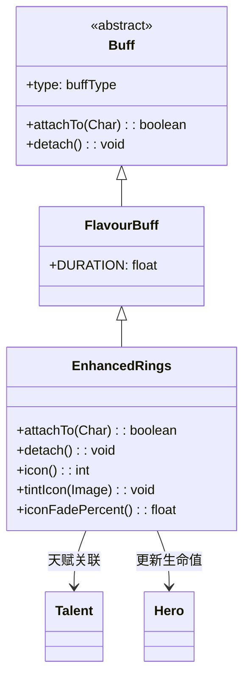

# EnhancedRings 类文档

## 1. 基本信息
| 属性 | 值 |
|------|-----|
| 文件路径 | core/src/main/java/com/shatteredpixel/shatteredpixeldungeon/actors/buffs/EnhancedRings.java |
| 包名 | com.shatteredpixel.shatteredpixeldungeon.actors.buffs |
| 类类型 | class |
| 继承关系 | extends FlavourBuff |
| 代码行数 | 68 |

## 2. 类职责说明
EnhancedRings（增强戒指）是一个正面Buff，使英雄佩戴的戒指效果增强。与增强戒指天赋绑定，持续时间随天赋等级增加。添加和移除时会更新英雄的生命值上限。

## 4. 继承与协作关系


## 实例字段表
| 字段名 | 类型 | 修饰符 | 说明 |
|--------|------|--------|------|
| type | buffType | - | POSITIVE（正面Buff） |

## 7. 方法详解

### attachTo(Char target)
**签名**: `public boolean attachTo(Char target)`
**功能**: 重写附加方法，更新英雄生命值上限。
**参数**:
- target: Char - 目标角色
**返回值**: boolean - 是否成功附加。
**实现逻辑**:
```java
if (super.attachTo(target)) {
    if (target == Dungeon.hero) {
        ((Hero) target).updateHT(false);  // 更新生命值上限
    }
    return true;
}
return false;
```

### detach()
**签名**: `public void detach()`
**功能**: 重写移除方法，更新英雄生命值上限。
**实现逻辑**:
```java
super.detach();
if (target == Dungeon.hero) {
    ((Hero) target).updateHT(false);  // 更新生命值上限
}
```

### icon()
**签名**: `public int icon()`
**功能**: 返回Buff图标的索引标识符。
**返回值**: int - 返回BuffIndicator.UPGRADE（升级图标）。

### tintIcon(Image icon)
**签名**: `public void tintIcon(Image icon)`
**功能**: 为Buff图标设置颜色色调。
**参数**:
- icon: Image - 需要着色的图标图像
**实现逻辑**:
```java
icon.hardlight(0, 1, 0);  // 设置绿色高光效果
```

### iconFadePercent()
**签名**: `public float iconFadePercent()`
**功能**: 计算Buff图标的淡出百分比。
**返回值**: float - 图标完整度比例。
**实现逻辑**:
```java
// 持续时间 = 3 * 天赋点数
float max = 3 * Dungeon.hero.pointsInTalent(Talent.ENHANCED_RINGS);
return Math.max(0, (max - visualcooldown()) / max);
```

## 11. 使用示例
```java
// 为英雄添加增强戒指效果
Buff.affect(hero, EnhancedRings.class);

// 检查是否有增强戒指
if (hero.buff(EnhancedRings.class) != null) {
    // 戒指效果增强
}
```

## 注意事项
1. 与增强戒指天赋绑定
2. 持续时间随天赋等级增加（3回合/级）
3. 添加和移除都会更新生命值上限
4. 是正面Buff

## 最佳实践
1. 配合增强戒指天赋使用
2. 在佩戴多枚戒指时效果更佳
3. 利用增强效果提升戒指实用性