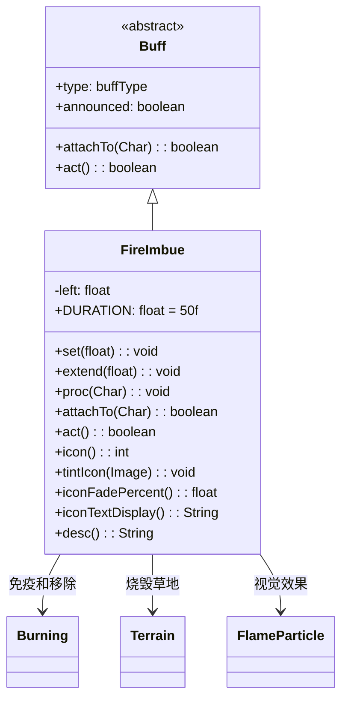

# FireImbue 类文档

## 1. 基本信息
| 属性 | 值 |
|------|-----|
| 文件路径 | core/src/main/java/com/shatteredpixel/shatteredpixeldungeon/actors/buffs/FireImbue.java |
| 包名 | com.shatteredpixel.shatteredpixeldungeon.actors.buffs |
| 类类型 | class |
| 继承关系 | extends Buff |
| 代码行数 | 130 |

## 2. 类职责说明
FireImbue（火焰灌注）是一个正面Buff，使角色的攻击附带火焰效果。每回合有50%概率点燃被攻击的敌人。角色站在草地上会将草烧成灰烬。免疫燃烧状态，添加时会移除已有的燃烧效果。主要用于火焰药剂、神器效果等场景。

## 4. 继承与协作关系


## 静态常量表
| 常量名 | 类型 | 值 | 说明 |
|--------|------|-----|------|
| DURATION | float | 50f | 默认持续时间（回合数） |
| LEFT | String | "left" | Bundle存储键 - 剩余时间 |

## 实例字段表
| 字段名 | 类型 | 修饰符 | 说明 |
|--------|------|--------|------|
| left | float | protected | 剩余持续时间 |
| type | buffType | - | POSITIVE（正面Buff） |
| announced | boolean | - | true（会公告） |
| immunities | HashSet | - | 包含Burning.class |

## 7. 方法详解

### attachTo(Char target)
**签名**: `public boolean attachTo(Char target)`
**功能**: 重写附加方法，添加时移除燃烧状态。
**参数**:
- target: Char - 目标角色
**返回值**: boolean - 是否成功附加。
**实现逻辑**:
```java
if (super.attachTo(target)) {
    Buff.detach(target, Burning.class);  // 移除燃烧状态
    return true;
}
return false;
```

### set(float duration)
**签名**: `public void set(float duration)`
**功能**: 设置持续时间。
**参数**:
- duration: float - 持续回合数
**实现逻辑**:
```java
this.left = duration;  // 设置剩余时间
```

### extend(float duration)
**签名**: `public void extend(float duration)`
**功能**: 延长持续时间。
**参数**:
- duration: float - 要延长的回合数
**实现逻辑**:
```java
left += duration;  // 直接增加时间
```

### act()
**签名**: `public boolean act()`
**功能**: 每回合检查并烧毁脚下的草地。
**返回值**: boolean - 返回true表示成功执行。
**实现逻辑**:
```java
// 检查脚下是否是草地
if (Dungeon.level.map[target.pos] == Terrain.GRASS) {
    Dungeon.level.set(target.pos, Terrain.EMBERS);  // 烧成灰烬
    GameScene.updateMap(target.pos);                 // 更新地图显示
}
spend(TICK);
left -= TICK;
if (left <= 0) {
    detach();  // 时间耗尽则移除
}
return true;
```

### proc(Char enemy)
**签名**: `public void proc(Char enemy)`
**功能**: 处理攻击时的火焰效果。
**参数**:
- enemy: Char - 被攻击的敌人
**返回值**: void
**实现逻辑**:
```java
if (Random.Int(2) == 0) {  // 50%概率
    Buff.affect(enemy, Burning.class).reignite(enemy);  // 点燃敌人
}
enemy.sprite.emitter().burst(FlameParticle.FACTORY, 2);  // 火焰粒子效果
```

### icon()
**签名**: `public int icon()`
**功能**: 返回Buff图标的索引标识符。
**返回值**: int - 返回BuffIndicator.IMBUE（灌注图标）。

### tintIcon(Image icon)
**签名**: `public void tintIcon(Image icon)`
**功能**: 为Buff图标设置颜色色调。
**参数**:
- icon: Image - 需要着色的图标图像
**实现逻辑**:
```java
icon.hardlight(2f, 0.75f, 0f);  // 设置橙红色高光效果
```

### iconFadePercent()
**签名**: `public float iconFadePercent()`
**功能**: 计算Buff图标的淡出百分比。
**返回值**: float - 图标完整度比例。

### iconTextDisplay()
**签名**: `public String iconTextDisplay()`
**功能**: 返回图标上显示的文本（剩余时间）。
**返回值**: String - 剩余时间的字符串表示。

### desc()
**签名**: `public String desc()`
**功能**: 返回Buff的详细描述文本。
**返回值**: String - 包含剩余时间的描述。

## 11. 使用示例
```java
// 为英雄添加火焰灌注，持续50回合
FireImbue imbue = Buff.affect(hero, FireImbue.class);
imbue.set(FireImbue.DURATION);

// 在攻击时调用proc方法
if (hero.buff(FireImbue.class) != null) {
    hero.buff(FireImbue.class).proc(enemy);
}

// 延长持续时间
if (hero.buff(FireImbue.class) != null) {
    hero.buff(FireImbue.class).extend(20f);
}
```

## 注意事项
1. 攻击有50%概率点燃敌人
2. 会烧毁脚下的草地
3. 免疫燃烧状态
4. 添加时会移除已有的燃烧效果
5. 持续时间较长（50回合）
6. 是正面Buff

## 最佳实践
1. 配合高攻击频率武器使用
2. 注意会烧毁草地，可能影响隐藏物品
3. 对火焰免疫的敌人效果降低
4. 与冰霜效果互相抵消