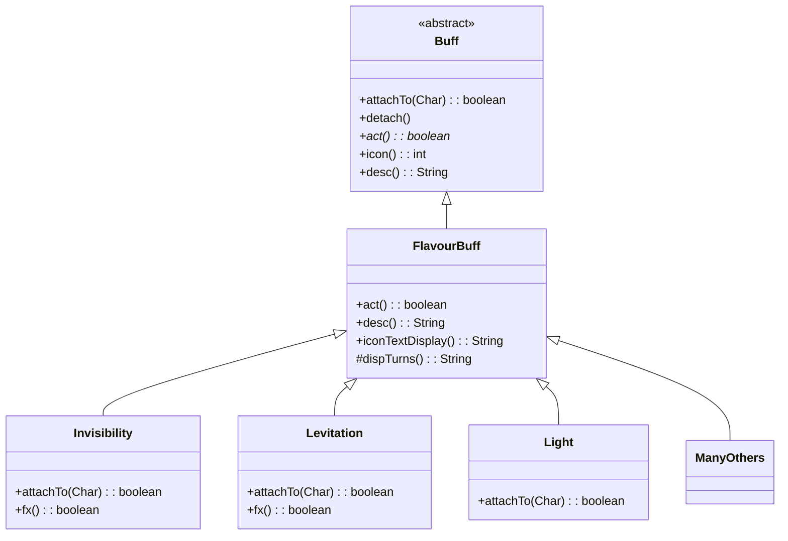

# FlavourBuff 类文档

## 1. 基本信息

| 属性 | 值 |
|------|-----|
| 文件路径 | core/src/main/java/com/shatteredpixel/shatteredpixeldungeon/actors/buffs/FlavourBuff.java |
| 包名 | com.shatteredpixel.shatteredpixeldungeon.actors.buffs |
| 类类型 | class |
| 继承关系 | extends Buff |
| 代码行数 | 49 行 |
| 许可证 | GNU GPL v3 |

## 2. 类职责说明

`FlavourBuff` 是简单计时Buff的基类，负责：

1. **自动过期** - 仅等待指定时间后自动移除
2. **时间显示** - 提供剩余回合数的文本显示
3. **简化实现** - 为不需要复杂逻辑的Buff提供简单基类

## 4. 继承与协作关系



## 7. 方法详解

### act()

**签名**: `@Override public boolean act()`

**功能**: Buff的主要逻辑，到达时间后自动移除。

**返回值**: `boolean` - 总是返回true

**实现逻辑**:
```java
// 第29-33行：
detach();  // 移除Buff
return true;
```

### desc()

**签名**: `@Override public String desc()`

**功能**: 返回Buff的描述文本，包含剩余回合数。

**返回值**: `String` - 格式化的描述文本

**实现逻辑**:
```java
// 第35-38行：
return Messages.get(this, "desc", dispTurns());  // 使用消息模板
// 例如："隐形中（剩余5回合）"
```

### dispTurns()

**签名**: `protected String dispTurns()`

**功能**: 返回剩余回合数的可读字符串。

**返回值**: `String` - 如"5回合"或"一回合"

**实现逻辑**:
```java
// 第41-43行：
return dispTurns(visualcooldown());  // 调用Buff基类的静态方法
```

### iconTextDisplay()

**签名**: `@Override public String iconTextDisplay()`

**功能**: 返回显示在图标上的文本（剩余回合数）。

**返回值**: `String` - 数字字符串

**实现逻辑**:
```java
// 第45-48行：
return Integer.toString((int)visualcooldown());  // 剩余回合数的整数
```

## 11. 使用示例

### 创建自定义FlavourBuff

```java
public class MySimpleBuff extends FlavourBuff {
    
    {
        type = Buff.buffType.POSITIVE;  // 正面效果
        announced = true;               // 添加时显示消息
    }
    
    @Override
    public int icon() {
        return BuffIndicator.MY_ICON;
    }
}
```

### 使用FlavourBuff

```java
// 添加持续5回合的Buff
Buff.affect(hero, MySimpleBuff.class, 5f);

// 检查是否存在
if (hero.buff(MySimpleBuff.class) != null) {
    // 有这个Buff
}

// 提前移除
Buff.detach(hero, MySimpleBuff.class);
```

## 子类列表

FlavourBuff被许多简单Buff继承：

| 子类 | 功能 |
|------|------|
| Invisibility | 隐身 |
| Levitation | 漂浮 |
| Light | 光照 |
| MindVision | 心灵视野 |
| Shadows | 暗影 |
| Haste | 急速 |
| Bless | 祝福 |
| Recharging | 充能 |
| Barkskin | 树皮术 |
| WellFed | 饱腹 |
| 以及更多... | |

## 注意事项

1. **简单场景** - 只适用于不需要复杂每帧逻辑的Buff
2. **时间管理** - 使用`spend()`设置持续时间
3. **显示** - 自动提供回合数显示
4. **子类化** - 通常只需重写`icon()`和设置`type`

## 相关文件

| 文件 | 说明 |
|------|------|
| Buff.java | 父类，Buff基类 |
| BuffIndicator.java | Buff图标定义 |
| Messages.java | 国际化消息系统 |