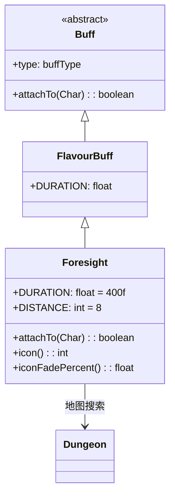

# Foresight 类文档

## 1. 基本信息
| 属性 | 值 |
|------|-----|
| 文件路径 | core/src/main/java/com/shatteredpixel/shatteredpixeldungeon/actors/buffs/Foresight.java |
| 包名 | com.shatteredpixel.shatteredpixeldungeon.actors.buffs |
| 类类型 | class |
| 继承关系 | extends FlavourBuff |
| 代码行数 | 62 |

## 2. 类职责说明
Foresight（预见）是一个正面Buff，使角色能够预知附近的陷阱和秘密。预见状态下角色周围8格范围内的陷阱和秘密门会被标记出来。添加时会触发一次搜索效果。主要用于预见药剂、特定天赋效果等场景。

## 4. 继承与协作关系


## 静态常量表
| 常量名 | 类型 | 值 | 说明 |
|--------|------|-----|------|
| DURATION | float | 400f | 默认持续时间（回合数） |
| DISTANCE | int | 8 | 预见范围（格数） |

## 实例字段表
| 字段名 | 类型 | 修饰符 | 说明 |
|--------|------|--------|------|
| type | buffType | - | POSITIVE（正面Buff） |

## 7. 方法详解

### attachTo(Char target)
**签名**: `public boolean attachTo(Char target)`
**功能**: 重写附加方法，添加时触发搜索效果。
**参数**:
- target: Char - 目标角色
**返回值**: boolean - 是否成功附加。
**实现逻辑**:
```java
if (super.attachTo(target)) {
    // 触发视觉效果扫描
    if (target == Dungeon.hero) {
        Dungeon.level.mapped[target.pos] = false;
        Dungeon.hero.search(false);  // 触发搜索
    }
    return true;
}
return false;
```

### icon()
**签名**: `public int icon()`
**功能**: 返回Buff图标的索引标识符。
**返回值**: int - 返回BuffIndicator.FORESIGHT（预见图标）。

### iconFadePercent()
**签名**: `public float iconFadePercent()`
**功能**: 计算Buff图标的淡出百分比。
**返回值**: float - 图标完整度比例。

## 11. 使用示例
```java
// 为英雄添加预见效果，持续400回合
Buff.affect(hero, Foresight.class, Foresight.DURATION);

// 检查是否有预见
if (hero.buff(Foresight.class) != null) {
    // 英雄可以预知8格内的陷阱和秘密
}
```

## 注意事项
1. 预见范围是8格
2. 可以发现陷阱和秘密门
3. 添加时会有搜索视觉效果
4. 持续时间很长（400回合）
5. 是正面Buff

## 最佳实践
1. 在未知区域探索时使用
2. 用于安全发现陷阱
3. 配合探索效果更佳
4. 持续时间长，不必频繁补充