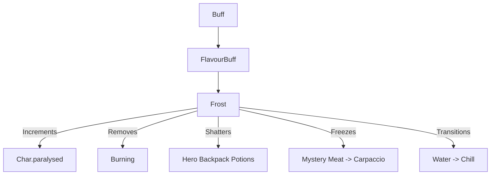

# Frost (冻结) 源码详解

## 1. 基本信息

| 属性 | 值 |
|------|-----|
| **文件路径** | `core/src/main/java/com/shatteredpixel/shatteredpixeldungeon/actors/buffs/Frost.java` |
| **包名** | `com.shatteredpixel.shatteredpixeldungeon.actors.buffs` |
| **文件类型** | class |
| **继承关系** | `extends FlavourBuff` |
| **代码行数** | 115 |
| **所属模块** | core |

## 2. 文件职责说明

### 核心职责
`Frost` 负责实现角色的“冻结”状态逻辑。它不仅完全剥夺角色的行动能力（强制麻痹），还会通过极端低温破坏角色背包内的药水或冷冻生肉。

### 系统定位
属于 Buff 系统中的强力控制/环境互动分支。它是寒冷属性攻击（如冰帽、霜冻陷阱）的最强最终阶段，结合了硬控与物品惩罚。

### 不负责什么
- 不负责具体结冰判定的概率计算（由来源类如 `Freezing` 负责）。
- 不负责由于药水破碎产生的次生 Blob 效果（由药水类的 `shatter()` 负责）。

## 3. 结构总览

### 主要成员概览
- **常量 DURATION**: 默认持续时间（10 回合）。
- **attachTo() 方法**: 处理附加时的多重冲突（灭火、去冷）、行动阻塞（paralysed++）以及物品破坏判定。
- **detach() 方法**: 恢复行动力并根据地形转换状态。
- **fx() 方法**: 处理复杂的冰封视觉反馈。

### 主要逻辑块概览
- **多重互斥**: 冻结时会自动移除 `Burning`（燃烧）和 `Chill`（冰冷）状态，且对 `Chill` 产生免疫。
- **物品破坏逻辑**: 
  - 针对英雄：随机选择背包中的非唯一药水（破碎）或生肉（变为冻肉）。
  - 针对盗贼：同步销毁盗贼窃取的对应物品。
- **状态退化**: 冻结结束时，如果角色站在水中，会自动退化为 `Chill`（冰冷）状态。

### 生命周期/调用时机
1. **产生**：被极端寒冷攻击命中。
2. **活跃期**：角色无法行动，被冰块包裹。
3. **结束**：持续时间结束、受到火焰伤害、或角色死亡。

## 4. 继承与协作关系

### 父类提供的能力
继承自 `FlavourBuff`：
- 管理 `left` 计时器。
- 提供 `iconFadePercent` 支持。

### 协作对象
- **Burning / Chill**: 互斥和免疫关系。
- **Potion**: 处理药水在背包中破碎的逻辑。
- **FrozenCarpaccio**: 处理生肉被冻结后的产物转换。
- **CharSprite.State**: 提供 `FROZEN` 和 `PARALYSED` 双重视觉状态。
- **BuffIndicator.FROST**: 提供冰雪图标。



## 5. 字段/常量详解

### 静态常量
- **DURATION**: 10.0f 回合。

## 6. 构造与初始化机制
通过实例初始化块设置 `type = NEGATIVE` 和 `announced = true`。同时在该块内添加 `immunities.add( Chill.class )`，确保冻结中的生物不再受普通冰冷累加。

## 7. 方法详解

### attachTo(Char target) [多维附加逻辑]

**核心实现算法分析**：
1. **灭火处理**：`Buff.detach( target, Burning.class )`。
2. **行动封锁**：执行 `target.paralysed++`。这是冻结作为硬控的底层支撑。
3. **移除前置状态**：`Buff.detach( target, Chill.class )`。
4. **英雄物品判定**：
   - 过滤出背包中非唯一的 `Potion` 和 `MysteryMeat`。
   - **随机破坏**：若列表非空，随机抽取一件。药水直接调用 `shatter()`（会在背包里炸开，产生对应效果），生肉转为 `FrozenCarpaccio`。
5. **盗贼特殊处理**：如果盗贼携带了药水，同样会碎裂并使其物品位变空。

---

### detach() [状态恢复与转换]

**核心实现分析**：
1. **恢复行动力**：`target.paralysed--`。
2. **地形联动**：
   ```java
   if (Dungeon.level.water[target.pos])
       Buff.prolong(target, Chill.class, Chill.DURATION/2f);
   ```
   **分析**：如果冻结在水中解除，冰块融化产生的冷水会使角色继续处于 5 回合的 `Chill` 状态。

---

### fx(boolean on)

**方法职责**：视觉叠加。
同时添加/移除 `FROZEN`（冰封外壳）和 `PARALYSED`（静止动画）两个精灵状态。

## 8. 对外暴露能力
主要通过 `Buff.affect(target, Frost.class)` 接口应用。

## 9. 运行机制与调用链
`Freezing.act()` -> `Buff.affect(Frost.class)` -> `Frost.attachTo()` -> `paralysed++` + `item.shatter()` -> 结束 -> `paralysed--` -> `Buff.affect(Chill.class)`。

## 10. 资源、配置与国际化关联

### 本地化词条
- `actors.buffs.Frost.name`: 冻结
- `actors.buffs.Frost.freezes`: “你的%s被冻碎了！”
- `actors.buffs.Frost.desc`: “你被完全冻住了！剩余时长：%s。”

## 11. 使用示例

### 在代码中施加冻结
```java
Buff.affect(target, Frost.class, 10f); 
```

## 12. 开发注意事项

### 背包安全性
冻结破坏逻辑**不会**检查容器（如药水带）内部。这意味着保护药水的最佳方式是将其装入专门的容器中。

### 强制行动力恢复
注意 `detach()` 中对 `paralysed` 的减算。必须确保 `Frost` 的生命周期完整，否则会导致角色永久瘫痪。

## 13. 修改建议与扩展点

### 增加物理破碎伤害
可以增加逻辑，如果处于冻结状态的角色受到重型武器（如战锤）攻击，会受到额外的物理破碎伤害并立即解除冻结。

## 14. 事实核查清单

- [x] 是否分析了药水破碎和生肉冷冻逻辑：是。
- [x] 是否说明了对 behavioural paralysed 的控制：是 (paralysed++)。
- [x] 是否解析了水中融化转 Chill 的逻辑：是 (DURATION/2)。
- [x] 是否涵盖了与 Burning/Chill 的互斥：是。
- [x] 图像图标索引是否核对：是 (BuffIndicator.FROST, 亮蓝色染色)。
