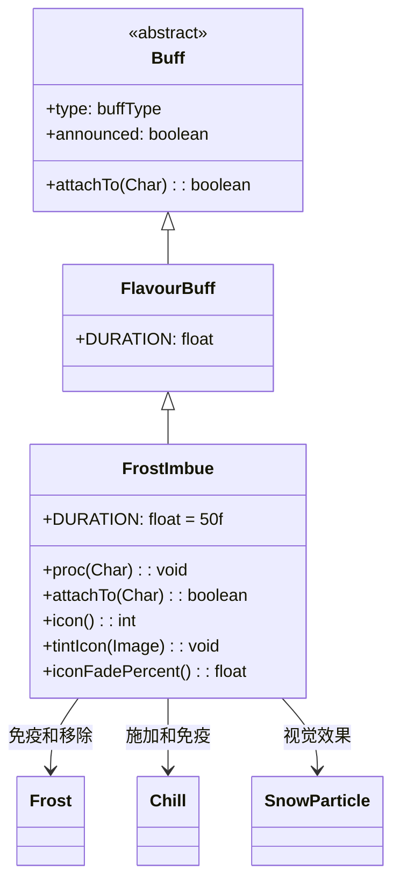

# FrostImbue 类文档

## 1. 基本信息
| 属性 | 值 |
|------|-----|
| 文件路径 | core/src/main/java/com/shatteredpixel/shatteredpixeldungeon/actors/buffs/FrostImbue.java |
| 包名 | com.shatteredpixel.shatteredpixeldungeon.actors.buffs |
| 类类型 | class |
| 继承关系 | extends FlavourBuff |
| 代码行数 | 73 |

## 2. 类职责说明
FrostImbue（冰霜灌注）是一个正面Buff，使角色的攻击附带冰霜效果。每次攻击都会对敌人施加3回合的冻伤效果。角色免疫冰冻和寒冷状态，添加时会移除已有的冰冻和冻伤效果。主要用于冰霜药剂、神器效果等场景。

## 4. 继承与协作关系


## 静态常量表
| 常量名 | 类型 | 值 | 说明 |
|--------|------|-----|------|
| DURATION | float | 50f | 默认持续时间（回合数） |

## 实例字段表
| 字段名 | 类型 | 修饰符 | 说明 |
|--------|------|--------|------|
| type | buffType | - | POSITIVE（正面Buff） |
| announced | boolean | - | true（会公告） |
| immunities | HashSet | - | 包含Frost.class和Chill.class |

## 7. 方法详解

### attachTo(Char target)
**签名**: `public boolean attachTo(Char target)`
**功能**: 重写附加方法，添加时移除冰冻和寒冷状态。
**参数**:
- target: Char - 目标角色
**返回值**: boolean - 是否成功附加。
**实现逻辑**:
```java
if (super.attachTo(target)) {
    Buff.detach(target, Frost.class);  // 移除冰冻
    Buff.detach(target, Chill.class);  // 移除寒冷
    return true;
}
return false;
```

### proc(Char enemy)
**签名**: `public void proc(Char enemy)`
**功能**: 处理攻击时的冰霜效果。
**参数**:
- enemy: Char - 被攻击的敌人
**返回值**: void
**实现逻辑**:
```java
Buff.affect(enemy, Chill.class, 3f);  // 施加3回合寒冷
enemy.sprite.emitter().burst(SnowParticle.FACTORY, 3);  // 雪花粒子效果
```

### icon()
**签名**: `public int icon()`
**功能**: 返回Buff图标的索引标识符。
**返回值**: int - 返回BuffIndicator.IMBUE（灌注图标）。

### tintIcon(Image icon)
**签名**: `public void tintIcon(Image icon)`
**功能**: 为Buff图标设置颜色色调。
**参数**:
- icon: Image - 需要着色的图标图像
**实现逻辑**:
```java
icon.hardlight(0, 2f, 3f);  // 设置冰蓝色高光效果
```

### iconFadePercent()
**签名**: `public float iconFadePercent()`
**功能**: 计算Buff图标的淡出百分比。
**返回值**: float - 图标完整度比例。

## 11. 使用示例
```java
// 为英雄添加冰霜灌注，持续50回合
Buff.affect(hero, FrostImbue.class, FrostImbue.DURATION);

// 在攻击时调用proc方法
if (hero.buff(FrostImbue.class) != null) {
    hero.buff(FrostImbue.class).proc(enemy);
}

// 延长持续时间
Buff.prolong(hero, FrostImbue.class, 20f);
```

## 注意事项
1. 每次攻击都会施加冻伤效果
2. 冻伤效果持续3回合，会减速敌人
3. 免疫冰冻和寒冷状态
4. 添加时会移除已有的冰冻和寒冷
5. 持续时间较长（50回合）
6. 是正面Buff

## 最佳实践
1. 配合高攻击频率武器使用
2. 利用减速效果控制敌人
3. 对快速移动的敌人特别有效
4. 与火焰效果互相抵消