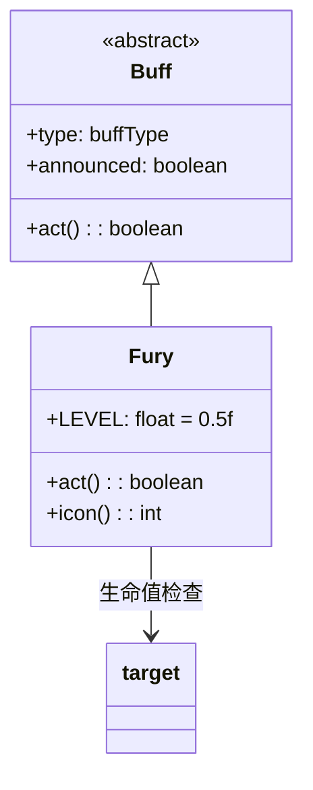

# Fury 类文档

## 1. 基本信息
| 属性 | 值 |
|------|-----|
| 文件路径 | core/src/main/java/com/shatteredpixel/shatteredpixeldungeon/actors/buffs/Fury.java |
| 包名 | com.shatteredpixel.shatteredpixeldungeon.actors.buffs |
| 类类型 | class |
| 继承关系 | extends Buff |
| 代码行数 | 50 |

## 2. 类职责说明
Fury（狂怒）是一个正面Buff，当英雄的生命值低于50%时激活，提供攻击伤害加成。Buff会持续检查英雄生命值，当生命值恢复到50%以上时自动移除。主要用于战士职业的被动技能。

## 4. 继承与协作关系


## 静态常量表
| 常量名 | 类型 | 值 | 说明 |
|--------|------|-----|------|
| LEVEL | float | 0.5f | 触发阈值（50%生命值） |

## 实例字段表
| 字段名 | 类型 | 修饰符 | 说明 |
|--------|------|--------|------|
| type | buffType | - | POSITIVE（正面Buff） |
| announced | boolean | - | true（会公告） |

## 7. 方法详解

### act()
**签名**: `public boolean act()`
**功能**: 每回合检查生命值，决定是否保持Buff。
**返回值**: boolean - 返回true表示成功执行。
**实现逻辑**:
```java
// 检查生命值是否高于50%
if (target.HP > target.HT * LEVEL) {
    detach();  // 生命值恢复，移除狂怒
}
spend(TICK);
return true;
```

### icon()
**签名**: `public int icon()`
**功能**: 返回Buff图标的索引标识符。
**返回值**: int - 返回BuffIndicator.FURY（狂怒图标）。

## 11. 使用示例
```java
// 当英雄生命值低于50%时自动获得狂怒
// （通常在Char类中检查并添加）

// 检查是否有狂怒Buff
if (hero.buff(Fury.class) != null) {
    // 英雄获得伤害加成
}

// 生命值恢复后狂怒自动移除
// 不需要手动移除
```

## 注意事项
1. 触发条件是生命值低于50%
2. 生命值恢复到50%以上时自动移除
3. 实际的伤害加成计算在Char类中实现
4. 是正面Buff
5. 会显示公告消息
6. 不需要手动管理，自动触发和移除

## 最佳实践
1. 在低生命值时利用伤害加成反击
2. 配合吸血或治疗效果可以在战斗中反复触发
3. 注意控制生命值在安全范围内
4. 战士职业的标志性能力，善加利用