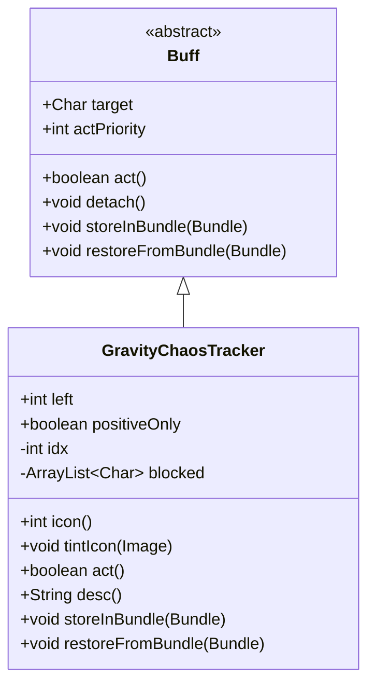

# GravityChaosTracker 类文档

## 1. 基本信息
| 属性 | 值 |
|------|-----|
| 文件路径 | core/src/main/java/com/shatteredpixel/shatteredpixeldungeon/actors/buffs/GravityChaosTracker.java |
| 包名 | com.shatteredpixel.shatteredpixeldungeon.actors.buffs |
| 类类型 | class |
| 继承关系 | extends Buff |
| 代码行数 | 176 行 |

## 2. 类职责说明
GravityChaosTracker 是一个追踪重力混乱效果的 Buff 类。它会随机将地牢中的所有角色（敌人、盟友和玩家）向同一随机方向推动，造成混乱的战场效果。该效果持续约 100 回合（30-70次推动），每次推动间隔 1-3 回合。

## 4. 继承与协作关系


## 静态常量表
| 常量名 | 类型 | 值 | 说明 |
|--------|------|-----|------|
| LEFT | String | "left" | Bundle 存储键 - 剩余推动次数 |
| POSITIVE_ONLY | String | "positive_only" | Bundle 存储键 - 是否仅正面效果 |

## 实例字段表
| 字段名 | 类型 | 修饰符 | 说明 |
|--------|------|--------|------|
| left | int | public | 剩余推动次数（初始30-70） |
| positiveOnly | boolean | public | 是否仅对敌人生效（不推盟友） |
| idx | int | - | 当前推动方向索引 |
| blocked | ArrayList\<Char\> | - | 被其他角色阻挡的角色列表 |

## 7. 方法详解

### icon()
**签名**: `public int icon()`
**功能**: 返回 Buff 图标标识符
**返回值**: int - BuffIndicator.VERTIGO（眩晕图标）
**实现逻辑**:
```
第50-52行: 返回眩晕图标，表示混乱的移动效果
```

### tintIcon(Image icon)
**签名**: `public void tintIcon(Image icon)`
**功能**: 根据模式为图标着色
**参数**:
- icon: Image - 要着色的图标图像
**实现逻辑**:
```
第56-57行: 如果 positiveOnly 为 true，着绿色（正面效果）
第59行: 否则着红色（负面效果）
```

### act()
**签名**: `public boolean act()`
**功能**: 每回合执行的核心逻辑，处理角色推动
**返回值**: boolean - 始终返回 true
**实现逻辑**:
```
第76-86行: 等待所有精灵完成移动动画（使用同步锁）
第88-113行: 处理被阻挡的角色：
  - 第90-97行: 尝试再次推动被阻挡的角色
  - 第99-109行: 如果没有角色被移除或列表为空，清理列表，减少剩余次数
  - 第110-112行: 如果有角色被移除，直接返回等待下次执行
第115行: 随机选择一个推动方向（8方向之一）
第116-132行: 遍历所有角色：
  - 第117-119行: 跳过不可移动的角色和（positiveOnly时）盟友
  - 第121-123行: 如果是睡眠的怪物，唤醒它
  - 第124-130行: 计算推动路径，如果被阻挡则加入blocked列表，否则推动角色
第134-145行: 如果没有被阻挡的角色，减少剩余次数，检查是否结束
```

### desc()
**签名**: `public String desc()`
**功能**: 返回 Buff 的详细描述文本
**返回值**: String - 格式化的描述文本
**实现逻辑**:
```
第152-156行: 构建描述文本，包含基础描述、positiveOnly时的正面效果说明和持续时间
```

### storeInBundle(Bundle bundle)
**签名**: `public void storeInBundle(Bundle bundle)`
**功能**: 将 Buff 状态保存到 Bundle 中以支持游戏存档
**参数**:
- bundle: Bundle - 存储容器
**实现逻辑**:
```
第165-167行: 保存剩余次数和 positiveOnly 标志
```

### restoreFromBundle(Bundle bundle)
**签名**: `public void restoreFromBundle(Bundle bundle)`
**功能**: 从 Bundle 恢复 Buff 状态
**参数**:
- bundle: Bundle - 存储容器
**实现逻辑**:
```
第172-174行: 恢复剩余次数和 positiveOnly 标志
```

## 11. 使用示例
```java
// 创建重力混乱追踪器（正常模式）
GravityChaosTracker tracker = Buff.append(target, GravityChaosTracker.class);
// 所有角色都会被随机推动

// 创建重力混乱追踪器（仅对敌人）
GravityChaosTracker safeTracker = Buff.append(target, GravityChaosTracker.class);
safeTracker.positiveOnly = true;  // 盟友不会被推动
```

## 注意事项
1. **推动机制**: 使用 WandOfBlastWave.throwChar() 实现推动效果
2. **阻挡处理**: 如果角色被其他角色阻挡，会在下一回合重试
3. **睡眠中断**: 被推动的睡眠怪物会被唤醒进入游荡状态
4. **英雄中断**: 被推动的英雄会被打断当前动作
5. **动画同步**: 使用 synchronized 等待所有精灵完成移动
6. **持续时间**: 平均 100 回合（30-70次推动，每次间隔1-3回合）

## 最佳实践
1. 使用 positiveOnly = true 可以创建对玩家有利的效果
2. 考虑在狭窄区域使用时可能造成角色卡住的情况
3. 效果结束时会有日志提示和音效反馈