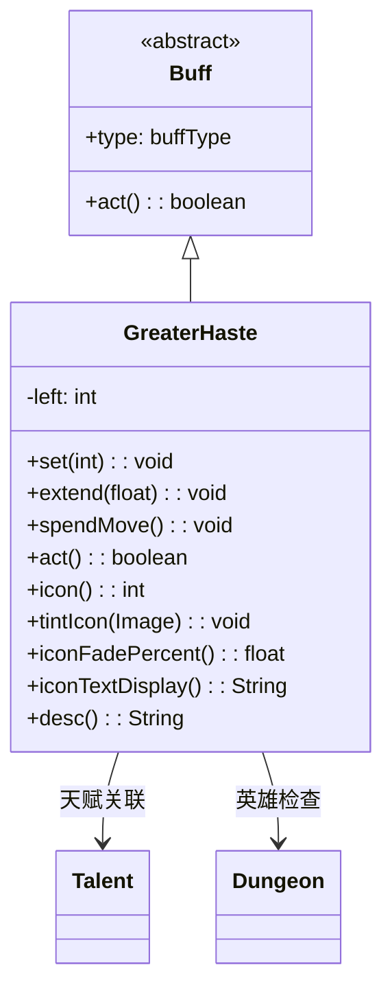

# GreaterHaste 类文档

## 1. 基本信息
| 属性 | 值 |
|------|-----|
| 文件路径 | core/src/main/java/com/shatteredpixel/shatteredpixeldungeon/actors/buffs/GreaterHaste.java |
| 包名 | com.shatteredpixel.shatteredpixeldungeon.actors.buffs |
| 类类型 | class |
| 继承关系 | extends Buff |
| 代码行数 | 105 |

## 2. 类职责说明
GreaterHaste（超级急速）是一个正面Buff，提供比普通急速更强的加速效果。与急速不同，超级急速按移动次数消耗，而不是按回合消耗。每次移动减少1点持续时间。目前仅应用于英雄，与致命急速天赋绑定。

## 4. 继承与协作关系


## 静态常量表
| 常量名 | 类型 | 值 | 说明 |
|--------|------|-----|------|
| LEFT | String | "left" | Bundle存储键 - 剩余次数 |

## 实例字段表
| 字段名 | 类型 | 修饰符 | 说明 |
|--------|------|--------|------|
| left | int | private | 剩余移动次数 |
| type | buffType | - | POSITIVE（正面Buff） |

## 7. 方法详解

### act()
**签名**: `public boolean act()`
**功能**: 每回合执行，但主要逻辑在spendMove()中。
**返回值**: boolean - 返回true表示成功执行。
**实现逻辑**:
```java
spendMove();  // 调用移动消耗
spend(TICK);
return true;
```

### spendMove()
**签名**: `public void spendMove()`
**功能**: 消耗一次移动次数，次数用尽则移除Buff。
**实现逻辑**:
```java
left--;
if (left <= 0) {
    detach();  // 次数用尽则移除
}
```

### set(int time)
**签名**: `public void set(int time)`
**功能**: 设置移动次数。
**参数**:
- time: int - 移动次数
**实现逻辑**:
```java
left = time;  // 设置剩余次数
```

### extend(float duration)
**签名**: `public void extend(float duration)`
**功能**: 增加移动次数。
**参数**:
- duration: float - 要增加的次数（转为整数）
**实现逻辑**:
```java
left += duration;  // 直接增加次数
```

### icon()
**签名**: `public int icon()`
**功能**: 返回Buff图标的索引标识符。
**返回值**: int - 返回BuffIndicator.HASTE（急速图标）。

### tintIcon(Image icon)
**签名**: `public void tintIcon(Image icon)`
**功能**: 为Buff图标设置颜色色调。
**参数**:
- icon: Image - 需要着色的图标图像
**实现逻辑**:
```java
icon.hardlight(1f, 0.3f, 0f);  // 设置橙红色高光效果（与普通急速区分）
```

### iconFadePercent()
**签名**: `public float iconFadePercent()`
**功能**: 计算Buff图标的淡出百分比。
**返回值**: float - 图标完整度比例。
**实现逻辑**:
```java
// 基于致命急速天赋计算最大次数
float duration = 1 + 2 * Dungeon.hero.pointsInTalent(Talent.LETHAL_HASTE);
return Math.max(0, (duration - left) / duration);
```

### iconTextDisplay()
**签名**: `public String iconTextDisplay()`
**功能**: 返回图标上显示的文本（剩余次数）。
**返回值**: String - 剩余次数的字符串表示。

### desc()
**签名**: `public String desc()`
**功能**: 返回Buff的详细描述文本。
**返回值**: String - 包含剩余次数的描述。

## 11. 使用示例
```java
// 为英雄添加超级急速，设置3次移动
GreaterHaste haste = Buff.affect(hero, GreaterHaste.class);
haste.set(3);

// 每次移动后调用
if (hero.buff(GreaterHaste.class) != null) {
    hero.buff(GreaterHaste.class).spendMove();
}

// 增加移动次数
if (hero.buff(GreaterHaste.class) != null) {
    hero.buff(GreaterHaste.class).extend(2);
}
```

## 注意事项
1. 按移动次数消耗，不是按回合
2. 目前仅应用于英雄
3. 与致命急速天赋绑定
4. 图标颜色与普通急速不同（橙红色）
5. 是正面Buff

## 最佳实践
1. 配合致命急速天赋使用
2. 利用有限次数进行战术移动
3. 比普通急速更灵活，可以精确控制
4. 击杀敌人可以触发（通过天赋）