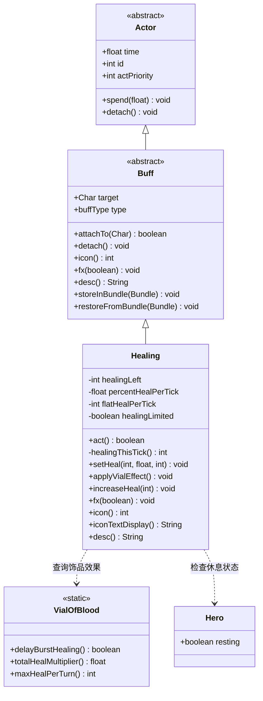

# Healing 源码详解

## 1. 基本信息

| 属性 | 值 |
|------|-----|
| **文件路径** | core/src/main/java/com/shatteredpixel/shatteredpixeldungeon/actors/buffs/Healing.java |
| **包名** | com.shatteredpixel.shatteredpixeldungeon.actors.buffs |
| **类类型** | public class |
| **继承关系** | extends Buff |
| **代码行数** | 148 |

---

## 类职责

Healing（治疗）是游戏中**持续治疗效果状态**的具体实现。它为角色提供**逐渐恢复生命值**的效果，每回合按固定比例或固定值进行治疗。

核心职责：
1. **持续治疗**：每回合恢复角色一定量的生命值
2. **治疗合并**：多个治疗来源可合并，保留最优属性
3. **VialOfBlood交互**：与血瓶饰品协同，限制每回合治疗量上限
4. **视觉反馈**：显示治疗数值动画和角色视觉效果

**与其他恢复机制的区别**：
- **Healing**：持续治疗状态，每回合恢复HP
- **直接恢复**：立即恢复HP（如某些道具）
- **Regeneration**：自然恢复，基于饥饿度

---

## 4. 继承与协作关系



---

## 静态常量表

| 常量名 | 值 | 用途 |
|--------|-----|------|
| `TICK` | (继承自Actor) | 回合时间单位，值为1.0f |
| `LEFT` | "left" | Bundle存储键，存储剩余治疗量 |
| `PERCENT` | "percent" | Bundle存储键，存储百分比治疗率 |
| `FLAT` | "flat" | Bundle存储键，存储固定治疗量 |
| `HEALING_LIMITED` | "healing_limited" | Bundle存储键，存储是否受限 |
| `HERO_PRIO` | (继承自Actor) | 英雄行动优先级基准值 |

---

## 实例字段表

| 字段名 | 类型 | 默认值 | 说明 |
|--------|------|--------|------|
| `healingLeft` | int | 0 | 剩余治疗总量 |
| `percentHealPerTick` | float | 0 | 每回合治疗百分比（相对于剩余量） |
| `flatHealPerTick` | int | 0 | 每回合固定治疗量 |
| `healingLimited` | boolean | false | 是否受VialOfBlood限制治疗速度 |
| `type` | buffType | POSITIVE | 继承自Buff，设置为正面效果 |
| `actPriority` | int | HERO_PRIO-1 | 继承自Actor，在英雄行动后立即执行 |

---

## 7. 方法详解

### 类初始化块

```java
{
    // 第42-48行：初始化块
    //unlike other buffs, this one acts after the hero and takes priority against other effects
    //healing is much more useful if you get some of it off before taking damage
    actPriority = HERO_PRIO - 1;
    
    type = buffType.POSITIVE;
}
```

**说明**：实例初始化块，设置Healing的核心属性。

**actPriority 设计理念**：
- 值为 `HERO_PRIO - 1`，意味着在英雄行动后**立即**执行治疗
- 这样设计的原因：在受到伤害前先治疗更有价值
- 例如：英雄满血时开始治疗，下一回合先治疗再被敌人攻击

**优先级对比**：
| 状态 | actPriority | 执行顺序 |
|------|-------------|---------|
| Healing | HERO_PRIO-1 | 英雄后立即执行 |
| 大多数Buff | 默认 | 较后执行 |
| 敌人 | 敌人优先级 | 更后执行 |

---

### act()

```java
@Override
public boolean act(){

    // 第1-6行：执行治疗（如果HP未满）
    if (target.HP < target.HT) {
        target.HP = Math.min(target.HT, target.HP + healingThisTick());

        if (target.HP == target.HT && target instanceof Hero) {
            ((Hero) target).resting = false;  // 满血时停止休息
        }
    }

    // 第7-8行：显示治疗动画
    target.sprite.showStatusWithIcon(CharSprite.POSITIVE, Integer.toString(healingThisTick()), FloatingText.HEALING);
    healingLeft -= healingThisTick();
    
    // 第9-13行：治疗完毕检查
    if (healingLeft <= 0){
        if (target instanceof Hero) {
            ((Hero) target).resting = false;  // 治疗结束停止休息
        }
        detach();
    }
    
    // 第14行：消耗一个回合
    spend( TICK );
    
    return true;
}
```

**方法作用**：每回合执行的治疗逻辑。

**执行流程**：
1. 检查目标HP是否未满
2. 恢复HP（不超过最大值）
3. 如果满血且是英雄，停止休息状态
4. 显示治疗动画（绿色数字）
5. 扣除已治疗的量
6. 治疗量为0时移除状态

**休息状态交互**：
- 当英雄在休息时获得治疗效果
- 满血或治疗结束时会自动停止休息

---

### healingThisTick()

```java
private int healingThisTick(){
    // 第1-3行：计算本回合治疗量
    int heal = (int)GameMath.gate(1,
            Math.round(healingLeft * percentHealPerTick) + flatHealPerTick,
            healingLeft);
    
    // 第4-6行：应用VialOfBlood限制
    if (healingLimited && heal > VialOfBlood.maxHealPerTurn()){
        heal = VialOfBlood.maxHealPerTurn();
    }
    return heal;
}
```

**方法作用**：计算本回合的治疗量。

**治疗量计算公式**：
```
heal = clamp(1, healingLeft × percentHealPerTick + flatHealPerTick, healingLeft)
```

**参数说明**：
- `GameMath.gate(min, value, max)`：将值限制在[min, max]范围内
- 最小值固定为1，确保每回合至少治疗1点
- 最大值为剩余治疗量，不会超量治疗

**VialOfBlood限制**：
- 当`healingLimited`为true时
- 每回合治疗量不超过`VialOfBlood.maxHealPerTurn()`
- 这个限制将"爆发治疗"转化为"持续治疗"

**计算示例**：
```java
// 假设 healingLeft = 100, percentHealPerTick = 0.25, flatHealPerTick = 0
// healingThisTick() = clamp(1, 100 × 0.25 + 0, 100) = 25

// 假设 healingLeft = 50, percentHealPerTick = 0.5, flatHealPerTick = 5
// healingThisTick() = clamp(1, 50 × 0.5 + 5, 50) = 30

// 假设 healingLeft = 100, healingLimited = true, maxHealPerTurn = 20
// healingThisTick() = min(30, 20) = 20
```

---

### setHeal(int amount, float percentPerTick, int flatPerTick)

```java
public void setHeal(int amount, float percentPerTick, int flatPerTick){
    // 第1-3行：合并治疗效果（取最大值）
    //multiple sources of healing do not overlap, but do combine the best of their properties
    healingLeft = Math.max(healingLeft, amount);
    percentHealPerTick = Math.max(percentHealPerTick, percentPerTick);
    flatHealPerTick = Math.max(flatHealPerTick, flatPerTick);
}
```

**方法作用**：设置或更新治疗参数。

**参数**：
| 参数 | 类型 | 说明 |
|------|------|------|
| `amount` | int | 治疗总量 |
| `percentPerTick` | float | 每回合治疗百分比 |
| `flatPerTick` | int | 每回合固定治疗量 |

**合并策略**：
- 多个治疗来源不会叠加，而是**取最优值**
- 这保证了高优先级治疗不会被低优先级覆盖
- 例如：太阳草的持续治疗（0%百分比）vs 治疗药水的快速治疗（25%百分比）

**设计意图**：
```
注释原文：multiple sources of healing do not overlap, but do combine the best of their properties
翻译：多个治疗来源不会重叠，但会结合它们最好的属性
```

**使用示例**：
```java
// 第一次设置：100HP，每回合25%
healing.setHeal(100, 0.25f, 0);

// 第二次设置：50HP，每回合50%，每回合+5
// 结果：healingLeft=100（取max），percentHealPerTick=0.5（取max），flatHealPerTick=5（取max）
healing.setHeal(50, 0.5f, 5);
```

---

### applyVialEffect()

```java
public void applyVialEffect(){
    // 第1行：检查是否需要限制
    healingLimited = VialOfBlood.delayBurstHealing();
    
    // 第2-4行：如果有限制，增加总治疗量
    if (healingLimited){
        healingLeft = Math.round(healingLeft * VialOfBlood.totalHealMultiplier());
    }
}
```

**方法作用**：应用VialOfBlood饰品的效果。

**VialOfBlood效果**：
1. **延迟爆发治疗**：将瞬间大量治疗分散到多个回合
2. **增加总治疗量**：根据饰品等级增加治疗总量

**totalHealMultiplier公式**：
```java
// VialOfBlood.totalHealMultiplier(level)
return 1f + 0.125f * (level + 1);

// 等级效果：
// 未装备：1.0（无加成）
// 等级0：1.125（+12.5%）
// 等级1：1.25（+25%）
// 等级2：1.375（+37.5%）
// 等级3：1.5（+50%）
```

**maxHealPerTurn限制**：
```java
// VialOfBlood.maxHealPerTurn(level)
// 基于英雄最大HP计算
// 等级0：4 + 15% HP
// 等级1：3 + 10% HP
// 等级2：2 + 7% HP
// 等级3：1 + 5% HP
```

**设计权衡**：饰品等级越高，每回合治疗上限越低，但总治疗量增加更多。

---

### increaseHeal(int amount)

```java
public void increaseHeal( int amount ){
    healingLeft += amount;
}
```

**方法作用**：增加剩余治疗量。

**参数**：
- `amount` (int)：要增加的治疗量

**使用场景**：在已有治疗状态上额外增加治疗量（不同于setHeal的合并逻辑）。

---

### fx(boolean on)

```java
@Override
public void fx(boolean on) {
    if (on) target.sprite.add( CharSprite.State.HEALING );
    else    target.sprite.remove( CharSprite.State.HEALING );
}
```

**方法作用**：管理治疗的视觉效果。

**参数**：
- `on` (boolean)：true=添加效果，false=移除效果

**CharSprite.State.HEALING 效果**：
- 角色周围显示治疗粒子效果
- 绿色的治愈光点环绕角色

---

### storeInBundle(Bundle bundle)

```java
private static final String LEFT = "left";
private static final String PERCENT = "percent";
private static final String FLAT = "flat";
private static final String HEALING_LIMITED = "healing_limited";

@Override
public void storeInBundle(Bundle bundle) {
    super.storeInBundle(bundle);                          // 第1行：存储父类数据
    bundle.put(LEFT, healingLeft);                        // 第2行：存储剩余治疗量
    bundle.put(PERCENT, percentHealPerTick);              // 第3行：存储百分比
    bundle.put(FLAT, flatHealPerTick);                    // 第4行：存储固定值
    bundle.put(HEALING_LIMITED, healingLimited);          // 第5行：存储限制标志
}
```

**方法作用**：将状态数据序列化保存（用于存档）。

**保存的数据**：
| 键 | 值类型 | 说明 |
|----|--------|------|
| `left` | int | 剩余治疗量 |
| `percent` | float | 每回合百分比 |
| `flat` | int | 每回合固定值 |
| `healing_limited` | boolean | 是否受限 |

---

### restoreFromBundle(Bundle bundle)

```java
@Override
public void restoreFromBundle(Bundle bundle) {
    super.restoreFromBundle(bundle);                          // 第1行：恢复父类数据
    healingLeft = bundle.getInt(LEFT);                         // 第2行：恢复剩余治疗量
    percentHealPerTick = bundle.getFloat(PERCENT);             // 第3行：恢复百分比
    flatHealPerTick = bundle.getInt(FLAT);                     // 第4行：恢复固定值
    healingLimited = bundle.getBoolean(HEALING_LIMITED);       // 第5行：恢复限制标志
}
```

**方法作用**：从序列化数据恢复状态。

---

### icon()

```java
@Override
public int icon() {
    return BuffIndicator.HEALING;  // 返回治疗图标索引（值为44）
}
```

**方法作用**：返回状态效果的图标索引。

**返回值**：`BuffIndicator.HEALING`（治疗图标，索引44）

---

### iconTextDisplay()

```java
@Override
public String iconTextDisplay() {
    return Integer.toString(healingLeft);  // 返回剩余治疗量的字符串
}
```

**方法作用**：返回在大图标上显示的文本。

**返回值**：剩余治疗量的字符串形式

**用途**：桌面版UI中，在治疗图标上显示剩余治疗数值

---

### desc()

```java
@Override
public String desc() {
    return Messages.get(this, "desc", healingThisTick(), healingLeft);
}
```

**方法作用**：返回状态效果的详细描述。

**返回值**：格式化的本地化描述文本

**消息格式**：
```
desc=正在逐渐恢复生命值。每回合恢复%d点，剩余%d点治疗量。
```

---

## 与其他类的交互

### 被哪些类使用

| 类名 | 使用方式 |
|------|---------|
| `PotionOfHealing` | 治疗药水创建Healing状态 |
| `Dewdrop` | 露水在VialOfBlood存在时创建Healing |
| `Sungrass` | 太阳草创建全额HP的Healing |
| `HealingDart` | 治疗飞镖创建Healing |
| `ElixirOfHoneyedHealing` | 蜂蜜治疗药剂创建Healing |
| `ElixirOfAquaticRejuvenation` | 水生回春药剂创建Healing |
| `WaterOfHealth` | 健康之水创建Healing |
| `Bomb` | 某些炸弹效果可能创建Healing |

### 依赖的类

| 类名 | 依赖方式 |
|------|---------|
| `VialOfBlood` | 查询治疗限制和加成 |
| `Hero` | 检查休息状态 |
| `BuffIndicator` | 提供状态图标 |
| `CharSprite` | 提供视觉效果 |
| `FloatingText` | 显示治疗数字 |
| `GameMath` | 数值计算辅助 |
| `Messages` | 国际化文本 |

---

## 11. 使用示例

### 基本用法

```java
// 创建一个持续治疗状态
Healing healing = Buff.affect(hero, Healing.class);
healing.setHeal(50, 0.25f, 0);  // 50HP总量，每回合25%

// 应用VialOfBlood效果（如果装备了）
healing.applyVialEffect();
```

### 治疗药水示例

```java
// PotionOfHealing.heal() 的实现
public static void heal(Char ch) {
    Healing healing = Buff.affect(ch, Healing.class);
    // 治疗量 = 80%最大HP + 14
    // 每回合恢复25%的剩余量
    healing.setHeal((int)(0.8f * ch.HT + 14), 0.25f, 0);
    healing.applyVialEffect();
}
```

**计算示例**（英雄20级，HP=100）：
- 治疗总量 = 0.8 × 100 + 14 = 94
- 第1回合：healingThisTick = 94 × 0.25 = 23，剩余71
- 第2回合：healingThisTick = 71 × 0.25 = 17，剩余54
- 第3回合：healingThisTick = 54 × 0.25 = 13，剩余41
- ...

### 太阳草示例

```java
// Sungrass 的实现
Buff.affect(ch, Healing.class).setHeal(ch.HT, 0, 1);
```

**特点**：
- 治疗总量 = 最大HP
- percentHealPerTick = 0（不按百分比）
- flatHealPerTick = 1（每回合固定1点）
- 结果：缓慢恢复到满血

### 露水与VialOfBlood交互

```java
// Dewdrop 的实现
if (heal > 0 && quantity > 1 && VialOfBlood.delayBurstHealing()) {
    Healing healing = Buff.affect(hero, Healing.class);
    // 每回合治疗量上限 = VialOfBlood.maxHealPerTurn()
    healing.setHeal(heal, 0, VialOfBlood.maxHealPerTurn());
    healing.applyVialEffect();
} else {
    // 直接恢复
    hero.HP += heal;
}
```

### 合并治疗效果

```java
// 场景：英雄已有Healing状态，又使用了治疗药水
Healing existing = hero.buff(Healing.class);
if (existing != null) {
    // setHeal会合并最优属性
    existing.setHeal(newAmount, newPercent, newFlat);
    existing.applyVialEffect();
} else {
    Healing healing = Buff.affect(hero, Healing.class);
    healing.setHeal(newAmount, newPercent, newFlat);
    healing.applyVialEffect();
}
```

### 自定义治疗效果

```java
// 创建一个快速治疗（每回合50%）
Healing quickHeal = Buff.affect(hero, Healing.class);
quickHeal.setHeal(30, 0.5f, 0);
// 第1回合：30 × 0.5 = 15
// 第2回合：15 × 0.5 = 7（最小1）
// 第3回合：8 × 0.5 = 4
// ...

// 创建一个稳定治疗（每回合固定5点）
Healing steadyHeal = Buff.affect(hero, Healing.class);
steadyHeal.setHeal(20, 0, 5);
// 每回合固定5点，共4回合
```

---

## 注意事项

### 治疗合并规则

```java
// setHeal 使用 Math.max，不会叠加
healing.setHeal(100, 0.25f, 0);  // healingLeft = 100
healing.setHeal(50, 0.5f, 5);     // healingLeft = 100（不覆盖）
                                   // percentHealPerTick = 0.5（更新）
                                   // flatHealPerTick = 5（更新）
```

### 优先级设计

```java
// actPriority = HERO_PRIO - 1
// 这意味着治疗在英雄行动后立即执行

// 好处：先恢复HP再被敌人攻击
// 例如：英雄有治疗状态，下一回合先恢复HP，再被敌人攻击
```

### VialOfBlood影响

```java
// 当装备VialOfBlood时：
// 1. 瞬间治疗变为持续治疗
// 2. 治疗总量增加
// 3. 每回合治疗量有上限

// 未装备VialOfBlood：
// - 治疗药水瞬间恢复HP
// - healingLimited = false

// 装备VialOfBlood：
// - 治疗药水创建Healing状态
// - healingLimited = true
// - 每回合治疗量不超过maxHealPerTurn()
```

### HP满时的行为

```java
// act() 中检查 HP < HT
if (target.HP < target.HT) {
    target.HP = Math.min(target.HT, target.HP + healingThisTick());
}

// 如果HP已满，不会执行治疗，但仍然消耗healingLeft
// 这是一种"浪费"，但设计上允许这种情况
```

### 休息状态

```java
// Healing会自动停止英雄的休息状态
if (target.HP == target.HT && target instanceof Hero) {
    ((Hero) target).resting = false;
}

// 治疗结束时也会停止休息
if (healingLeft <= 0){
    if (target instanceof Hero) {
        ((Hero) target).resting = false;
    }
    detach();
}
```

---

## 最佳实践

### 1. 正确设置治疗参数

```java
// 推荐：根据场景选择合适的百分比
// 快速治疗（治疗药水）
healing.setHeal(amount, 0.25f, 0);

// 稳定治疗（太阳草）
healing.setHeal(ch.HT, 0, 1);

// 带上限的治疗（露水）
healing.setHeal(amount, 0, VialOfBlood.maxHealPerTurn());
```

### 2. 始终调用applyVialEffect()

```java
// 正确做法
Healing healing = Buff.affect(target, Healing.class);
healing.setHeal(amount, percent, flat);
healing.applyVialEffect();  // 重要！

// 忘记调用可能导致：
// - VialOfBlood效果不生效
// - 治疗总量不增加
```

### 3. 检查现有状态

```java
// 使用 Buff.affect 而非 Buff.append
// affect 会获取现有实例，append 总是创建新实例

// 推荐
Healing healing = Buff.affect(hero, Healing.class);

// 不推荐（可能导致重复状态）
Healing healing = Buff.append(hero, Healing.class);
```

### 4. 理解合并逻辑

```java
// 当需要叠加治疗时，使用 increaseHeal
healing.increaseHeal(bonusAmount);

// 当需要更新治疗属性时，使用 setHeal
healing.setHeal(newAmount, newPercent, newFlat);
```

### 5. 序列化完整性

```java
// 如果扩展Healing类，确保新增字段被序列化
private static final String MY_FIELD = "my_field";

@Override
public void storeInBundle(Bundle bundle) {
    super.storeInBundle(bundle);
    bundle.put(MY_FIELD, myField);
}

@Override
public void restoreFromBundle(Bundle bundle) {
    super.restoreFromBundle(bundle);
    myField = bundle.getInt(MY_FIELD);
}
```

---

## 设计模式分析

### 治疗合并策略

Healing使用了"最优属性合并"策略：

```
当多个治疗来源同时存在时：
1. 不叠加治疗量（取最大值）
2. 不叠加治疗速度（取最大值）
3. 保留最好的属性组合

优点：
- 防止治疗效果过于强大
- 高质量治疗不会被低质量治疗稀释
- 简化治疗状态管理
```

### VialOfBlood设计

```
"延迟爆发治疗"模式：

原理：
- 将瞬间大量治疗转化为持续治疗
- 增加总治疗量作为补偿
- 限制每回合治疗量

平衡考量：
- 紧急情况下不能瞬间回满
- 总体收益更高（更多HP恢复）
- 鼓励提前使用治疗道具
```

---

## 相关文件

| 文件 | 关系 |
|------|------|
| `Buff.java` | 父类，提供状态效果基础 |
| `VialOfBlood.java` | 饰品，修改治疗行为 |
| `PotionOfHealing.java` | 主要使用者，治疗药水 |
| `Sungrass.java` | 使用者，太阳草 |
| `Dewdrop.java` | 使用者，露水 |
| `BuffIndicator.java` | 图标定义 |
| `CharSprite.java` | 视觉效果定义 |
| `FloatingText.java` | 治疗数字显示 |
| `GameMath.java` | 数值计算工具 |