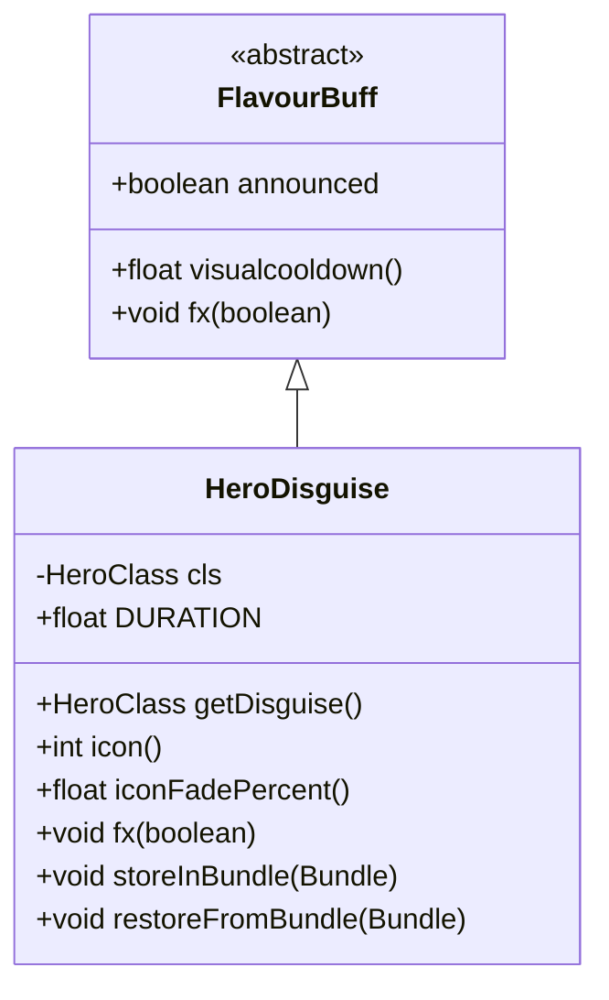

# HeroDisguise 类文档

## 1. 基本信息
| 属性 | 值 |
|------|-----|
| 文件路径 | core/src/main/java/com/shatteredpixel/shatteredpixeldungeon/actors/buffs/HeroDisguise.java |
| 包名 | com.shatteredpixel.shatteredpixeldungeon.actors.buffs |
| 类类型 | class |
| 继承关系 | extends FlavourBuff |
| 代码行数 | 84 行 |

## 2. 类职责说明
HeroDisguise 是一个管理英雄伪装效果的 Buff 类。它让英雄的外观变成另一个随机职业的样子，持续约 1000 回合。这个效果主要用于视觉上的娱乐和欺骗，不影响实际的游戏属性或能力。

## 4. 继承与协作关系


## 静态常量表
| 常量名 | 类型 | 值 | 说明 |
|--------|------|-----|------|
| DURATION | float | 1000f | 效果持续时间（回合） |
| CLASS | String | "class" | Bundle 存储键 - 伪装职业 |

## 实例字段表
| 字段名 | 类型 | 修饰符 | 说明 |
|--------|------|--------|------|
| cls | HeroClass | private | 伪装成的职业类型 |

## 7. 方法详解

### getDisguise()
**签名**: `public HeroClass getDisguise()`
**功能**: 获取伪装的职业类型
**返回值**: HeroClass - 伪装成的职业
**实现逻辑**:
```
第42-44行: 直接返回 cls 字段
```

### icon()
**签名**: `public int icon()`
**功能**: 返回 Buff 图标标识符
**返回值**: int - BuffIndicator.DISGUISE（伪装图标）
**实现逻辑**:
```
第47-49行: 返回伪装图标
```

### iconFadePercent()
**签名**: `public float iconFadePercent()`
**功能**: 计算图标淡入淡出百分比
**返回值**: float - 0到1之间的值，表示剩余时间的比例
**实现逻辑**:
```
第52-54行: 根据剩余冷却时间和总持续时间计算淡入淡出比例
```

### fx(boolean on)
**签名**: `public void fx(boolean on)`
**功能**: 应用或移除视觉伪装效果
**参数**:
- on: boolean - true 表示启用效果，false 表示禁用
**实现逻辑**:
```
第58-63行: 检查目标是否为 Hero 且精灵为 HeroSprite
         如果 cls 为 null，随机选择一个不同于当前职业的伪装
第65-66行: 启用时应用伪装，禁用时恢复原职业外观
第67行: 更新头像显示
```

### storeInBundle(Bundle bundle)
**签名**: `public void storeInBundle(Bundle bundle)`
**功能**: 将 Buff 状态保存到 Bundle 中以支持游戏存档
**参数**:
- bundle: Bundle - 存储容器
**实现逻辑**:
```
第75-76行: 调用父类存储方法，保存伪装职业类型
```

### restoreFromBundle(Bundle bundle)
**签名**: `public void restoreFromBundle(Bundle bundle)`
**功能**: 从 Bundle 恢复 Buff 状态
**参数**:
- bundle: Bundle - 存储容器
**实现逻辑**:
```
第81-82行: 调用父类恢复方法，恢复伪装职业类型
```

## 11. 使用示例
```java
// 给英雄添加伪装效果
HeroDisguise disguise = Buff.affect(hero, HeroDisguise.class);

// 伪装会在启用时随机选择一个不同的职业外观
// 玩家看起来像是另一个职业的角色

// 获取当前伪装的职业
HeroClass currentDisguise = disguise.getDisguise();

// 1000回合后效果自动消失，恢复原职业外观
```

## 注意事项
1. **纯视觉效果**: 伪装只改变外观，不影响实际属性或能力
2. **随机选择**: 伪装职业是随机选择的，但不会是英雄的真实职业
3. **持续时间**: 效果持续约 1000 回合（很长的时间）
4. **存档兼容**: 伪装职业会被保存和恢复
5. **头像更新**: 效果应用和移除时会更新游戏界面上的头像

## 最佳实践
1. 这主要用于娱乐效果，不应用于核心游戏机制
2. 可以用于特殊事件或彩蛋
3. 考虑在某些特殊情况下可能需要检查真实职业而非伪装