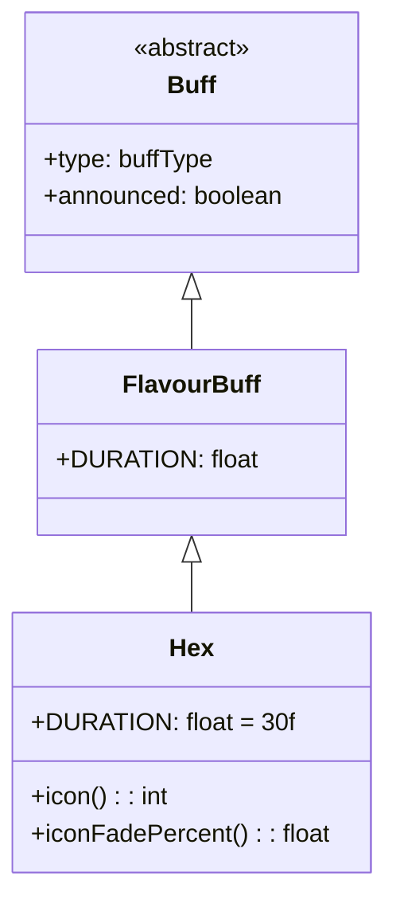

# Hex 类文档

## 1. 基本信息
| 属性 | 值 |
|------|-----|
| 文件路径 | core/src/main/java/com/shatteredpixel/shatteredpixeldungeon/actors/buffs/Hex.java |
| 包名 | com.shatteredpixel.shatteredpixeldungeon.actors.buffs |
| 类类型 | class |
| 继承关系 | extends FlavourBuff |
| 代码行数 | 44 |

## 2. 类职责说明
Hex（诅咒）是一个负面Buff，使受影响的角色的准确率和躲避率降低。诅咒状态下角色的战斗能力下降，更容易被击中且更难击中敌人。主要用于诅咒武器、特定敌人攻击等场景。

## 4. 继承与协作关系


## 静态常量表
| 常量名 | 类型 | 值 | 说明 |
|--------|------|-----|------|
| DURATION | float | 30f | 默认持续时间（回合数） |

## 实例字段表
| 字段名 | 类型 | 修饰符 | 说明 |
|--------|------|--------|------|
| type | buffType | - | NEGATIVE（负面Buff） |
| announced | boolean | - | true（会公告） |

## 7. 方法详解

### icon()
**签名**: `public int icon()`
**功能**: 返回Buff图标的索引标识符。
**返回值**: int - 返回BuffIndicator.HEX（诅咒图标）。

### iconFadePercent()
**签名**: `public float iconFadePercent()`
**功能**: 计算Buff图标的淡出百分比，用于显示剩余时间。
**返回值**: float - 返回一个0到1之间的值，表示图标应显示的完整度。
**实现逻辑**:
```java
return Math.max(0, (DURATION - visualcooldown()) / DURATION);
// 计算剩余时间比例
```

## 11. 使用示例
```java
// 对敌人施加诅咒效果，持续30回合
Buff.affect(enemy, Hex.class, Hex.DURATION);

// 检查是否有诅咒Buff
if (hero.buff(Hex.class) != null) {
    // 英雄准确率和躲避率降低
}

// 延长诅咒时间
Buff.prolong(hero, Hex.class, 15f);
```

## 注意事项
1. 诅咒效果降低准确率和躲避率
2. 实际的战斗效果在Char类中检查此Buff实现
3. 是负面Buff，会被净化效果移除
4. 持续时间较长（30回合）
5. 会显示公告消息

## 最佳实践
1. 对高躲避敌人使用可以有效提高命中率
2. 在危险时避免被诅咒
3. 使用净化道具尽快移除
4. 配合其他减益效果叠加使用