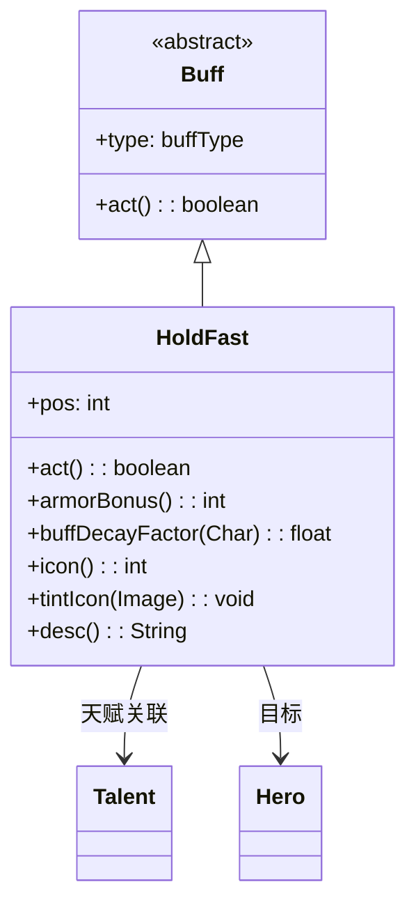

# HoldFast 类文档

## 1. 基本信息
| 属性 | 值 |
|------|-----|
| 文件路径 | core/src/main/java/com/shatteredpixel/shatteredpixeldungeon/actors/buffs/HoldFast.java |
| 包名 | com.shatteredpixel.shatteredpixeldungeon.actors.buffs |
| 类类型 | class |
| 继承关系 | extends Buff |
| 代码行数 | 110 |

## 2. 类职责说明
HoldFast（坚守）是一个正面Buff，使战士在原地不动时获得护甲加成。只有当角色保持在同一位置时才有效，移动后Buff会自动移除。与坚守天赋绑定，护甲加成和连击时间衰减减缓效果随天赋等级增加。

## 4. 继承与协作关系


## 静态常量表
| 常量名 | 类型 | 值 | 说明 |
|--------|------|-----|------|
| POS | String | "pos" | Bundle存储键 - 位置 |

## 实例字段表
| 字段名 | 类型 | 修饰符 | 说明 |
|--------|------|--------|------|
| pos | int | public | 记录的位置（用于检测移动） |
| type | buffType | - | POSITIVE（正面Buff） |

## 7. 方法详解

### act()
**签名**: `public boolean act()`
**功能**: 每回合检查是否移动，移动则移除Buff。
**返回值**: boolean - 返回true表示成功执行。
**实现逻辑**:
```java
if (pos != target.pos) {
    detach();  // 位置改变则移除
} else {
    spend(TICK);
}
return true;
```

### armorBonus()
**签名**: `public int armorBonus()`
**功能**: 获取护甲加成值。
**返回值**: int - 护甲加成值。
**实现逻辑**:
```java
// 检查位置是否匹配且是英雄
if (pos == target.pos && target instanceof Hero) {
    // 返回天赋值到2倍天赋值之间的随机数
    return Random.NormalIntRange(
        ((Hero) target).pointsInTalent(Talent.HOLD_FAST),
        2 * ((Hero) target).pointsInTalent(Talent.HOLD_FAST)
    );
} else {
    detach();
    return 0;
}
```

### buffDecayFactor(Char target)
**签名**: `public static float buffDecayFactor(Char target)`
**功能**: 静态方法，获取连击时间衰减系数。
**参数**:
- target: Char - 目标角色
**返回值**: float - 衰减系数（越小衰减越慢）。
**实现逻辑**:
```java
HoldFast buff = target.buff(HoldFast.class);
if (buff != null && target.pos == buff.pos && target instanceof Hero) {
    switch (((Hero) target).pointsInTalent(Talent.HOLD_FAST)) {
        case 1: return 0.5f;   // 1级：衰减减半
        case 2: return 0.25f;  // 2级：衰减1/4
        case 3: return 0;      // 3级：不衰减
    }
} else if (buff != null) {
    buff.detach();  // 位置不匹配则移除
}
return 1;  // 默认正常衰减
```

### icon()
**签名**: `public int icon()`
**功能**: 返回Buff图标的索引标识符。
**返回值**: int - 返回BuffIndicator.ARMOR（护甲图标）。

### tintIcon(Image icon)
**签名**: `public void tintIcon(Image icon)`
**功能**: 为Buff图标设置颜色色调。
**参数**:
- icon: Image - 需要着色的图标图像
**实现逻辑**:
```java
icon.hardlight(1.9f, 2.4f, 3.25f);  // 设置浅蓝色高光效果
```

### desc()
**签名**: `public String desc()`
**功能**: 返回Buff的详细描述文本。
**返回值**: String - 包含天赋信息的描述。

## 11. 使用示例
```java
// 添加坚守效果（通常在等待时触发）
HoldFast holdFast = Buff.affect(hero, HoldFast.class);
holdFast.pos = hero.pos;  // 记录当前位置

// 获取护甲加成
int bonus = holdFast.armorBonus();

// 检查连击衰减系数
float decayFactor = HoldFast.buffDecayFactor(hero);
```

## 注意事项
1. 只在原地不动时有效
2. 移动后Buff自动移除
3. 护甲加成与天赋等级相关
4. 高天赋可以减缓连击时间衰减
5. 是正面Buff

## 最佳实践
1. 在防守时使用获得护甲加成
2. 配合连击系统使用（减缓衰减）
3. 3级天赋时连击时间不衰减
4. 注意移动会立即失去效果