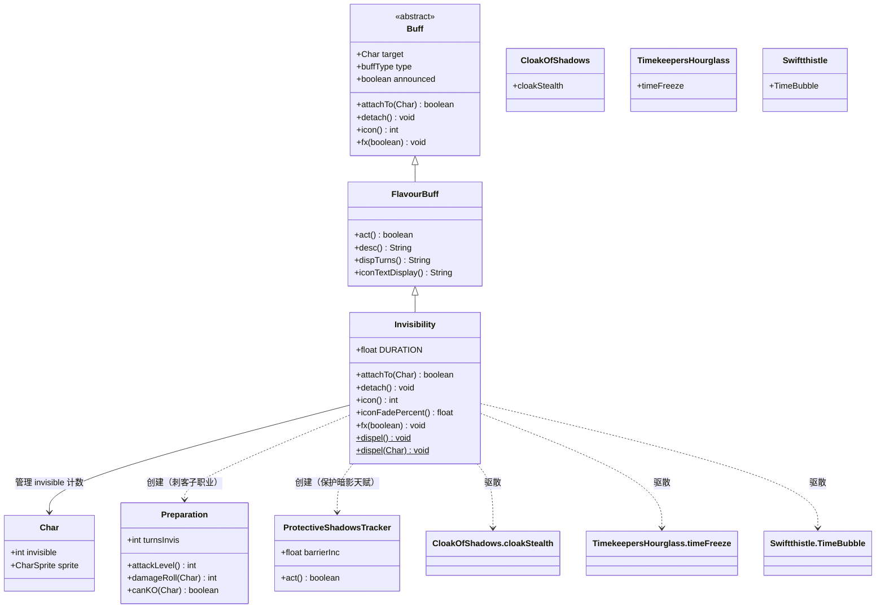

# Invisibility 源码详解

## 1. 基本信息

| 属性 | 值 |
|------|-----|
| **文件路径** | core/src/main/java/com/shatteredpixel/shatteredpixeldungeon/actors/buffs/Invisibility.java |
| **包名** | com.shatteredpixel.shatteredpixeldungeon.actors.buffs |
| **类类型** | public class |
| **继承关系** | extends FlavourBuff |
| **代码行数** | 121 |
| **状态类型** | POSITIVE（正面效果） |

---

## 类职责

Invisibility（隐身）是游戏中管理角色隐身状态的核心 Buff 类。

**核心职责：**
1. **隐身状态管理**：管理角色的隐身层数（`target.invisible`）
2. **视觉特效**：控制角色精灵的透明度显示
3. **子职业联动**：与刺客子职业的 Preparation（准备）状态联动
4. **天赋联动**：与"保护暗影"天赋联动，提供护盾效果
5. **驱散机制**：提供统一的隐身及相关状态驱散方法

**游戏效果：**
- 隐身状态下敌人无法发现玩家
- 隐身状态下攻击可获得偷袭伤害加成
- 某些行动会驱散隐身效果

---

## 4. 继承与协作关系



---

## 静态常量表

| 常量名 | 类型 | 值 | 说明 |
|--------|------|-----|------|
| `DURATION` | float | 20f | 隐身效果的默认持续时间（20回合） |

---

## 实例字段表

| 字段名 | 类型 | 来源 | 说明 |
|--------|------|------|------|
| `type` | buffType | 初始化块 | 设为 POSITIVE（正面效果） |
| `announced` | boolean | 初始化块 | 设为 true（获得/失去时显示提示） |
| `target` | Char | 继承自 Buff | 状态效果附加的目标角色 |

---

## 7. 方法详解

### 初始化块

```java
{
    type = buffType.POSITIVE;  // 设置为正面效果
    announced = true;          // 获得/失去时显示提示消息
}
```

**逐行解释：**
- **第41行**：`type = buffType.POSITIVE` — 将此状态标记为正面效果，UI 中将以绿色显示
- **第42行**：`announced = true` — 当角色获得或失去此状态时，会在游戏界面显示提示消息

---

### attachTo(Char target)

```java
@Override
public boolean attachTo( Char target ) {
    if (super.attachTo( target )) {                    // 第47行：调用父类附加方法
        target.invisible++;                            // 第48行：增加隐身层数
        if (target instanceof Hero && ((Hero) target).subClass == HeroSubClass.ASSASSIN){
            Buff.affect(target, Preparation.class);    // 第50行：刺客子职业获得准备状态
        }
        if (target instanceof Hero && ((Hero) target).hasTalent(Talent.PROTECTIVE_SHADOWS)){
            Buff.affect(target, Talent.ProtectiveShadowsTracker.class);  // 第53行：保护暗影天赋
        }
        return true;                                    // 第55行：返回成功
    } else {
        return false;                                   // 第57行：附加失败
    }
}
```

**逐行解释：**

| 行号 | 代码 | 说明 |
|------|------|------|
| 47 | `if (super.attachTo( target ))` | 调用父类 `FlavourBuff.attachTo()`，执行标准的 Buff 附加逻辑（免疫检查、添加到目标等） |
| 48 | `target.invisible++` | 增加目标的隐身层数计数器。`Char.invisible` 是一个整数，支持多层隐身叠加 |
| 49-50 | 刺客子职业检查 | 如果目标是英雄且子职业是刺客（ASSASSIN），自动附加 `Preparation` 状态 |
| 51 | `Buff.affect(target, Preparation.class)` | 获取或创建 Preparation 状态，用于追踪隐身回合数并计算偷袭伤害加成 |
| 52-53 | 保护暗影天赋检查 | 如果目标是英雄且拥有"保护暗影"天赋（PROTECTIVE_SHADOWS），附加护盾追踪器 |
| 54 | `Buff.affect(...)` | ProtectiveShadowsTracker 会在隐身期间每回合为英雄提供护盾 |
| 55 | `return true` | 附加成功，返回 true |
| 57 | `return false` | 附加失败（通常因为目标免疫），返回 false |

**关键设计点：**
- 隐身层数使用计数器设计，允许多个隐身来源叠加
- 刺客子职业的 Preparation 是隐身的核心玩法，提供偷袭加成
- 保护暗影天赋使隐身期间获得护盾，增加生存能力

---

### detach()

```java
@Override
public void detach() {
    if (target.invisible > 0)          // 第63行：检查隐身层数
        target.invisible--;             // 第64行：减少隐身层数
    super.detach();                     // 第65行：调用父类移除逻辑
}
```

**逐行解释：**

| 行号 | 代码 | 说明 |
|------|------|------|
| 63 | `if (target.invisible > 0)` | 安全检查，确保隐身层数不会变成负数 |
| 64 | `target.invisible--` | 减少隐身层数计数器 |
| 65 | `super.detach()` | 调用父类的 `detach()` 方法，从目标移除此 Buff 并清理视觉特效 |

**关键设计点：**
- 使用计数器而非布尔值，正确处理多层隐身的情况
- 当 `invisible` 降为 0 时，角色才会真正显形
- `super.detach()` 会触发 `fx(false)` 移除视觉特效

---

### icon()

```java
@Override
public int icon() {
    return BuffIndicator.INVISIBLE;    // 第70行：返回隐身图标索引
}
```

**逐行解释：**

| 行号 | 代码 | 说明 |
|------|------|------|
| 70 | `return BuffIndicator.INVISIBLE` | 返回 `BuffIndicator.INVISIBLE`（值为 12），这是状态栏中显示的隐身图标 |

---

### iconFadePercent()

```java
@Override
public float iconFadePercent() {
    return Math.max(0, (DURATION - visualcooldown()) / DURATION);  // 第75行
}
```

**逐行解释：**

| 行号 | 代码 | 说明 |
|------|------|------|
| 75 | `Math.max(0, (DURATION - visualcooldown()) / DURATION)` | 计算图标的填充百分比（0-1） |

**计算逻辑：**
- `visualcooldown()` 返回剩余回合数（从 FlavourBuff 继承）
- 公式：`(总时长 - 剩余时间) / 总时长 = 已消耗比例`
- 使用 `Math.max(0, ...)` 确保不会返回负值
- 当剩余时间 = DURATION 时，填充 = 0（刚获得时图标全满）
- 当剩余时间 = 0 时，填充 = 1（即将结束时图标全淡）

---

### fx(boolean on)

```java
@Override
public void fx(boolean on) {
    if (on) target.sprite.add( CharSprite.State.INVISIBLE );        // 第80行
    else if (target.invisible == 0) target.sprite.remove( CharSprite.State.INVISIBLE );  // 第81行
}
```

**逐行解释：**

| 行号 | 代码 | 说明 |
|------|------|------|
| 80 | `if (on) target.sprite.add(CharSprite.State.INVISIBLE)` | 当附加此状态时，为角色精灵添加隐身视觉状态，使角色变半透明 |
| 81 | `else if (target.invisible == 0)` | 当移除状态时，只有在隐身层数降为 0 时才真正移除视觉特效 |
| 81 | `target.sprite.remove(...)` | 移除角色的隐身视觉状态，恢复正常显示 |

**关键设计点：**
- 移除时的 `target.invisible == 0` 检查非常重要
- 如果有多个隐身来源叠加，移除其中一个不应让角色显形
- 只有当所有隐身效果都消失时，才移除视觉特效

---

### dispel()（静态方法 - 无参版本）

```java
public static void dispel() {
    if (Dungeon.hero == null) return;    // 第85行：空检查
    
    dispel(Dungeon.hero);                 // 第87行：调用重载方法
}
```

**逐行解释：**

| 行号 | 代码 | 说明 |
|------|------|------|
| 85 | `if (Dungeon.hero == null) return` | 安全检查，如果英雄不存在则直接返回 |
| 87 | `dispel(Dungeon.hero)` | 调用带参数的 dispel 方法，驱散英雄的所有隐身相关状态 |

**使用场景：**
- 当英雄进行某些会打破隐身的行动时调用
- 如攻击、使用物品、开门等

---

### dispel(Char ch)（静态方法 - 带参版本）

```java
public static void dispel(Char ch){

    for ( Buff invis : ch.buffs( Invisibility.class )){   // 第92行
        invis.detach();                                    // 第93行
    }
    CloakOfShadows.cloakStealth cloakBuff = ch.buff( CloakOfShadows.cloakStealth.class );
    if (cloakBuff != null) {                              // 第96行
        cloakBuff.dispel();                               // 第97行
    }

    //these aren't forms of invisibility, but do dispel at the same time as it.
    TimekeepersHourglass.timeFreeze timeFreeze = ch.buff( TimekeepersHourglass.timeFreeze.class );
    if (timeFreeze != null) {                             // 第102行
        timeFreeze.detach();                              // 第103行
    }

    Preparation prep = ch.buff( Preparation.class );
    if (prep != null){                                    // 第107行
        prep.detach();                                    // 第108行
    }

    Swiftthistle.TimeBubble bubble =  ch.buff( Swiftthistle.TimeBubble.class );
    if (bubble != null){                                  // 第112行
        bubble.detach();                                  // 第113行
    }

    RoundShield.GuardTracker guard = ch.buff(RoundShield.GuardTracker.class);
    if (guard != null && guard.hasBlocked){               // 第117行
        guard.detach();                                   //第118行
    }
}
```

**逐行解释：**

| 行号 | 代码 | 说明 |
|------|------|------|
| 92-93 | 遍历并移除所有 Invisibility 实例 | 使用 `ch.buffs(Invisibility.class)` 获取所有隐身状态实例并逐一移除 |
| 95-97 | 移除暗影斗篷隐身 | 暗影斗篷（CloakOfShadows）有自己的隐身状态 `cloakStealth`，需要特殊处理 |
| 100-103 | 移除时间冻结 | 时之沙漏的时间冻结效果（timeFreeze）虽然不是隐身，但在同一时机驱散 |
| 106-108 | 移除准备状态 | 刺客的准备状态（Preparation）应该与隐身一同移除 |
| 111-113 | 移除时间气泡 | 迅捷蓟的时间气泡（TimeBubble）效果同时驱散 |
| 116-118 | 移除圆盾格挡追踪器 | 如果圆盾格挡追踪器已成功格挡过，则一同移除 |

**驱动散的状态列表：**

| 状态类 | 来源 | 说明 |
|--------|------|------|
| `Invisibility` | 隐身药水、卷轴等 | 普通隐身效果 |
| `CloakOfShadows.cloakStealth` | 暗影斗篷神器 | 盗贼专用的隐身能力 |
| `TimekeepersHourglass.timeFreeze` | 时之沙漏神器 | 时间冻结效果 |
| `Preparation` | 刺客子职业 | 偷袭准备状态 |
| `Swiftthistle.TimeBubble` | 迅捷蓟植物 | 时间气泡效果 |
| `RoundShield.GuardTracker` | 圆盾 | 格挡后追踪器（条件性移除） |

**设计理念：**
- 注释说明：第100-101行的注释指出，某些效果虽然不是隐身形式，但会在同一时机驱散
- 这提供了统一的游戏机制：攻击等行动会同时打断这些"潜伏/准备"类状态

---

## 11. 使用示例

### 1. 给角色添加隐身效果

```java
// 基础用法：给角色添加默认20回合隐身
Buff.affect(hero, Invisibility.class, Invisibility.DURATION);

// 使用 prolong 延长现有隐身时间
Buff.prolong(hero, Invisibility.class, 10f);

// 自定义持续时间
Buff.affect(hero, Invisibility.class, 15f);
```

### 2. 驱散隐身效果

```java
// 驱散英雄的所有隐身相关状态（最常用）
Invisibility.dispel();

// 驱散特定角色的隐身状态
Invisibility.dispel(enemy);
```

### 3. 检查角色是否隐身

```java
// 检查隐身层数
if (hero.invisible > 0) {
    // 角色处于隐身状态
}

// 获取具体的隐身 Buff
Invisibility invis = hero.buff(Invisibility.class);
if (invis != null) {
    float remaining = invis.visualcooldown();
    // 剩余回合数
}
```

### 4. 在自定义物品中使用

```java
public class CustomPotion extends Potion {
    @Override
    public void apply(Hero hero) {
        // 给予15回合隐身
        Buff.affect(hero, Invisibility.class, 15f);
        GLog.i("你变得透明了！");
    }
}
```

### 5. 条件性驱散

```java
// 攻击时通常会驱散隐身
public void attack(Char target) {
    // 某些攻击不驱散隐身（如某些天赋或物品）
    if (!preservesInvisibility) {
        Invisibility.dispel();
    }
    // 执行攻击...
}
```

---

## 注意事项

### 1. 隐身层数机制

- `Char.invisible` 是**整数计数器**而非布尔值
- 多个隐身来源可以叠加（如药水+暗影斗篷）
- 只有当 `invisible == 0` 时角色才真正显形
- 移除单个隐身效果时不应移除视觉特效（`fx()` 方法处理此逻辑）

### 2. 刺客子职业联动

- 刺客（ASSASSIN）获得隐身时自动获得 `Preparation` 状态
- Preparation 追踪隐身回合数，提供偷袭伤害加成
- 伤害加成随隐身时间增加，最高可达50%额外伤害
- 还可触发瞬移攻击（Blink Strike）

### 3. 保护暗影天赋

- 拥有 PROTECTIVE_SHADOWS 天赋的盗贼在隐身期间获得护盾
- 护盾每1-2回合增加1点，上限为3-5点（取决于天赋等级）
- ProtectiveShadowsTracker 在隐身期间持续运行

### 4. 驱散时机

以下行动通常会触发隐身驱散：
- 攻击敌人
- 使用物品
- 开门
- 拾取物品
- 某些法术施放

### 5. 与其他效果的交互

| 效果 | 交互方式 |
|------|----------|
| 暗影斗篷 | 独立隐身来源，使用 `cloakStealth.dispel()` 而非 `detach()` |
| 时间冻结 | 同时驱散，但效果不同 |
| 时间气泡 | 迅捷蓟的额外效果，同时驱散 |
| 准备状态 | 刺客专属，隐身驱散时同时移除 |

---

## 最佳实践

### 1. 添加隐身

```java
// 推荐：使用 affect/append 方法
Buff.affect(hero, Invisibility.class, Invisibility.DURATION);

// 不推荐：直接 new 和 attachTo
Invisibility invis = new Invisibility();
invis.attachTo(hero);  // 缺少持续时间管理
```

### 2. 驱散隐身

```java
// 推荐：使用静态 dispel 方法，处理所有相关状态
Invisibility.dispel();

// 不推荐：只移除 Invisibility 类
Buff.detach(hero, Invisibility.class);  // 遗漏了暗影斗篷等
```

### 3. 检查隐身状态

```java
// 推荐：检查 invisible 计数器
if (hero.invisible > 0) {
    // 角色隐身中
}

// 注意：检查特定 Buff 只能发现部分隐身来源
Invisibility invis = hero.buff(Invisibility.class);  // 不包括暗影斗篷
```

### 4. 自定义驱散条件

```java
// 某些攻击可能保留隐身
public boolean attackPreservesInvisibility() {
    // 例如：某些天赋或装备
    return hasTalent(Talent.SHADOW_STRIKER) || hasBuff(ShadowForm.class);
}

public void performAttack() {
    if (!attackPreservesInvisibility()) {
        Invisibility.dispel();
    }
    // 执行攻击
}
```

### 5. 正确处理视觉效果

```java
// 在自定义隐身类中，确保 fx 方法正确处理多层
@Override
public void fx(boolean on) {
    if (on) {
        target.sprite.add(CharSprite.State.INVISIBLE);
    } else if (target.invisible == 0) {  // 关键：检查计数器
        target.sprite.remove(CharSprite.State.INVISIBLE);
    }
}
```

---

## 相关类

| 类名 | 关系 | 说明 |
|------|------|------|
| `FlavourBuff` | 父类 | 提供基础的持续时间管理 |
| `Buff` | 祖父类 | 提供 attach/detach 基础逻辑 |
| `Char` | 目标类 | 拥有 `invisible` 计数器 |
| `Preparation` | 关联类 | 刺客的偷袭准备状态 |
| `CloakOfShadows.cloakStealth` | 类似类 | 盗贼神器的隐身实现 |
| `CharSprite.State.INVISIBLE` | 视觉类 | 隐身的视觉表现 |
| `BuffIndicator.INVISIBLE` | UI类 | 状态栏图标索引 |