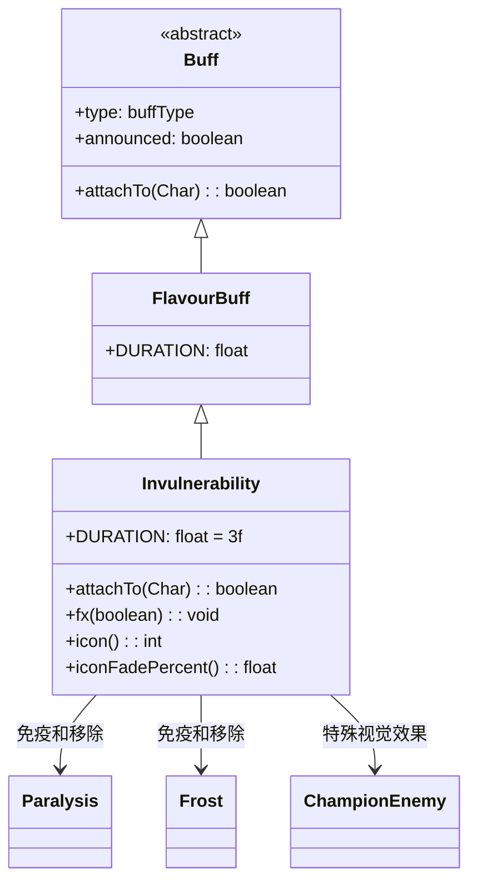

# Invulnerability 类文档

## 1. 基本信息
| 属性 | 值 |
|------|-----|
| 文件路径 | core/src/main/java/com/shatteredpixel/shatteredpixeldungeon/actors/buffs/Invulnerability.java |
| 包名 | com.shatteredpixel.shatteredpixeldungeon.actors.buffs |
| 类类型 | class |
| 继承关系 | extends FlavourBuff |
| 代码行数 | 69 |

## 2. 类职责说明
Invulnerability（无敌）是一个正面Buff，使角色在持续时间内完全免疫所有伤害。添加时会移除麻痹和冰冻效果，并对这两个效果免疫。冠军敌人有特殊的视觉效果处理。主要用于安卡复活、特定技能效果等场景。

## 4. 继承与协作关系


## 静态常量表
| 常量名 | 类型 | 值 | 说明 |
|--------|------|-----|------|
| DURATION | float | 3f | 默认持续时间（回合数） |

## 实例字段表
| 字段名 | 类型 | 修饰符 | 说明 |
|--------|------|--------|------|
| type | buffType | - | POSITIVE（正面Buff） |
| announced | boolean | - | true（会公告） |
| immunities | HashSet | - | 包含Paralysis.class和Frost.class |

## 7. 方法详解

### attachTo(Char target)
**签名**: `public boolean attachTo(Char target)`
**功能**: 重写附加方法，添加时移除麻痹和冰冻效果。
**参数**:
- target: Char - 目标角色
**返回值**: boolean - 是否成功附加。
**实现逻辑**:
```java
if (super.attachTo(target)) {
    Buff.detach(target, Paralysis.class);  // 移除麻痹
    Buff.detach(target, Frost.class);      // 移除冰冻
    return true;
}
return false;
```

### fx(boolean on)
**签名**: `public void fx(boolean on)`
**功能**: 设置角色的视觉效果（金色光环）。
**参数**:
- on: boolean - true表示添加效果，false表示移除效果
**实现逻辑**:
```java
// 冠军敌人有特殊处理，不添加光环
if (!target.buffs(ChampionEnemy.class).isEmpty()) return;
if (on) {
    target.sprite.aura(0xFFFF00, 5);  // 添加金色光环
} else {
    target.sprite.clearAura();        // 清除光环
}
```

### icon()
**签名**: `public int icon()`
**功能**: 返回Buff图标的索引标识符。
**返回值**: int - 返回BuffIndicator.ANKH（安卡图标）。

### iconFadePercent()
**签名**: `public float iconFadePercent()`
**功能**: 计算Buff图标的淡出百分比。
**返回值**: float - 图标完整度比例。

## 11. 使用示例
```java
// 为英雄添加无敌效果，持续3回合
Buff.affect(hero, Invulnerability.class, Invulnerability.DURATION);

// 检查是否有无敌
if (hero.buff(Invulnerability.class) != null) {
    // 英雄免疫所有伤害
}
```

## 注意事项
1. 无敌状态完全免疫伤害
2. 添加时移除麻痹和冰冻
3. 对麻痹和冰冻免疫
4. 持续时间很短（3回合）
5. 冠军敌人有特殊视觉效果处理
6. 是正面Buff

## 最佳实践
1. 在危急时刻使用
2. 安卡复活后自动获得
3. 利用无敌时间调整战术
4. 配合攻击可以安全输出