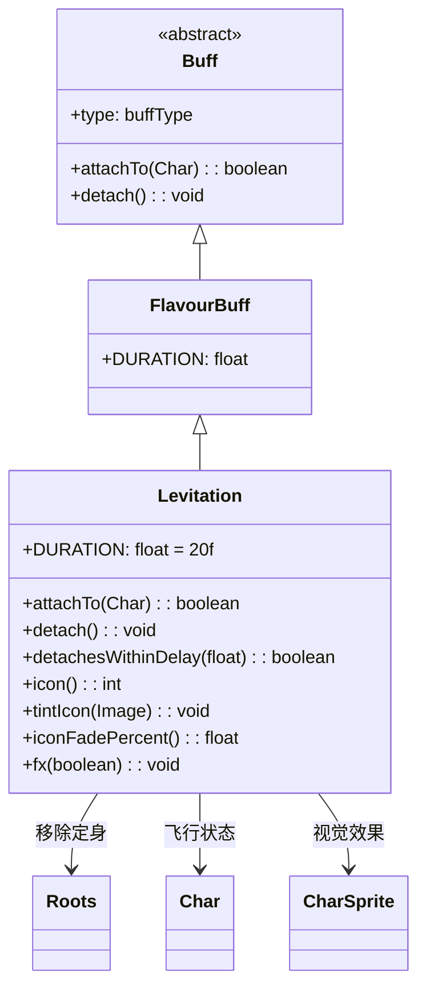

# Levitation 类文档

## 1. 基本信息
| 属性 | 值 |
|------|-----|
| 文件路径 | core/src/main/java/com/shatteredpixel/shatteredpixeldungeon/actors/buffs/Levitation.java |
| 包名 | com.shatteredpixel.shatteredpixeldungeon.actors.buffs |
| 类类型 | class |
| 继承关系 | extends FlavourBuff |
| 代码行数 | 96 |

## 2. 类职责说明
Levitation（漂浮）是一个正面Buff，使角色获得漂浮能力。漂浮状态下角色可以飞越陷阱、水面、深渊等地形，不受地面效果影响。添加时会移除定身效果，移除时会重新检查当前位置。主要用于漂浮药剂、神器效果等场景。

## 4. 继承与协作关系


## 静态常量表
| 常量名 | 类型 | 值 | 说明 |
|--------|------|-----|------|
| DURATION | float | 20f | 默认持续时间（回合数） |

## 实例字段表
| 字段名 | 类型 | 修饰符 | 说明 |
|--------|------|--------|------|
| type | buffType | - | POSITIVE（正面Buff） |

## 7. 方法详解

### attachTo(Char target)
**签名**: `public boolean attachTo(Char target)`
**功能**: 重写附加方法，添加时设置飞行状态并移除定身。
**参数**:
- target: Char - 目标角色
**返回值**: boolean - 是否成功附加。
**实现逻辑**:
```java
if (super.attachTo(target)) {
    target.flying = true;              // 设置飞行状态
    Roots.detach(target, Roots.class); // 移除定身效果
    return true;
}
return false;
```

### detach()
**签名**: `public void detach()`
**功能**: 重写移除方法，移除飞行状态并检查当前位置。
**实现逻辑**:
```java
target.flying = false;  // 取消飞行状态
super.detach();
// 只有在游戏场景中才检查位置
if (ShatteredPixelDungeon.scene() instanceof GameScene) {
    Dungeon.level.occupyCell(target);  // 重新检查当前位置（可能触发陷阱）
}
```

### detachesWithinDelay(float delay)
**签名**: `public boolean detachesWithinDelay(float delay)`
**功能**: 检查漂浮是否会在指定延迟内结束。
**参数**:
- delay: float - 延迟时间
**返回值**: boolean - 是否会在延迟内结束。
**实现逻辑**:
```java
// 如果有时间气泡效果，不会在延迟内结束
if (target.buff(Swiftthistle.TimeBubble.class) != null) {
    return false;
}
// 如果有时间冻结效果，不会在延迟内结束
if (target.buff(TimekeepersHourglass.timeFreeze.class) != null) {
    return false;
}
return cooldown() < delay;  // 检查剩余时间
```

### icon()
**签名**: `public int icon()`
**功能**: 返回Buff图标的索引标识符。
**返回值**: int - 返回BuffIndicator.LEVITATION（漂浮图标）。

### tintIcon(Image icon)
**签名**: `public void tintIcon(Image icon)`
**功能**: 为Buff图标设置颜色色调。
**参数**:
- icon: Image - 需要着色的图标图像
**实现逻辑**:
```java
icon.hardlight(1f, 2.1f, 2.5f);  // 设置浅蓝色高光效果
```

### iconFadePercent()
**签名**: `public float iconFadePercent()`
**功能**: 计算Buff图标的淡出百分比。
**返回值**: float - 图标完整度比例。

### fx(boolean on)
**签名**: `public void fx(boolean on)`
**功能**: 设置角色的视觉效果。
**参数**:
- on: boolean - true表示添加效果，false表示移除效果
**实现逻辑**:
```java
if (on) {
    target.sprite.add(CharSprite.State.LEVITATING);    // 添加漂浮动画
} else {
    target.sprite.remove(CharSprite.State.LEVITATING); // 移除漂浮动画
}
```

## 11. 使用示例
```java
// 为英雄添加漂浮效果，持续20回合
Buff.affect(hero, Levitation.class, Levitation.DURATION);

// 检查是否有漂浮Buff
if (hero.buff(Levitation.class) != null) {
    // 英雄可以飞越陷阱和水面
}

// 检查漂浮是否即将结束
if (hero.buff(Levitation.class) != null 
    && hero.buff(Levitation.class).detachesWithinDelay(3)) {
    // 漂浮将在3回合内结束
}
```

## 注意事项
1. 漂浮状态可以飞越陷阱、水面、深渊
2. 添加时会移除定身效果
3. 移除时会重新检查当前位置，可能触发陷阱
4. 受时间冻结和时间气泡影响
5. 持续时间中等（20回合）
6. 是正面Buff

## 最佳实践
1. 用于安全穿越危险地形
2. 注意移除后可能触发陷阱
3. 配合时间冻结可以延长有效时间
4. 在深渊区域使用可以避免坠落伤害