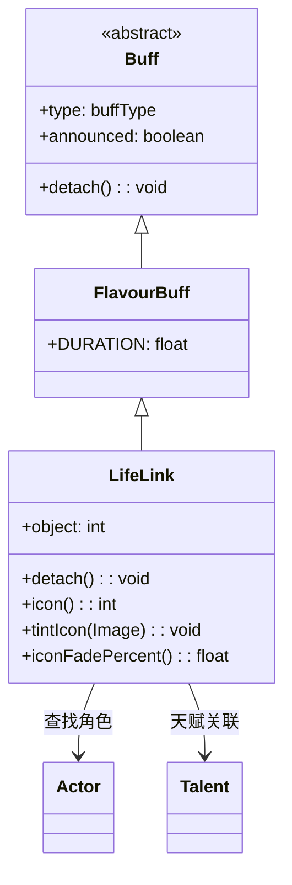

# LifeLink 类文档

## 1. 基本信息
| 属性 | 值 |
|------|-----|
| 文件路径 | core/src/main/java/com/shatteredpixel/shatteredpixeldungeon/actors/buffs/LifeLink.java |
| 包名 | com.shatteredpixel.shatteredpixeldungeon.actors.buffs |
| 类类型 | class |
| 继承关系 | extends FlavourBuff |
| 代码行数 | 84 |

## 2. 类职责说明
LifeLink（生命链接）是一个正面Buff，实现两个角色之间的生命链接效果。当一个角色受到伤害时，伤害会分摊给链接的另一端。链接是双向的，移除时会清理对方的链接。与生命链接天赋绑定，持续时间随天赋等级增加。

## 4. 继承与协作关系


## 静态常量表
| 常量名 | 类型 | 值 | 说明 |
|--------|------|-----|------|
| OBJECT | String | "object" | Bundle存储键 - 链接对象ID |

## 实例字段表
| 字段名 | 类型 | 修饰符 | 说明 |
|--------|------|--------|------|
| object | int | public | 链接对象的Actor ID |
| type | buffType | - | POSITIVE（正面Buff） |
| announced | boolean | - | true（会公告） |

## 7. 方法详解

### detach()
**签名**: `public void detach()`
**功能**: 重写移除方法，移除时清理对方的生命链接。
**实现逻辑**:
```java
super.detach();
Char ch = (Char)Actor.findById(object);  // 查找链接对象
if (!target.isActive() && ch != null) {
    // 遍历对方的所有生命链接
    for (LifeLink l : ch.buffs(LifeLink.class)) {
        if (l.object == target.id()) {
            l.detach();  // 移除指向当前目标的链接
        }
    }
}
```

### icon()
**签名**: `public int icon()`
**功能**: 返回Buff图标的索引标识符。
**返回值**: int - 返回BuffIndicator.HERB_HEALING（草药治疗图标）。

### tintIcon(Image icon)
**签名**: `public void tintIcon(Image icon)`
**功能**: 为Buff图标设置颜色色调。
**参数**:
- icon: Image - 需要着色的图标图像
**实现逻辑**:
```java
icon.hardlight(1, 0, 1);  // 设置紫色高光效果
```

### iconFadePercent()
**签名**: `public float iconFadePercent()`
**功能**: 计算Buff图标的淡出百分比。
**返回值**: float - 图标完整度比例。
**实现逻辑**:
```java
// 持续时间随天赋增加：基础6.67 + 每级3.33
int duration = Math.round(6.67f + 3.33f * Dungeon.hero.pointsInTalent(Talent.LIFE_LINK));
return Math.max(0, (duration - visualcooldown()) / duration);
```

## 11. 使用示例
```java
// 创建生命链接（通常由天赋触发）
LifeLink link = Buff.affect(hero, LifeLink.class);
link.object = ally.id();  // 设置链接对象

// 双向链接
LifeLink reverseLink = Buff.affect(ally, LifeLink.class);
reverseLink.object = hero.id();

// 检查是否有生命链接
if (hero.buff(LifeLink.class) != null) {
    // 英雄与某人生命链接
}
```

## 注意事项
1. 生命链接是双向的，需要两边都设置
2. object字段存储链接对象的Actor ID
3. 移除时会自动清理对方的链接
4. 持续时间随天赋等级增加
5. 是正面Buff

## 最佳实践
1. 与盟友建立链接分担伤害
2. 配合高生命值盟友使用效果更佳
3. 注意链接会随时间消失
4. 投资生命链接天赋增加持续时间