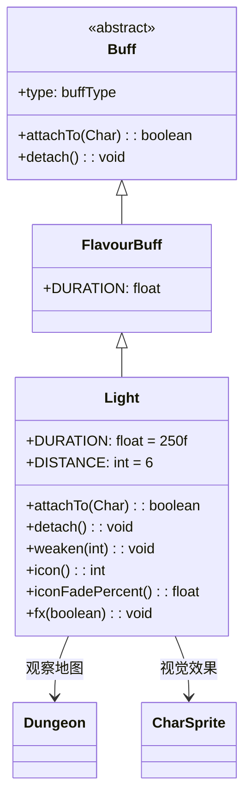

# Light 类文档

## 1. 基本信息
| 属性 | 值 |
|------|-----|
| 文件路径 | core/src/main/java/com/shatteredpixel/shatteredpixeldungeon/actors/buffs/Light.java |
| 包名 | com.shatteredpixel.shatteredpixeldungeon.actors.buffs |
| 类类型 | class |
| 继承关系 | extends FlavourBuff |
| 代码行数 | 77 |

## 2. 类职责说明
Light（光照）是一个正面Buff，使角色获得额外的视野范围。光照状态下视野范围扩展到6格（如果原本更小）。添加和移除时会触发地图观察更新。主要用于光照药剂、灯笼神器等场景。

## 4. 继承与协作关系


## 静态常量表
| 常量名 | 类型 | 值 | 说明 |
|--------|------|-----|------|
| DURATION | float | 250f | 默认持续时间（回合数） |
| DISTANCE | int | 6 | 光照视野范围 |

## 实例字段表
| 字段名 | 类型 | 修饰符 | 说明 |
|--------|------|--------|------|
| type | buffType | - | POSITIVE（正面Buff） |

## 7. 方法详解

### attachTo(Char target)
**签名**: `public boolean attachTo(Char target)`
**功能**: 重写附加方法，添加时扩展视野范围。
**参数**:
- target: Char - 目标角色
**返回值**: boolean - 是否成功附加。
**实现逻辑**:
```java
if (super.attachTo(target)) {
    if (Dungeon.level != null) {
        // 设置视野范围为6或原视野（取较大值）
        target.viewDistance = Math.max(Dungeon.level.viewDistance, DISTANCE);
        Dungeon.observe();  // 触发地图观察
    }
    return true;
}
return false;
```

### detach()
**签名**: `public void detach()`
**功能**: 重写移除方法，恢复原始视野范围。
**实现逻辑**:
```java
target.viewDistance = Dungeon.level.viewDistance;  // 恢复默认视野
Dungeon.observe();  // 触发地图观察
super.detach();
```

### weaken(int amount)
**签名**: `public void weaken(int amount)`
**功能**: 减少剩余时间。
**参数**:
- amount: int - 要减少的回合数
**实现逻辑**:
```java
spend(-amount);  // 负值表示减少等待时间（缩短持续时间）
```

### icon()
**签名**: `public int icon()`
**功能**: 返回Buff图标的索引标识符。
**返回值**: int - 返回BuffIndicator.LIGHT（光照图标）。

### iconFadePercent()
**签名**: `public float iconFadePercent()`
**功能**: 计算Buff图标的淡出百分比。
**返回值**: float - 图标完整度比例。

### fx(boolean on)
**签名**: `public void fx(boolean on)`
**功能**: 设置角色的视觉效果。
**参数**:
- on: boolean - true表示添加效果，false表示移除效果
**实现逻辑**:
```java
if (on) {
    target.sprite.add(CharSprite.State.ILLUMINATED);    // 添加发光效果
} else {
    target.sprite.remove(CharSprite.State.ILLUMINATED); // 移除发光效果
}
```

## 11. 使用示例
```java
// 为英雄添加光照效果，持续250回合
Buff.affect(hero, Light.class, Light.DURATION);

// 检查是否有光照Buff
if (hero.buff(Light.class) != null) {
    // 英雄视野扩展到6格
}

// 减少光照时间
if (hero.buff(Light.class) != null) {
    hero.buff(Light.class).weaken(50);
}
```

## 注意事项
1. 光照效果扩展视野到6格
2. 如果原视野更大则不会缩小
3. 添加和移除都会触发地图观察
4. 持续时间很长（250回合）
5. 是正面Buff
6. 有角色发光视觉效果

## 最佳实践
1. 在黑暗区域使用可以提高安全性
2. 用于发现隐藏的敌人和陷阱
3. 配合探索效果更佳
4. 持续时间很长，不用担心频繁补充