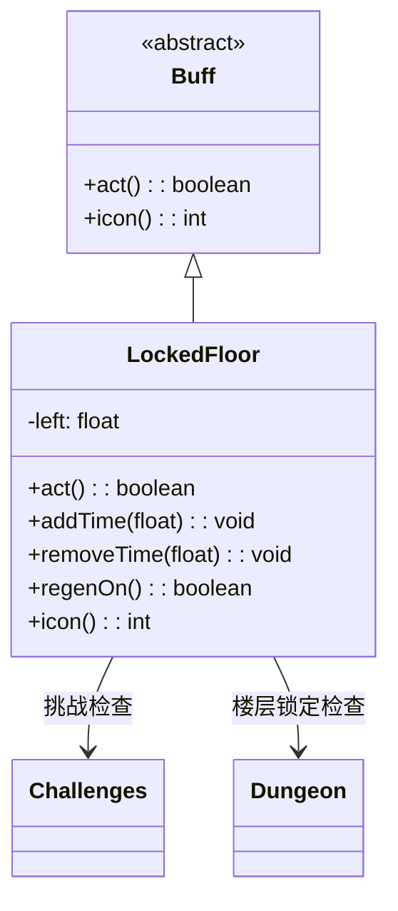

# LockedFloor 类文档

## 1. 基本信息
| 属性 | 值 |
|------|-----|
| 文件路径 | core/src/main/java/com/shatteredpixel/shatteredpixeldungeon/actors/buffs/LockedFloor.java |
| 包名 | com.shatteredpixel.shatteredpixeldungeon.actors.buffs |
| 类类型 | class |
| 继承关系 | extends Buff |
| 代码行数 | 79 |

## 2. 类职责说明
LockedFloor（锁定楼层）是一个特殊的Buff，表示当前楼层被锁定（通常是Boss层）。在锁定状态下，某些有益的被动效果会在一定时间后失效（如自然回复）。计时器从50回合开始（更强Boss挑战下为20回合），影响再生效果。

## 4. 继承与协作关系


## 静态常量表
| 常量名 | 类型 | 值 | 说明 |
|--------|------|-----|------|
| LEFT | String | "left" | Bundle存储键 - 剩余时间 |

## 实例字段表
| 字段名 | 类型 | 修饰符 | 说明 |
|--------|------|--------|------|
| left | float | private | 剩余有益效果时间 |

## 7. 方法详解

### act()
**签名**: `public boolean act()`
**功能**: 每回合检查楼层锁定状态并减少计时器。
**返回值**: boolean - 返回true表示成功执行。
**实现逻辑**:
```java
spend(TICK);

if (!Dungeon.level.locked) {
    detach();  // 楼层不再锁定则移除Buff
}

if (left >= 1) {
    left--;  // 减少计时器
}

return true;
```

### addTime(float time)
**签名**: `public void addTime(float time)`
**功能**: 增加计时器时间。
**参数**:
- time: float - 要增加的时间
**实现逻辑**:
```java
left += time;
left = Math.min(left, 50);  // 上限50回合
```

### removeTime(float time)
**签名**: `public void removeTime(float time)`
**功能**: 减少计时器时间。
**参数**:
- time: float - 要减少的时间
**实现逻辑**:
```java
left -= time;  // 可以变成负数
```

### regenOn()
**签名**: `public boolean regenOn()`
**功能**: 检查是否有益被动效果（如自然回复）应该生效。
**返回值**: boolean - 是否应该生效。
**实现逻辑**:
```java
return left >= 1;  // 计时器>=1时有效
```

### icon()
**签名**: `public int icon()`
**功能**: 返回Buff图标的索引标识符。
**返回值**: int - 返回BuffIndicator.LOCKED_FLOOR（锁定楼层图标）。

## 11. 使用示例
```java
// 检查楼层是否锁定
if (hero.buff(LockedFloor.class) != null) {
    // 楼层被锁定（Boss层）
    
    // 检查再生是否有效
    if (!hero.buff(LockedFloor.class).regenOn()) {
        // 再生效果已失效
    }
}

// 增加有益效果时间
if (hero.buff(LockedFloor.class) != null) {
    hero.buff(LockedFloor.class).addTime(10);
}
```

## 注意事项
1. 只在锁定楼层存在（Boss层）
2. 楼层解锁后自动移除
3. 计时器影响有益被动效果（自然回复等）
4. 更强Boss挑战下初始时间更少（20vs50）
5. 计时器上限50回合
6. 不是正面或负面Buff

## 最佳实践
1. 在Boss战中注意时间管理
2. 使用道具恢复时间
3. 计时器耗尽后自然回复停止
4. 更强Boss挑战需要更快完成战斗