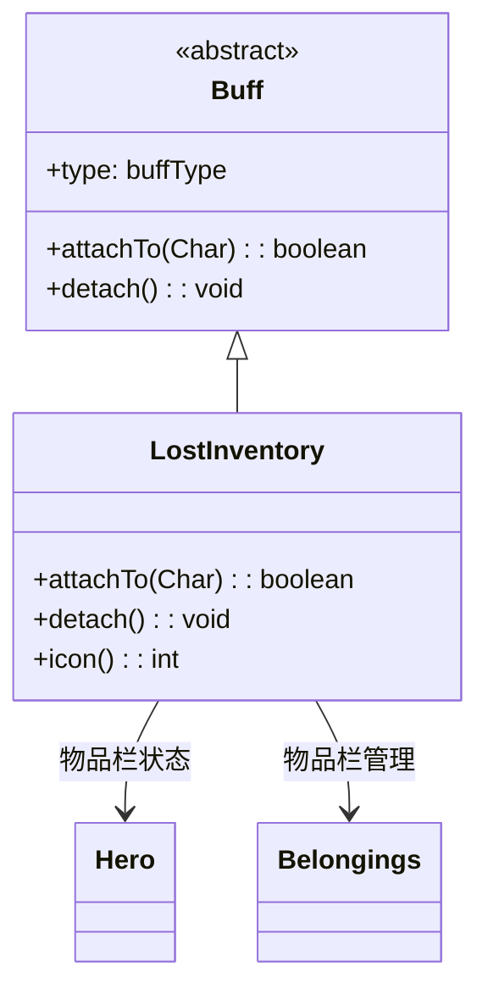

# LostInventory 类文档

## 1. 基本信息
| 属性 | 值 |
|------|-----|
| 文件路径 | core/src/main/java/com/shatteredpixel/shatteredpixeldungeon/actors/buffs/TimeStasis.java |
| 包名 | com.shatteredpixel.shatteredpixeldungeon.actors.buffs |
| 类类型 | class |
| 继承关系 | extends Buff |
| 代码行数 | 59 |

## 2. 类职责说明
LostInventory（丢失物品栏）是一个负面Buff，表示英雄的物品栏丢失状态。在此状态下，英雄无法使用背包中的物品。添加时会标记物品栏为丢失，移除时会恢复。主要用于某些特殊的游戏机制。

## 4. 继承与协作关系


## 实例字段表
| 字段名 | 类型 | 修饰符 | 说明 |
|--------|------|--------|------|
| type | buffType | - | NEGATIVE（负面Buff） |

## 7. 方法详解

### attachTo(Char target)
**签名**: `public boolean attachTo(Char target)`
**功能**: 重写附加方法，标记物品栏为丢失状态。
**参数**:
- target: Char - 目标角色
**返回值**: boolean - 是否成功附加。
**实现逻辑**:
```java
if (super.attachTo(target)) {
    if (target instanceof Hero && ((Hero) target).belongings != null) {
        ((Hero) target).belongings.lostInventory(true);  // 标记物品栏丢失
    }
    return true;
}
return false;
```

### detach()
**签名**: `public void detach()`
**功能**: 重写移除方法，恢复物品栏状态。
**实现逻辑**:
```java
super.detach();
if (target instanceof Hero && ((Hero) target).belongings != null) {
    ((Hero) target).belongings.lostInventory(false);  // 恢复物品栏
}
```

### icon()
**签名**: `public int icon()`
**功能**: 返回Buff图标的索引标识符。
**返回值**: int - 返回BuffIndicator.NOINV（无物品栏图标）。

## 11. 使用示例
```java
// 添加丢失物品栏状态
Buff.affect(hero, LostInventory.class);

// 检查是否有丢失物品栏
if (hero.buff(LostInventory.class) != null) {
    // 英雄无法使用背包物品
}

// 移除丢失物品栏状态
Buff.detach(hero, LostInventory.class);
```

## 注意事项
1. 禁止使用背包物品
2. 添加时标记物品栏丢失
3. 移除时恢复物品栏
4. 是负面Buff
5. 通常由特殊游戏机制触发

## 最佳实践
1. 用于特定游戏机制
2. 需要通过特定方式恢复物品栏
3. 注意在此状态下无法使用道具