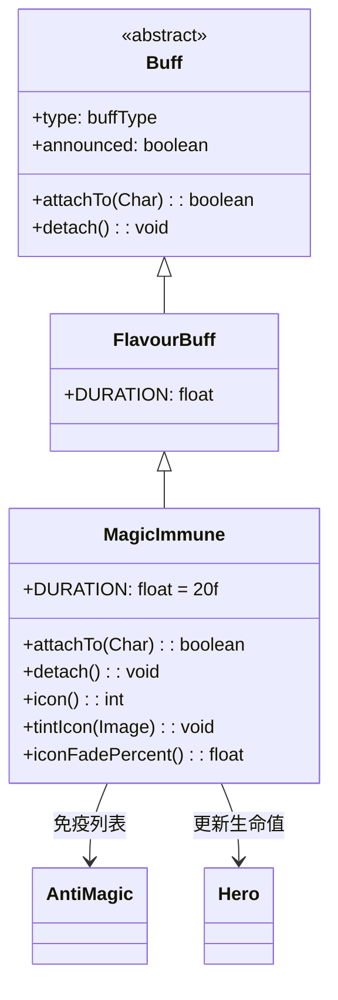

# MagicImmune 类文档

## 1. 基本信息
| 属性 | 值 |
|------|-----|
| 文件路径 | core/src/main/java/com/shatteredpixel/shatteredpixeldungeon/actors/buffs/MagicImmune.java |
| 包名 | com.shatteredpixel.shatteredpixeldungeon.actors.buffs |
| 类类型 | class |
| 继承关系 | extends FlavourBuff |
| 代码行数 | 85 |

## 2. 类职责说明
MagicImmune（魔法免疫）是一个正面Buff，使角色免疫所有魔法效果。添加时会移除所有已存在的魔法类Buff，并更新英雄的生命值上限。主要用于抗魔药剂、特定技能效果等场景。

## 4. 继承与协作关系


## 静态常量表
| 常量名 | 类型 | 值 | 说明 |
|--------|------|-----|------|
| DURATION | float | 20f | 默认持续时间（回合数） |

## 实例字段表
| 字段名 | 类型 | 修饰符 | 说明 |
|--------|------|--------|------|
| type | buffType | - | POSITIVE（正面Buff） |
| announced | boolean | - | true（会公告） |
| immunities | HashSet | - | 包含AntiMagic.RESISTS中的所有类 |

## 7. 方法详解

### attachTo(Char target)
**签名**: `public boolean attachTo(Char target)`
**功能**: 重写附加方法，移除所有魔法类Buff并更新英雄状态。
**参数**:
- target: Char - 目标角色
**返回值**: boolean - 是否成功附加。
**实现逻辑**:
```java
if (super.attachTo(target)) {
    // 遍历目标所有Buff
    for (Buff b : target.buffs()) {
        // 检查是否在免疫列表中
        for (Class immunity : immunities) {
            if (b.getClass().isAssignableFrom(immunity)) {
                b.detach();  // 移除魔法Buff
                break;
            }
        }
    }
    // 更新英雄生命值上限
    if (target instanceof Hero) {
        ((Hero) target).updateHT(false);
    }
    return true;
}
return false;
```

### detach()
**签名**: `public void detach()`
**功能**: 重写移除方法，更新英雄状态。
**实现逻辑**:
```java
super.detach();
// 更新英雄生命值上限
if (target instanceof Hero) {
    ((Hero) target).updateHT(false);
}
```

### icon()
**签名**: `public int icon()`
**功能**: 返回Buff图标的索引标识符。
**返回值**: int - 返回BuffIndicator.COMBO（连击图标，复用）。

### tintIcon(Image icon)
**签名**: `public void tintIcon(Image icon)`
**功能**: 为Buff图标设置颜色色调。
**参数**:
- icon: Image - 需要着色的图标图像
**实现逻辑**:
```java
icon.hardlight(0, 1, 0);  // 设置绿色高光效果
```

### iconFadePercent()
**签名**: `public float iconFadePercent()`
**功能**: 计算Buff图标的淡出百分比。
**返回值**: float - 图标完整度比例。

## 11. 使用示例
```java
// 为英雄添加魔法免疫，持续20回合
Buff.affect(hero, MagicImmune.class, MagicImmune.DURATION);

// 检查是否有魔法免疫
if (hero.buff(MagicImmune.class) != null) {
    // 英雄免疫所有魔法效果
}

// 延长魔法免疫时间
Buff.prolong(hero, MagicImmune.class, 10f);
```

## 注意事项
1. 免疫所有魔法效果
2. 添加时会移除已存在的魔法类Buff
3. 会更新英雄的生命值上限
4. 免疫列表来自AntiMagic.RESISTS
5. 持续时间中等（20回合）
6. 是正面Buff

## 最佳实践
1. 在面对魔法攻击的敌人时使用
2. 配合抗魔护甲效果更佳
3. 注意免疫包括正面和负面魔法
4. 使用时注意已有的魔法Buff会被移除