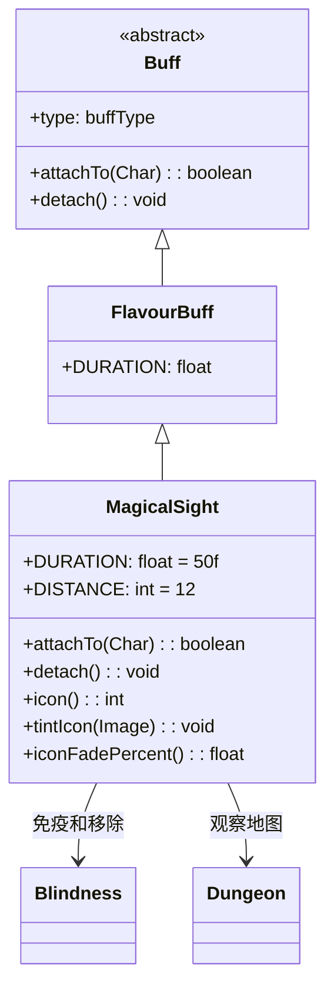

# MagicalSight 类文档

## 1. 基本信息
| 属性 | 值 |
|------|-----|
| 文件路径 | core/src/main/java/com/shatteredpixel/shatteredpixeldungeon/actors/buffs/MagicalSight.java |
| 包名 | com.shatteredpixel.shatteredpixeldungeon.actors.buffs |
| 类类型 | class |
| 继承关系 | extends FlavourBuff |
| 代码行数 | 74 |

## 2. 类职责说明
MagicalSight（魔法视觉）是一个正面Buff，使角色获得魔法视觉能力，视野范围扩展到12格。添加时会移除失明效果，对失明免疫。移除时会更新视野和迷雾。主要用于魔法视觉药剂、特定技能效果等场景。

## 4. 继承与协作关系


## 静态常量表
| 常量名 | 类型 | 值 | 说明 |
|--------|------|-----|------|
| DURATION | float | 50f | 默认持续时间（回合数） |
| DISTANCE | int | 12 | 视野范围（格数） |

## 实例字段表
| 字段名 | 类型 | 修饰符 | 说明 |
|--------|------|--------|------|
| type | buffType | - | POSITIVE（正面Buff） |
| immunities | HashSet | - | 包含Blindness.class |

## 7. 方法详解

### attachTo(Char target)
**签名**: `public boolean attachTo(Char target)`
**功能**: 重写附加方法，移除失明效果。
**参数**:
- target: Char - 目标角色
**返回值**: boolean - 是否成功附加。
**实现逻辑**:
```java
if (super.attachTo(target)) {
    Buff.detach(target, Blindness.class);  // 移除失明
    return true;
}
return false;
```

### detach()
**签名**: `public void detach()`
**功能**: 重写移除方法，更新视野和迷雾。
**实现逻辑**:
```java
super.detach();
Dungeon.observe();       // 触发地图观察
GameScene.updateFog();   // 更新迷雾效果
```

### icon()
**签名**: `public int icon()`
**功能**: 返回Buff图标的索引标识符。
**返回值**: int - 返回BuffIndicator.MIND_VISION（心灵视觉图标）。

### tintIcon(Image icon)
**签名**: `public void tintIcon(Image icon)`
**功能**: 为Buff图标设置颜色色调。
**参数**:
- icon: Image - 需要着色的图标图像
**实现逻辑**:
```java
icon.hardlight(1f, 1.67f, 1f);  // 设置淡粉色高光效果
```

### iconFadePercent()
**签名**: `public float iconFadePercent()`
**功能**: 计算Buff图标的淡出百分比。
**返回值**: float - 图标完整度比例。

## 11. 使用示例
```java
// 添加魔法视觉效果，持续50回合
Buff.affect(hero, MagicalSight.class, MagicalSight.DURATION);

// 检查是否有魔法视觉
if (hero.buff(MagicalSight.class) != null) {
    // 英雄视野扩展到12格
}

// 延长魔法视觉时间
Buff.prolong(hero, MagicalSight.class, 25f);
```

## 注意事项
1. 视野扩展到12格
2. 添加时移除失明效果
3. 对失明免疫
4. 移除时更新视野和迷雾
5. 持续时间较长（50回合）
6. 是正面Buff

## 最佳实践
1. 用于探索大型区域
2. 在黑暗区域使用提高安全性
3. 对失明状态特别有效
4. 配合其他探索效果更佳