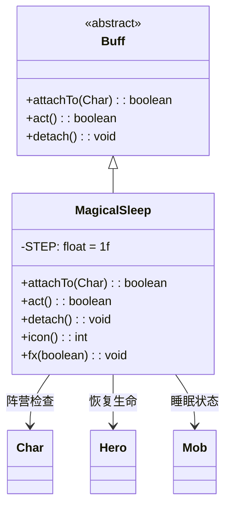

# MagicalSleep 类文档

## 1. 基本信息
| 属性 | 值 |
|------|-----|
| 文件路径 | core/src/main/java/com/shatteredpixel/shatteredpixeldungeon/actors/buffs/MagicalSleep.java |
| 包名 | com.shatteredpixel.shatteredpixeldungeon.actors.buffs |
| 类类型 | class |
| 继承关系 | extends Buff |
| 代码行数 | 105 |

## 2. 类职责说明
MagicalSleep（魔法睡眠）是一个特殊的Buff，使角色进入魔法睡眠状态。对盟友角色，睡眠期间会恢复生命值直到满血。对敌人，会使其进入睡眠状态。角色被麻痹，但睡眠免疫的角色无法附加此Buff。

## 4. 继承与协作关系


## 静态常量表
| 常量名 | 类型 | 值 | 说明 |
|--------|------|-----|------|
| STEP | float | 1f | 每回合时间步长 |

## 实例字段表
无特殊实例字段。

## 7. 方法详解

### attachTo(Char target)
**签名**: `public boolean attachTo(Char target)`
**功能**: 重写附加方法，设置麻痹状态和睡眠状态。
**参数**:
- target: Char - 目标角色
**返回值**: boolean - 是否成功附加。
**实现逻辑**:
```java
// 检查是否免疫睡眠
if (!target.isImmune(Sleep.class) && super.attachTo(target)) {
    target.paralysed++;  // 增加麻痹计数
    
    // 盟友特殊处理
    if (target.alignment == Char.Alignment.ALLY) {
        if (target.HP == target.HT) {
            // 已满血则不移除
            if (target instanceof Hero) GLog.i(Messages.get(this, "toohealthy"));
            detach();
            return true;
        } else {
            if (target instanceof Hero) GLog.i(Messages.get(this, "fallasleep"));
        }
    }
    
    // 敌人进入睡眠状态
    if (target instanceof Mob) {
        ((Mob) target).state = ((Mob) target).SLEEPING;
    }
    
    return true;
}
return false;
```

### act()
**签名**: `public boolean act()`
**功能**: 每回合恢复盟友生命值。
**返回值**: boolean - 返回true表示成功执行。
**实现逻辑**:
```java
// 敌人被唤醒则移除
if (target instanceof Mob && ((Mob) target).state != ((Mob) target).SLEEPING) {
    detach();
    return true;
}

// 盟友恢复生命值
if (target.alignment == Char.Alignment.ALLY) {
    target.HP = Math.min(target.HP + 1, target.HT);  // 每回合恢复1HP
    if (target instanceof Hero) ((Hero) target).resting = true;
    
    if (target.HP == target.HT) {
        // 满血则唤醒
        if (target instanceof Hero) GLog.p(Messages.get(this, "wakeup"));
        detach();
    }
}

spend(STEP);
return true;
```

### detach()
**签名**: `public void detach()`
**功能**: 重写移除方法，解除麻痹和休息状态。
**实现逻辑**:
```java
if (target.paralysed > 0) {
    target.paralysed--;  // 减少麻痹计数
}
if (target instanceof Hero) {
    ((Hero) target).resting = false;  // 停止休息
} else if (target instanceof Mob && target.alignment == Char.Alignment.ALLY 
           && ((Mob) target).state == ((Mob) target).SLEEPING) {
    ((Mob) target).state = ((Mob) target).WANDERING;  // 切换到游荡状态
}
super.detach();
```

### icon()
**签名**: `public int icon()`
**功能**: 返回Buff图标的索引标识符。
**返回值**: int - 返回BuffIndicator.MAGIC_SLEEP（魔法睡眠图标）。

### fx(boolean on)
**签名**: `public void fx(boolean on)`
**功能**: 设置角色的视觉效果。
**参数**:
- on: boolean - true表示添加效果，false表示移除效果
**实现逻辑**:
```java
if (!on && (target.paralysed <= 1)) {
    // 只在最后一个麻痹移除时清理视觉效果
    target.sprite.remove(CharSprite.State.PARALYSED);
}
```

## 11. 使用示例
```java
// 为盟友添加魔法睡眠（会恢复生命）
Buff.affect(ally, MagicalSleep.class);

// 检查是否有魔法睡眠
if (hero.buff(MagicalSleep.class) != null) {
    // 英雄正在睡眠恢复生命
}

// 对敌人使用（会使其睡眠）
Buff.affect(enemy, MagicalSleep.class);
```

## 注意事项
1. 盟友睡眠期间每回合恢复1HP
2. 满血后自动唤醒
3. 敌人进入睡眠状态
4. 对睡眠免疫的角色无效
5. 会麻痹角色
6. 盟友和敌人效果不同

## 最佳实践
1. 对受伤的盟友使用恢复生命
2. 对敌人使用可以暂时控制
3. 注意睡眠免疫的角色无效
4. 英雄满血时不会进入睡眠