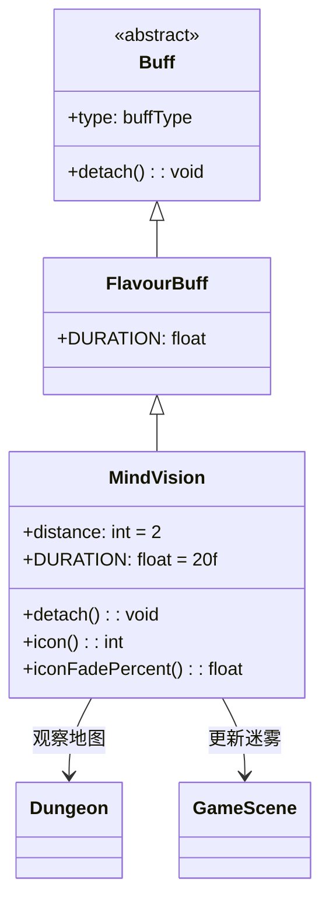

# MindVision 类文档

## 1. 基本信息
| 属性 | 值 |
|------|-----|
| 文件路径 | core/src/main/java/com/shatteredpixel/shatteredpixeldungeon/actors/buffs/MindVision.java |
| 包名 | com.shatteredpixel.shatteredpixeldungeon.actors.buffs |
| 类类型 | class |
| 继承关系 | extends FlavourBuff |
| 代码行数 | 54 |

## 2. 类职责说明
MindVision（心灵视觉）是一个正面Buff，使角色能够感知附近的生物。与普通视野不同，心灵视觉可以穿透墙壁看到敌人。移除时会触发地图观察更新。主要用于心灵视觉药剂、特定技能效果等场景。

## 4. 继承与协作关系


## 静态常量表
| 常量名 | 类型 | 值 | 说明 |
|--------|------|-----|------|
| DURATION | float | 20f | 默认持续时间（回合数） |

## 实例字段表
| 字段名 | 类型 | 修饰符 | 说明 |
|--------|------|--------|------|
| distance | int | public | 感知距离（默认2格） |
| type | buffType | - | POSITIVE（正面Buff） |

## 7. 方法详解

### detach()
**签名**: `public void detach()`
**功能**: 重写移除方法，移除时更新视野和迷雾。
**实现逻辑**:
```java
super.detach();
Dungeon.observe();       // 触发地图观察
GameScene.updateFog();   // 更新迷雾效果
```

### icon()
**签名**: `public int icon()`
**功能**: 返回Buff图标的索引标识符。
**返回值**: int - 返回BuffIndicator.MIND_VISION（心灵视觉图标）。

### iconFadePercent()
**签名**: `public float iconFadePercent()`
**功能**: 计算Buff图标的淡出百分比。
**返回值**: float - 图标完整度比例。

## 11. 使用示例
```java
// 为英雄添加心灵视觉，持续20回合
Buff.affect(hero, MindVision.class, MindVision.DURATION);

// 设置感知距离
MindVision vision = Buff.affect(hero, MindVision.class);
vision.distance = 4;  // 扩展到4格

// 检查是否有心灵视觉
if (hero.buff(MindVision.class) != null) {
    // 英雄可以感知附近的敌人
}
```

## 注意事项
1. 心灵视觉可以穿透墙壁看到敌人
2. distance字段控制感知范围
3. 实际的感知逻辑在Dungeon类中实现
4. 移除时会更新视野和迷雾
5. 持续时间中等（20回合）
6. 是正面Buff

## 最佳实践
1. 用于发现隐藏在墙后的敌人
2. 在探索未知区域时使用
3. 配合远程攻击可以安全消灭敌人
4. 注意distance可以调整感知范围