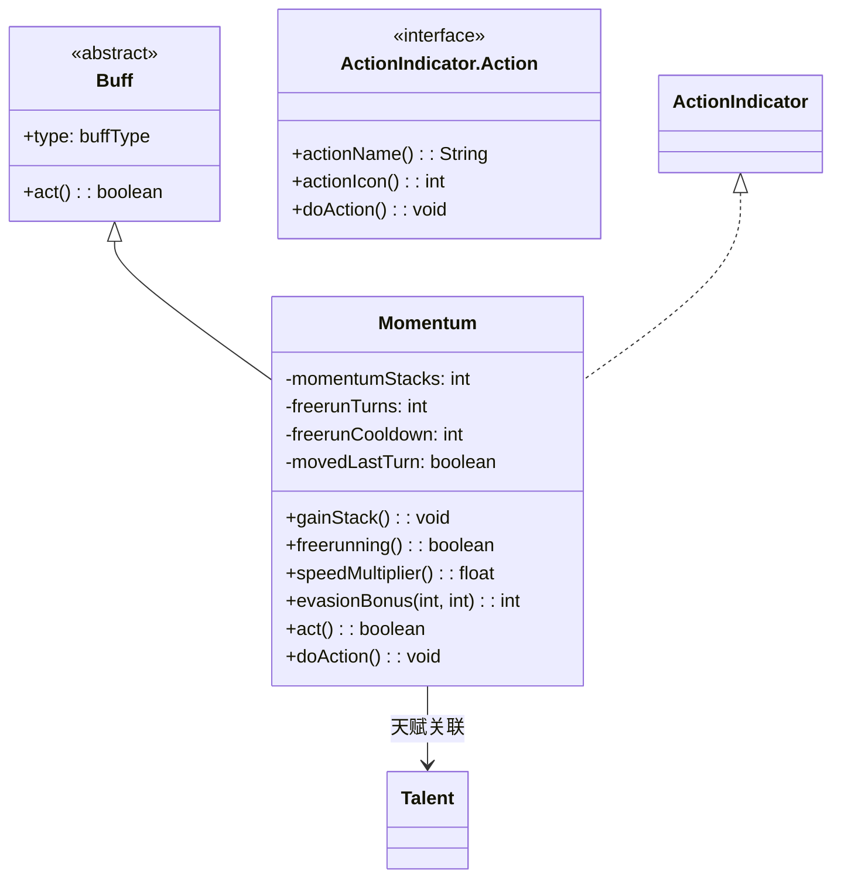

# Momentum 类文档

## 1. 基本信息
| 属性 | 值 |
|------|-----|
| 文件路径 | core/src/main/java/com/shatteredpixel/shatteredpixeldungeon/actors/buffs/Momentum.java |
| 包名 | com.shatteredpixel.shatteredpixeldungeon.actors.buffs |
| 类类型 | class |
| 继承关系 | extends Buff implements ActionIndicator.Action |
| 代码行数 | 247 |

## 2. 类职责说明
Momentum（动量）是一个正面Buff，属于决斗家的核心机制。通过移动积累动量层数，达到一定层数后可以触发自由奔跑（Freerun）状态，获得双倍移动速度和躲避加成。与迅捷潜行和躲避护甲天赋绑定。

## 4. 继承与协作关系


## 静态常量表
| 常量名 | 类型 | 值 | 说明 |
|--------|------|-----|------|
| STACKS | String | "stacks" | Bundle存储键 |
| FREERUN_TURNS | String | "freerun_turns" | Bundle存储键 |
| FREERUN_CD | String | "freerun_CD" | Bundle存储键 |

## 实例字段表
| 字段名 | 类型 | 修饰符 | 说明 |
|--------|------|--------|------|
| momentumStacks | int | private | 动量层数（0-10） |
| freerunTurns | int | private | 自由奔跑剩余回合 |
| freerunCooldown | int | private | 冷却剩余回合 |
| movedLastTurn | boolean | private | 上回合是否移动 |
| type | buffType | - | POSITIVE（正面Buff） |
| actPriority | int | - | HERO_PRIO+1（英雄之前执行） |

## 7. 方法详解

### gainStack()
**签名**: `public void gainStack()`
**功能**: 增加一层动量。
**实现逻辑**:
```java
movedLastTurn = true;
if (freerunCooldown <= 0 && !freerunning()) {
    postpone(target.cooldown() + (1/target.speed()));
    momentumStacks = Math.min(momentumStacks + 1, 10);  // 最多10层
    ActionIndicator.setAction(this);
    BuffIndicator.refreshHero();
}
```

### freerunning()
**签名**: `public boolean freerunning()`
**功能**: 检查是否处于自由奔跑状态。
**返回值**: boolean - 是否自由奔跑。

### speedMultiplier()
**签名**: `public float speedMultiplier()`
**功能**: 获取速度倍率。
**返回值**: float - 速度倍率（1或2）。
**实现逻辑**:
```java
if (freerunning()) {
    return 2;  // 自由奔跑时双倍速度
} else if (target.invisible > 0 && Dungeon.hero.pointsInTalent(Talent.SPEEDY_STEALTH) == 3) {
    return 2;  // 3级迅捷潜行天赋+隐形时双倍速度
} else {
    return 1;
}
```

### evasionBonus(int heroLvl, int excessArmorStr)
**签名**: `public int evasionBonus(int heroLvl, int excessArmorStr)`
**功能**: 获取躲避加成。
**参数**:
- heroLvl: int - 英雄等级
- excessArmorStr: int - 超出护甲需求的力量值
**返回值**: int - 躲避加成值。
**实现逻辑**:
```java
if (freerunTurns > 0) {
    return heroLvl/2 + excessArmorStr * Dungeon.hero.pointsInTalent(Talent.EVASIVE_ARMOR);
} else {
    return 0;
}
```

### act()
**签名**: `public boolean act()`
**功能**: 每回合处理冷却、动量衰减等逻辑。
**返回值**: boolean - 返回true表示成功执行。

### doAction()
**签名**: `public void doAction()`
**功能**: 触发自由奔跑状态。
**实现逻辑**:
```java
freerunTurns = 2 * momentumStacks;            // 持续时间 = 2 * 层数
freerunCooldown = 10 + 4 * momentumStacks;    // 冷却时间 = 10 + 4 * 层数
Sample.INSTANCE.play(Assets.Sounds.MISS, 1f, 0.8f);
target.sprite.emitter().burst(Speck.factory(Speck.JET), 5 + momentumStacks);
SpellSprite.show(target, SpellSprite.HASTE, 1, 1, 0);
momentumStacks = 0;
BuffIndicator.refreshHero();
ActionIndicator.clearAction(this);
```

## 11. 使用示例
```java
// 移动时增加动量
Momentum momentum = hero.buff(Momentum.class);
if (momentum != null) {
    momentum.gainStack();
}

// 检查是否自由奔跑
if (hero.buff(Momentum.class) != null && hero.buff(Momentum.class).freerunning()) {
    // 双倍移动速度
}

// 获取躲避加成
int evasion = momentum.evasionBonus(hero.lvl, excessStr);
```

## 注意事项
1. 移动积累动量，最多10层
2. 不移动时动量会衰减
3. 自由奔跑持续2*层数回合
4. 冷却期间无法积累动量
5. 与迅捷潜行天赋有联动
6. 是正面Buff

## 最佳实践
1. 持续移动积累动量
2. 在关键时刻触发自由奔跑
3. 配合隐形使用效果更佳
4. 注意冷却期间无法积累动量