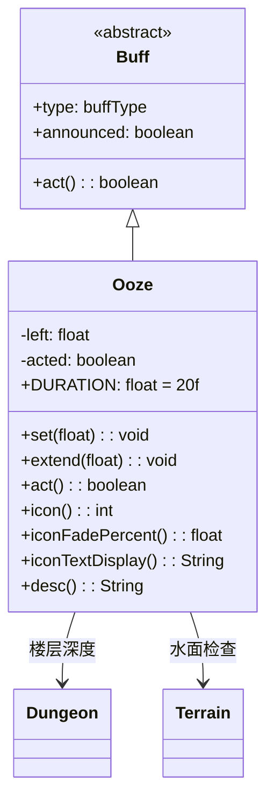

# Ooze 类文档

## 1. 基本信息
| 属性 | 值 |
|------|-----|
| 文件路径 | core/src/main/java/com/shatteredpixel/shatteredpixeldungeon/actors/buffs/Ooze.java |
| 包名 | com.shatteredpixel.shatteredpixeldungeon.actors.buffs |
| 类类型 | class |
| 继承关系 | extends Buff |
| 代码行数 | 122 |

## 2. 类职责说明
Ooze（粘液）是一个负面Buff，使受影响的角色受到持续酸液腐蚀伤害。伤害量与楼层深度相关，站在水中可以洗掉粘液。主要用于Goo Boss攻击、腐蚀陷阱等场景。

## 4. 继承与协作关系


## 静态常量表
| 常量名 | 类型 | 值 | 说明 |
|--------|------|-----|------|
| DURATION | float | 20f | 默认持续时间 |
| LEFT | String | "left" | Bundle存储键 |
| ACTED | String | "acted" | Bundle存储键 |

## 实例字段表
| 字段名 | 类型 | 修饰符 | 说明 |
|--------|------|--------|------|
| left | float | private | 剩余持续时间 |
| acted | boolean | private | 是否已造成伤害 |
| type | buffType | - | NEGATIVE（负面Buff） |
| announced | boolean | - | true（会公告） |

## 7. 方法详解

### set(float left)
**签名**: `public void set(float left)`
**功能**: 设置持续时间。
**参数**:
- left: float - 持续回合数
**实现逻辑**:
```java
this.left = left;
acted = false;  // 重置伤害标记
```

### extend(float duration)
**签名**: `public void extend(float duration)`
**功能**: 延长持续时间。
**参数**:
- duration: float - 要延长的回合数
**实现逻辑**:
```java
left += duration;
```

### act()
**签名**: `public boolean act()`
**功能**: 每回合造成腐蚀伤害，检查水中洗掉效果。
**返回值**: boolean - 返回true表示成功执行。
**实现逻辑**:
```java
// 如果已造成伤害且在水中且不飞行，洗掉粘液
if (acted && Dungeon.level.water[target.pos] && !target.flying) {
    detach();
} else if (target.isAlive()) {
    acted = true;
    
    // 伤害计算基于楼层深度
    if (Dungeon.scalingDepth() > 5) {
        // 深层：每回合 1 + 深度/5 伤害
        target.damage(1 + Dungeon.scalingDepth() / 5, this);
    } else if (Dungeon.scalingDepth() == 5) {
        // 第5层（Goo）：每回合1伤害
        target.damage(1, this);
    } else if (Random.Int(2) == 0) {
        // 浅层：50%概率1伤害（平均0.5/回合）
        target.damage(1, this);
    }
    
    // 英雄死亡处理
    if (!target.isAlive() && target == Dungeon.hero) {
        Dungeon.fail(this);
        GLog.n(Messages.get(this, "ondeath"));
    }
    
    spend(TICK);
    left -= TICK;
    if (left <= 0) {
        detach();
    }
} else {
    detach();
}

// 再次检查水中洗掉
if (Dungeon.level.water[target.pos] && !target.flying) {
    detach();
}
return true;
```

### icon()
**签名**: `public int icon()`
**功能**: 返回Buff图标的索引标识符。
**返回值**: int - 返回BuffIndicator.OOZE（粘液图标）。

### iconFadePercent()
**签名**: `public float iconFadePercent()`
**功能**: 计算Buff图标的淡出百分比。
**返回值**: float - 图标完整度比例。

### iconTextDisplay()
**签名**: `public String iconTextDisplay()`
**功能**: 返回图标上显示的文本（剩余时间）。
**返回值**: String - 剩余时间的字符串表示。

### desc()
**签名**: `public String desc()`
**功能**: 返回Buff的详细描述文本。
**返回值**: String - 包含剩余时间的描述。

## 11. 使用示例
```java
// 添加粘液效果，持续20回合
Ooze ooze = Buff.affect(enemy, Ooze.class);
ooze.set(Ooze.DURATION);

// 检查是否有粘液
if (hero.buff(Ooze.class) != null) {
    // 站在水中可以洗掉
}

// 延长粘液时间
if (enemy.buff(Ooze.class) != null) {
    enemy.buff(Ooze.class).extend(10f);
}
```

## 注意事项
1. 伤害与楼层深度相关，深层伤害更高
2. 站在水中可以洗掉粘液
3. 第一次造成伤害后才能在水中洗掉
4. 飞行角色无法在水中洗掉
5. 是负面Buff

## 最佳实践
1. 在有水的区域战斗可以快速清除
2. 浅层伤害较低，深层更危险
3. 配合Goo Boss战斗时注意躲避
4. 飞行角色需要其他方式清除