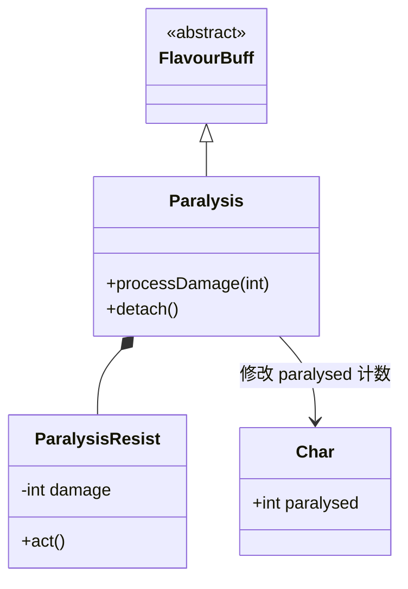

# Paralysis (麻痹) 源码详解

## 1. 基本信息

| 属性 | 值 |
|------|-----|
| **文件路径** | `core/src/main/java/com/shatteredpixel/shatteredpixeldungeon/actors/buffs/Paralysis.java` |
| **包名** | `com.shatteredpixel.shatteredpixeldungeon.actors.buffs` |
| **文件类型** | class / inner class |
| **继承关系** | `extends FlavourBuff` |
| **代码行数** | 102 |
| **所属模块** | core |

## 2. 文件职责说明

### 核心职责
`Paralysis` 负责实现角色的“麻痹”状态逻辑。它是一种强力的控制效果，能够完全阻止角色的任何行动，并包含一套受击脱离机制（受伤害有概率苏醒）。

### 系统定位
属于 Buff 系统中的硬控（Hard CC）分支。它是麻痹气体、闪电陷阱或特定怪物攻击产生的最危险状态之一。

### 不负责什么
- 不负责实际的行动阻塞判定（由 `Char.act()` 检查 `paralysed` 计数器实现）。
- 不负责由于麻痹导致的药水破碎或环境互动。

## 3. 结构总览

### 主要成员概览
- **常量 DURATION**: 默认持续时间（10 回合）。
- **字段 target.paralysed**: 核心计数器，决定角色是否处于麻痹态。
- **内部类 ParalysisResist**: 辅助 Buff，用于记录受到的伤害总量以支撑“受击苏醒”逻辑。
- **processDamage() 方法**: 核心算法，计算受到的伤害是否足以打破麻痹。

### 主要逻辑块概览
- **计数器机制**: 使用叠加计数器而非布尔值，确保多个麻痹来源能正确叠加和移除。
- **动态苏醒概率**: 苏醒概率随受到的总伤害增加而提升，且受目标当前生命值的影响。
- **抗性衰减**: 当麻痹解除后，累积的伤害抗性会随时间缓慢衰减。

### 生命周期/调用时机
1. **产生**：受到麻痹性攻击。
2. **活跃期**：角色无法行动。如果受击，调用 `processDamage`。
3. **苏醒**：时间耗尽或受击判定通过。

## 4. 继承与协作关系

### 父类提供的能力
继承自 `FlavourBuff`：
- 提供基础的持续时间管理和 UI 描述支持。

### 协作对象
- **Char**: 被控制的主体，其 `paralysed` 字段是逻辑核心。
- **ParalysisResist**: 内部协作类，负责跨回合存储受击数据。
- **CharSprite.State.PARALYSED**: 提供视觉上的静止/石化特效。



## 5. 字段/常量详解

### 静态常量
- **DURATION**: 10.0f 回合。

### ParalysisResist 字段
| 字段名 | 类型 | 说明 |
|--------|------|------|
| `damage` | int | 麻痹期间累计受到的伤害。该值越高，苏醒概率越大。 |

## 6. 构造与初始化机制
通过实例初始化块设置 `type = NEGATIVE` 和 `announced = true`。附加时通过 `target.paralysed++` 立即生效。

## 7. 方法详解

### attachTo(Char target)

**方法职责**：初始化麻痹状态。
除了父类的附加逻辑外，强制递增目标的 `paralysed` 计数器。这确保了只要有一个 `Paralysis` 实例存在，角色就无法行动。

---

### processDamage(int damage) [受击苏醒算法]

**算法职责**：判定当前伤害是否导致麻痹解除。

**核心逻辑分析**：
1. **累加伤害**：将本次伤害加入 `ParalysisResist` 计数。
2. **概率判定**：
   ```java
   if (Random.NormalIntRange(0, resist.damage) >= Random.NormalIntRange(0, target.HP))
   ```
   **分析**：
   - 这是一个“伤害 vs 生命值”的博弈。
   - 如果累积受到的伤害非常高，或者目标当前生命值非常低，苏醒概率会显著提升。
   - **设计意图**：防止玩家在麻痹状态下被低攻击力的敌人无限制地“连击到死”。

---

### detach()

**方法职责**：清理状态。
递减计数器并在 UI 上显示“苏醒”消息。只有当 `paralysed` 降为 0 时，角色才恢复行动力。

---

### ParalysisResist.act() [抗性回收]

**逻辑分析**：
如果角色当前没有处于麻痹状态，该 Buff 每回合会自行减少约 10% 的累积伤害值 (`damage -= Math.ceil(damage / 10f)`)。
**设计意图**：这模拟了身体机能的恢复。如果短时间内连续被麻痹，受击苏醒的概率会继承之前的积累；但如果间隔很久，抗性会重置。

## 8. 对外暴露能力
- `processDamage(int)`: 被战斗系统调用，处理受击逻辑。

## 9. 运行机制与调用链
`Trap.trigger()` -> `Buff.affect(Paralysis.class)` -> `target.paralysed++` -> `Char.damage()` -> `Paralysis.processDamage()` -> `detach()`。

## 10. 资源、配置与国际化关联

### 本地化词条
- `actors.buffs.Paralysis.name`: 麻痹
- `actors.buffs.Paralysis.out`: “苏醒”
- `actors.buffs.Paralysis.desc`: “你动弹不得！剩余时长：%s。”

## 11. 使用示例

### 在代码中手动施加麻痹
```java
Buff.affect(target, Paralysis.class, 5f);
```

## 12. 开发注意事项

### 计数器同步
必须始终使用 `detach()` 移除 Buff，不要直接修改 `target.paralysed` 字段，否则会导致 Buff 实例与角色的物理状态不一致。

### 视觉覆盖
当 `target.paralysed <= 1` 时才移除特效。这是为了处理多个麻痹源（如两个麻痹陷阱同时触发）的情况。

## 13. 修改建议与扩展点

### 引入力量影响
可以修改 `processDamage` 算法，使高力量（STR）的角色更容易从麻痹中通过物理力量“震开”枷锁。

## 14. 事实核查清单

- [x] 是否解析了受击苏醒概率公式：是 (damage vs HP 的随机博弈)。
- [x] 是否说明了计数器 (paralysed++) 机制：是。
- [x] 是否涵盖了 ParalysisResist 的衰减逻辑：是 (每回合 10%)。
- [x] 是否解析了多重麻痹源的视觉同步：是 (target.paralysed <= 1 检查)。
- [x] 图像索引属性是否核对：是 (BuffIndicator.PARALYSIS)。
