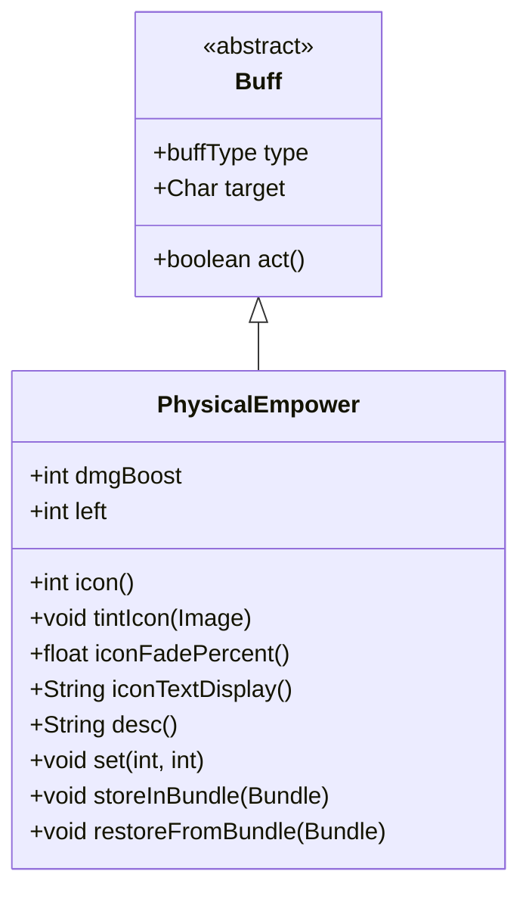

# PhysicalEmpower 类文档

## 1. 基本信息
| 属性 | 值 |
|------|-----|
| 文件路径 | core/src/main/java/com/shatteredpixel/shatteredpixeldungeon/actors/buffs/PhysicalEmpower.java |
| 包名 | com.shatteredpixel.shatteredpixeldungeon.actors.buffs |
| 类类型 | class |
| 继承关系 | extends Buff |
| 代码行数 | 90 行 |

## 2. 类职责说明
PhysicalEmpower 是一个增强英雄物理攻击伤害的 Buff 类。它为近战攻击提供额外的伤害加成，持续一定次数的攻击。该效果通常通过"强化餐点"（Strengthening Meal）天赋获得，为战士职业提供持续的伤害提升。

## 4. 继承与协作关系


## 静态常量表
| 常量名 | 类型 | 值 | 说明 |
|--------|------|-----|------|
| BOOST | String | "boost" | Bundle 存储键 - 伤害加成值 |
| LEFT | String | "left" | Bundle 存储键 - 剩余攻击次数 |

## 实例字段表
| 字段名 | 类型 | 修饰符 | 说明 |
|--------|------|--------|------|
| dmgBoost | int | public | 每次攻击的额外伤害值 |
| left | int | public | 剩余的强化攻击次数 |

## 7. 方法详解

### icon()
**签名**: `public int icon()`
**功能**: 返回 Buff 图标标识符
**返回值**: int - BuffIndicator.UPGRADE（升级图标）
**实现逻辑**:
```
第38-40行: 返回升级图标，表示武器的强化效果
```

### tintIcon(Image icon)
**签名**: `public void tintIcon(Image icon)`
**功能**: 为图标着色
**参数**:
- icon: Image - 要着色的图标图像
**实现逻辑**:
```
第44行: 将图标着色为橙色（1, 0.5f, 0），表示物理强化
```

### iconFadePercent()
**签名**: `public float iconFadePercent()`
**功能**: 计算图标淡入淡出百分比
**返回值**: float - 0到1之间的值，表示剩余时间的比例
**实现逻辑**:
```
第49行: 从天赋系统获取最大攻击次数（基础1 + 天赋点数）
第50行: 根据剩余次数计算百分比
```

### iconTextDisplay()
**签名**: `public String iconTextDisplay()`
**功能**: 返回图标上显示的文本
**返回值**: String - 剩余攻击次数的字符串表示
**实现逻辑**:
```
第55行: 将剩余次数转换为字符串显示在图标上
```

### desc()
**签名**: `public String desc()`
**功能**: 返回 Buff 的详细描述文本
**返回值**: String - 格式化的描述文本
**实现逻辑**:
```
第60行: 使用消息模板，传入伤害加成值和剩余攻击次数
```

### set(int dmg, int hits)
**签名**: `public void set(int dmg, int hits)`
**功能**: 设置伤害加成参数，仅在更强时覆盖
**参数**:
- dmg: int - 每次攻击的额外伤害
- hits: int - 攻击次数
**实现逻辑**:
```
第67-70行: 如果新的总伤害(dmg*hits)大于当前总伤害(dmgBoost*left)，则更新参数
          这确保只保留最强的强化效果
```

### storeInBundle(Bundle bundle)
**签名**: `public void storeInBundle(Bundle bundle)`
**功能**: 将 Buff 状态保存到 Bundle 中以支持游戏存档
**参数**:
- bundle: Bundle - 存储容器
**实现逻辑**:
```
第78-80行: 保存伤害加成值和剩余攻击次数
```

### restoreFromBundle(Bundle bundle)
**签名**: `public void restoreFromBundle(Bundle bundle)`
**功能**: 从 Bundle 恢复 Buff 状态
**参数**:
- bundle: Bundle - 存储容器
**实现逻辑**:
```
第85-87行: 恢复伤害加成值和剩余攻击次数
```

## 11. 使用示例
```java
// 通过天赋获得物理强化效果
PhysicalEmpower empower = Buff.affect(hero, PhysicalEmpower.class);
empower.set(5, 3);  // 接下来3次攻击各加5点伤害

// 在攻击时使用强化
if (hero.buff(PhysicalEmpower.class) != null) {
    PhysicalEmpower pe = hero.buff(PhysicalEmpower.class);
    damage += pe.dmgBoost;  // 增加额外伤害
    pe.left--;  // 减少剩余次数
    if (pe.left <= 0) {
        pe.detach();  // 效果结束
    }
}
```

## 注意事项
1. **天赋关联**: 最大攻击次数与"强化餐点"天赋等级相关
2. **效果叠加**: set() 方法确保只保留总伤害最高的效果
3. **正面效果**: type 设置为 POSITIVE，显示为绿色 Buff
4. **图标显示**: 图标上会显示剩余攻击次数
5. **持久性**: 效果会持续直到攻击次数用完，不受时间限制

## 最佳实践
1. 在战斗开始前使用食物触发此效果
2. 配合高伤害武器可以最大化收益
3. 注意效果是按次数消耗，而非时间
4. 天赋等级越高，效果持续越久