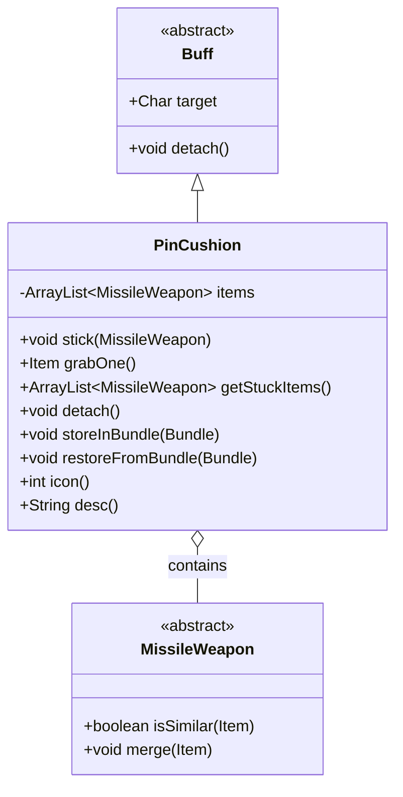

# PinCushion 类文档

## 1. 基本信息
| 属性 | 值 |
|------|-----|
| 文件路径 | core/src/main/java/com/shatteredpixel/shatteredpixeldungeon/actors/buffs/PinCushion.java |
| 包名 | com.shatteredpixel.shatteredpixeldungeon.actors.buffs |
| 类类型 | class |
| 继承关系 | extends Buff |
| 代码行数 | 104 行 |

## 2. 类职责说明
PinCushion 是一个追踪插在角色身上的投掷武器的 Buff 类。当投掷武器（如飞镖、匕首等）命中敌人但没有杀死它时，武器会"插在"敌人身上。当敌人死亡时，这些武器会掉落在地。这个机制允许玩家回收投掷武器，同时也支持某些特殊效果（如尖刺战术）。

## 4. 继承与协作关系


## 静态常量表
| 常量名 | 类型 | 值 | 说明 |
|--------|------|-----|------|
| ITEMS | String | "items" | Bundle 存储键 - 插入的武器列表 |

## 实例字段表
| 字段名 | 类型 | 修饰符 | 说明 |
|--------|------|--------|------|
| items | ArrayList\<MissileWeapon\> | private | 插入角色身上的投掷武器列表 |

## 7. 方法详解

### stick(MissileWeapon projectile)
**签名**: `public void stick(MissileWeapon projectile)`
**功能**: 将投掷武器"插在"目标身上
**参数**:
- projectile: MissileWeapon - 要插入的投掷武器
**实现逻辑**:
```
第41-53行: 遍历已插入的武器列表
  - 第42行: 检查新武器是否与已有武器相似
  - 第43-44行: 如果相似，合并武器并更新列表中的项
  - 第45-50行: 处理特殊飞镖丢失的普通飞镖
  - 第51行: 返回，不添加新项
第54行: 如果没有相似武器，直接添加到列表末尾
```

### grabOne()
**签名**: `public Item grabOne()`
**功能**: 取出一个插入的武器
**返回值**: Item - 取出的武器物品
**实现逻辑**:
```
第58行: 移除并返回列表中的第一个武器
第59-61行: 如果列表为空，分离此 Buff
第62行: 返回取出的武器
```

### getStuckItems()
**签名**: `public ArrayList<MissileWeapon> getStuckItems()`
**功能**: 获取所有插入武器的副本列表
**返回值**: ArrayList\<MissileWeapon\> - 武器列表的副本
**实现逻辑**:
```
第66行: 返回 items 列表的新副本，防止外部修改
```

### detach()
**签名**: `public void detach()`
**功能**: 重写分离方法，在移除 Buff 时掉落所有武器
**实现逻辑**:
```
第71-72行: 遍历所有插入的武器，将它们掉落在目标位置
第73行: 调用父类的 detach 方法
```

### storeInBundle(Bundle bundle)
**签名**: `public void storeInBundle(Bundle bundle)`
**功能**: 将 Buff 状态保存到 Bundle 中以支持游戏存档
**参数**:
- bundle: Bundle - 存储容器
**实现逻辑**:
```
第80行: 保存武器列表到 Bundle
第81行: 调用父类存储方法
```

### restoreFromBundle(Bundle bundle)
**签名**: `public void restoreFromBundle(Bundle bundle)`
**功能**: 从 Bundle 恢复 Buff 状态
**参数**:
- bundle: Bundle - 存储容器
**实现逻辑**:
```
第86行: 从 Bundle 恢复武器列表，需要进行类型转换
第87行: 调用父类恢复方法
```

### icon()
**签名**: `public int icon()`
**功能**: 返回 Buff 图标标识符
**返回值**: int - BuffIndicator.PINCUSHION（针垫图标）
**实现逻辑**:
```
第92行: 返回针垫图标
```

### desc()
**签名**: `public String desc()`
**功能**: 返回 Buff 的详细描述文本
**返回值**: String - 格式化的描述文本
**实现逻辑**:
```
第97行: 获取基础描述文本
第98-100行: 添加每个插入武器的名称到描述中
```

## 11. 使用示例
```java
// 当投掷武器命中敌人时
PinCushion pc = Buff.append(enemy, PinCushion.class);
pc.stick(thrownWeapon);  // 将武器插入敌人

// 检查敌人身上有多少武器
ArrayList<MissileWeapon> stuck = pc.getStuckItems();
for (MissileWeapon w : stuck) {
    GLog.i("插着: " + w.name());
}

// 当敌人死亡时，武器自动掉落（在 detach() 中处理）
```

## 注意事项
1. **武器合并**: 相同类型的武器会自动合并堆叠
2. **掉落时机**: 敌人死亡时武器自动掉落在其位置
3. **特殊飞镖**: 特殊飞钉可能会丢失普通飞镖，这些会被追踪
4. **存档支持**: 武器列表会随游戏存档保存
5. **描述显示**: Buff 描述中会列出所有插入的武器名称

## 最佳实践
1. 在投掷武器攻击逻辑中检查并添加此 Buff
2. 使用 getStuckItems() 遍历武器时，返回的是副本，修改不会影响原列表
3. grabOne() 会减少武器数量，当列表为空时自动移除 Buff
4. 考虑某些特殊能力（如狙击手的尖刺）可以利用此机制