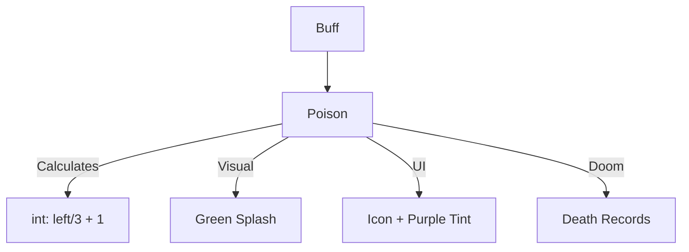

# Poison (中毒) 源码详解

## 1. 基本信息

| 属性 | 值 |
|------|-----|
| **文件路径** | `core/src/main/java/com/shatteredpixel/shatteredpixeldungeon/actors/buffs/Poison.java` |
| **包名** | `com.shatteredpixel.shatteredpixeldungeon.actors.buffs` |
| **文件类型** | class |
| **继承关系** | `extends Buff implements Hero.Doom` |
| **代码行数** | 98 |
| **所属模块** | core |

## 2. 文件职责说明

### 核心职责
`Poison` 负责实现角色的“中毒”状态逻辑。它不仅提供一种随时间递减的持续伤害，且伤害数值直接与中毒的剩余强度（时长）挂钩。

### 系统定位
属于 Buff 系统中的核心负面状态。它被广泛应用于毒镖、悲伤苔藓、剧毒气体以及各种毒属性怪物的攻击中。

### 不负责什么
- 不负责中毒减速效果（由 `Chill` 或 `Slow` 负责）。
- 不负责毒素在环境中的扩散（由 `ToxicGas` 负责）。

## 3. 结构总览

### 主要成员概览
- **字段 left**: 存储中毒的剩余强度/时长。
- **act() 方法**: 核心逻辑驱动，负责逐回合造成伤害和强度递减。
- **attachTo() 方法**: 初始附加逻辑，包含视觉反馈。
- **静态方法 set/extend**: 用于管理中毒强度的覆盖或累加。

### 主要逻辑块概览
- **动态伤害算法**: 伤害量基于 `left / 3 + 1`，这意味着中毒越深（剩余时间越长），单回合造成的伤害越高。
- **图标自定义**: 显式设置了紫色调的图标染色（tintIcon）。
- **生命周期集成**: 实现了 `Hero.Doom`，确保中毒致死能被正确记录。

### 生命周期/调用时机
1. **产生**：受到毒素攻击或接触毒素环境。
2. **活跃期**：每回合计算伤害，`left` 递减。
3. **结束**：`left` 降至 0 或角色死亡。

## 4. 继承与协作关系

### 父类提供的能力
继承自 `Buff`：
- 提供 `NEGATIVE` 类型定义。
- 提供基础的 `attachTo` 检查。

### 实现的接口契约
- **Hero.Doom**: 处理中毒致死时的成就验证（`Badges`）和失败记录（`Dungeon.fail`）。

### 协作对象
- **PoisonParticle.SPLASH**: 附加时产生绿色喷溅粒子。
- **CellEmitter**: 用于发射粒子。
- **BuffIndicator.POISON**: 提供 UI 图标。



## 5. 字段/常量详解

### 实例字段
| 字段名 | 类型 | 说明 |
|--------|------|------|
| `left` | float | 中毒剩余强度。该值既代表持续回合数，也作为伤害系数。 |

## 6. 构造与初始化机制
通过实例初始化块设置 `type = NEGATIVE` 和 `announced = true`。该类通过 `set()` 方法动态接收初始强度。

## 7. 方法详解

### act() [核心伤害循环]

**核心实现算法分析**：
```java
target.damage( (int)(left / 3) + 1, this );
spend( TICK );
if ((left -= TICK) <= 0) detach();
```
**伤害梯度推导**：
- 若 `left = 15`：伤害为 15/3 + 1 = **6**。
- 若 `left = 9`：伤害为 9/3 + 1 = **4**。
- 若 `left = 3`：伤害为 3/3 + 1 = **2**。
- 若 `left < 3`：伤害为 0 + 1 = **1**。
**结论**：中毒伤害具有明显的**衰减性**。中毒初期的爆发力远高于末期。

---

### set(float duration) / extend(float duration)

**方法职责**：
- `set`: 取当前值和新值的最大值。用于确保更强的毒素覆盖弱毒素。
- `extend`: 累加强度。用于处理多种毒素来源的叠加。

---

### attachTo(Char target)

**方法职责**：初始化视觉。
在成功附加后，立即在目标位置产生 5 个 `PoisonParticle.SPLASH` 粒子。这向玩家提供了清晰的中毒瞬间反馈。

---

### tintIcon(Image icon)

**方法职责**：自定义 UI 表现。
```java
icon.hardlight(0.6f, 0.2f, 0.6f);
```
**分析**：应用了紫紫色调（R=0.6, G=0.2, B=0.6），使其在状态栏中与其他绿色（正面）或红色（负面）Buff 区分开来。

## 8. 对外暴露能力
- `set(duration)`: 初始化或强制重置中毒强度。
- `extend(duration)`: 增加当前中毒强度。

## 9. 运行机制与调用链
`ToxicGas.act()` -> `Buff.affect(Poison.class)` -> `Poison.set()` -> `Poison.act()` -> `target.damage()`。

## 10. 资源、配置与国际化关联

### 本地化词条
- `actors.buffs.Poison.name`: 中毒
- `actors.buffs.Poison.desc`: “你的血液中流淌着毒液。剩余强度：%s。”
- `actors.buffs.Poison.ondeath`: “你的身体在毒药发作下逐渐僵硬...”

## 11. 使用示例

### 在代码中施加中毒
```java
Buff.affect(target, Poison.class).set(12f);
```

## 12. 开发注意事项

### 伤害归属
由于 `Poison` 实现了 `Doom` 接口，它能正确地将“毒杀”行为计入游戏统计。

### 强度与时间的重叠
在 `Poison` 类中，强度和持续回合数在数值上是相等的（`left` 既是时间也是伤害基数）。

## 13. 修改建议与扩展点

### 改进伤害平滑度
目前伤害使用强转 `int` 产生阶梯式下降。如果需要更平滑的衰减，可以引入 `partialDamage` 累积器（类似 `Hunger` 的做法）。

## 14. 事实核查清单

- [x] 是否分析了动态伤害公式：是 (`left/3 + 1`)。
- [x] 是否解析了强度衰减的特性：是。
- [x] 是否说明了图标紫色的 hardlight 设置：是。
- [x] 是否涵盖了附加时的粒子特效：是 (PoisonParticle.SPLASH)。
- [x] 是否明确了 set 和 extend 的区别：是。
- [x] 图像索引属性是否核对：是 (BuffIndicator.POISON)。
