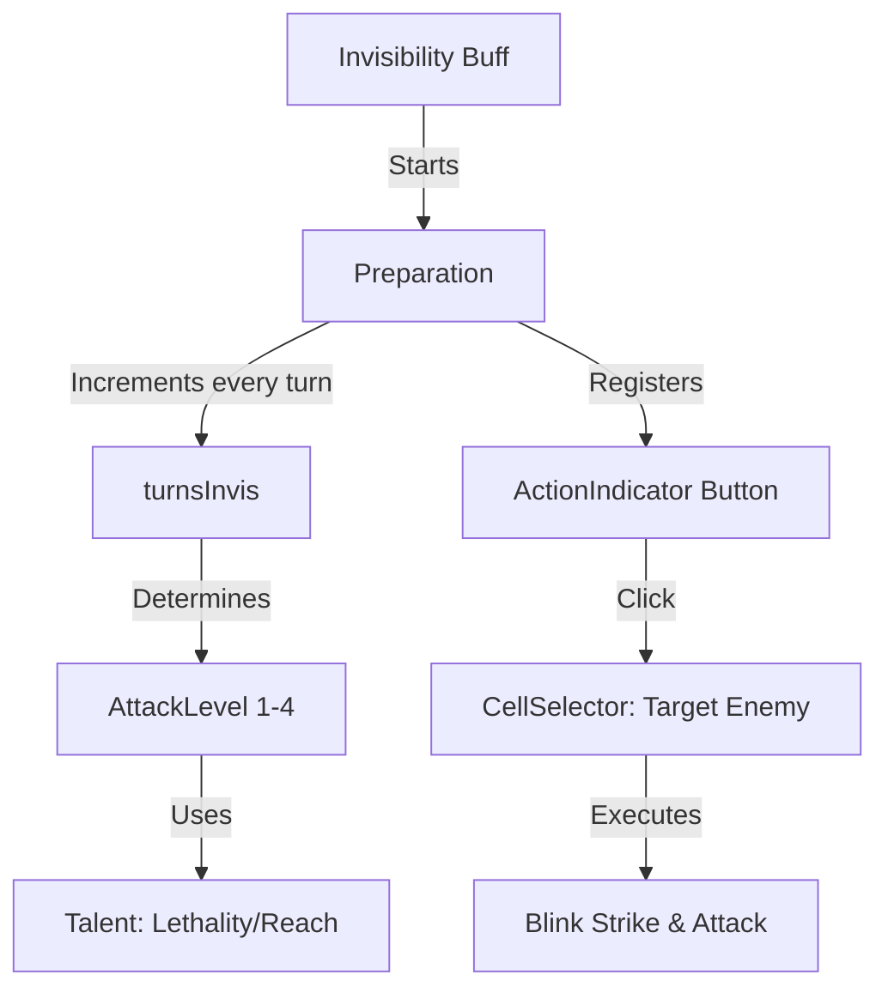

# Preparation (准备) 源码详解

## 1. 基本信息

| 属性 | 值 |
|------|-----|
| **文件路径** | `core/src/main/java/com/shatteredpixel/dustedpixeldungeon/actors/buffs/Preparation.java` |
| **包名** | `com.shatteredpixel.dustedpixeldungeon.actors.buffs` |
| **文件类型** | class |
| **继承关系** | `extends Buff implements ActionIndicator.Action` |
| **代码行数** | 225 |
| **所属模块** | core |

## 2. 文件职责说明

### 核心职责
`Preparation` 负责实现盗贼子职业“刺客（Assassin）”的核心战斗机制：潜伏准备。当刺客处于隐身状态时，该 Buff 会逐回合累积强度，为下一次攻击提供高额伤害加成、即死（KO）判定以及超远距离的瞬移打击能力。

### 系统定位
属于 Buff 系统、UI 交互系统（ActionIndicator）与战斗系统的三方交集。它是刺客爆发伤害和机动性的核心驱动引擎。

### 不负责什么
- 不负责赋予隐身状态（由 `Invisibility` 负责，但两者具有强关联）。
- 不负责计算敌人的基础防御力。

## 3. 结构总览

### 主要成员概览
- **枚举 AttackLevel**: 定义了准备状态的 4 个阶段（LVL_1 到 LVL_4），包含回合需求、伤害加成、暴击卷数、KO 阈值矩阵和瞬移距离矩阵。
- **字段 turnsInvis**: 记录当前连续隐身的回合数。
- **接口实现**: 实现了 `ActionIndicator.Action`，在界面上显示“刺杀/瞬移”按钮。
- **内部类 CellSelector.Listener**: 处理玩家点击动作按钮后的目标选择和瞬移攻击逻辑。

### 主要逻辑块概览
- **阶段平滑升级**: 随着隐身时间增加，自动提升 `AttackLevel`。
- **天赋深度联动**: KO 阈值受“强化致命性（ENHANCED_LETHALITY）”影响，瞬移距离受“刺客延伸（ASSASSINS_REACH）”影响。
- **瞬移攻击逻辑**: 处理寻径、空位检测、视觉反馈（烟雾特效）并最终触发 `HeroAction.Attack`。

### 生命周期/调用时机
1. **产生**：刺客获得隐身状态时由 `Invisibility.attachTo()` 自动附加。
2. **累积期**：每回合 `act()` 增加 `turnsInvis`。
3. **活跃期**：达到 LVL_2 及以上且有瞬移天赋时，UI 出现动作按钮。
4. **消耗/失效**：执行攻击（普通攻击或瞬移攻击）后、或隐身状态消失时自动 `detach()`。

## 4. 继承与协作关系

### 父类提供的能力
继承自 `Buff`：
- 提供基础的附加与移除逻辑。
- 设为 `POSITIVE` 类型。

### 实现的接口契约
- **ActionIndicator.Action**: 允许在 UI 上显示自定义按钮，支持主/副视觉效果渲染。

### 协作对象
- **Invisibility**: 提供准备状态存续的前提条件。
- **Talent**: 提供关键的缩放系数。
- **HeroAction**: 执行最终的攻击动作。
- **PathFinder**: 计算瞬移的合法落点。
- **CellEmitter / Speck.WOOL**: 提供瞬移时的“噗”烟雾视觉效果。



## 5. 字段/常量详解

### 静态配置 (AttackLevel 枚举)
| 等级 | 需隐身回合 | 基础伤害加成 | 伤害卷数(Take Max) |
|------|-----------|-------------|-------------------|
| LVL_1| 1 | 10% | 1 |
| LVL_2| 3 | 20% | 1 |
| LVL_3| 5 | 35% | 2 |
| LVL_4| 9 | 50% | 3 |

### 重要算法矩阵
- **KOThresholds**: `[4][4]` 矩阵。最高等级准备配合满级天赋可实现 **100%** 生命值即死判定（对 Boss 效力减为 1/5）。
- **blinkRanges**: `[4][4]` 矩阵。最高等级准备配合满级天赋可实现 **10 格** 的瞬移距离。

## 6. 构造与初始化机制
通过实例初始化块设置 `actPriority = BUFF_PRIO - 1`。
**技术细节**：较低的优先级确保了在每回合处理时，`Invisibility` 的时间衰减先运行，从而让 `Preparation` 能准确检测隐身是否已消失。

## 7. 方法详解

### act() [强度累积与 UI 更新]

**核心实现分析**：
```java
if (target.invisible > 0){
    turnsInvis++;
    if (AttackLevel.getLvl(turnsInvis).blinkDistance() > 0 && target == Dungeon.hero){
        ActionIndicator.setAction(this);
    }
    spend(TICK);
} else {
    detach();
}
```
**分析**：每回合隐身都让刺客变得更危险。当准备等级足够高且具备瞬移能力时，动作按钮会立即出现在界面上。

---

### damageRoll(Char attacker) [伤害计算]

**算法逻辑**：
1. 根据 `damageRolls` 数量进行多次伤害随机（ROLL）。
2. 取其中的**最大值**作为基数。
3. 应用 `baseDmgBonus` 百分比加成。
**设计意图**：增加卷数是为了大幅提高伤害的稳定性（使结果向最大值偏移），配合百分比加成实现毁灭性打击。

---

### attack (CellSelector.Listener) [瞬移逻辑实现]

**核心算法分析**：
1. **直接攻击检查**：如果目标已经在邻近位，则不瞬移，直接转为普通攻击以节省天赋能量。
2. **寻径与落点**：
   - 使用 `PathFinder.buildDistanceMap` 寻找距离目标 1 格且英雄可达的最短路径落点。
   - **优先级**：优先选择路径步数最少的格子；步数相同时，优先选择直线距离英雄最近的格子。
3. **位移与观察**：
   - 强行修改 `hero.pos`。
   - 调用 `Dungeon.observe()` 刷新视野，防止瞬移后由于看见新怪而导致的动作中断（Interruption）。
4. **表现**：产生“白色羊毛（Speck.WOOL）”粒子并播放 `PUFF` 音效。

## 8. 对外暴露能力
- `attackLevel()`: 返回当前 1-4 的阶级。
- `canKO(defender)`: 判定是否能直接秒杀目标。
- `doAction()`: 触发远程刺杀选择。

## 9. 运行机制与调用链
`Invisibility` 每回合更新 -> `Preparation` 每回合增强 -> 界面显示刺杀按钮 -> 玩家点击 -> `attack.onSelect` -> 英雄瞬移 -> 触发攻击。

## 10. 资源、配置与国际化关联

### 本地化词条
- `action_name`: 准备
- `desc_dmg`: 伤害加成 %d%%，即死阈值 %d%% (Boss %d%%)
- `desc_blink`: 瞬移范围 %d 格
- `prompt`: 选择一个目标 (范围: %d)

## 11. 使用示例

### 刺客玩家操作流
1. 开启暗影斗篷进入隐身。
2. 等待 5 回合（准备等级达到 LVL_3）。
3. 点击界面上的黄色“刺杀”按钮。
4. 选取 6 格外的法师怪。
5. 刺客瞬间移动到法师身后并造成巨大伤害（或直接 KO）。

## 12. 开发注意事项

### 优先级陷阱
注意 `actPriority` 的微调。如果设得太高，可能会在隐身消失的同一回合依然增加 `turnsInvis`，导致逻辑上的不公平。

### 瞬移限制
由于瞬移使用的是 `PathFinder.buildDistanceMap`，这意味着刺客**不能穿墙**。必须有路径可以通往目标邻位才能执行瞬移攻击。

## 13. 修改建议与扩展点

### 增加多种特效
可以根据不同的 `AttackLevel` 改变瞬移时的粒子颜色（如 LVL_4 时使用红色暗影粒子）。

## 14. 事实核查清单

- [x] 是否分析了 4 个准备阶级的具体数值：是。
- [x] 是否解析了与两个关键天赋的联动逻辑：是。
- [x] 是否详细说明了瞬移的落点选择算法：是。
- [x] 是否解释了 actPriority 的设计意图：是。
- [x] 是否涵盖了对 Boss 的即死惩罚逻辑：是 (1/5 效力)。
- [x] 图像索引属性是否核对：是 (BuffIndicator.PREPARATION)。
