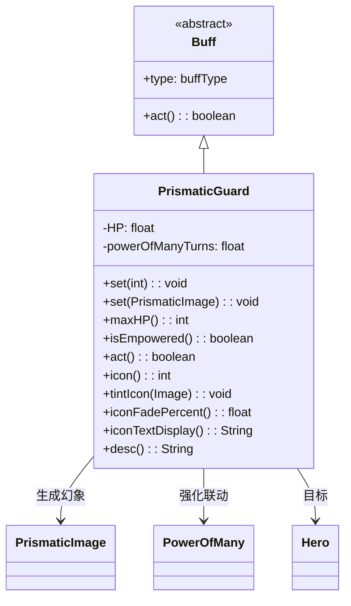

# PrismaticGuard 类文档

## 1. 基本信息
| 属性 | 值 |
|------|-----|
| 文件路径 | core/src/main/java/com/shatteredpixel/shatteredpixeldungeon/actors/buffs/PrismaticGuard.java |
| 包名 | com.shatteredpixel.shatteredpixeldungeon.actors.buffs |
| 类类型 | class |
| 继承关系 | extends Buff |
| 代码行数 | 184 |

## 2. 类职责说明
PrismaticGuard（棱镜护卫）是一个正面Buff，管理棱镜幻象的存储和生成。当敌人在5格范围内时，会生成一个棱镜幻象协助战斗。幻象的生命值会随时间恢复。可以与"众力"能力联动获得强化效果。

## 4. 继承与协作关系


## 实例字段表
| 字段名 | 类型 | 修饰符 | 说明 |
|--------|------|--------|------|
| HP | float | private | 存储的生命值 |
| powerOfManyTurns | float | private | 众力强化剩余回合 |
| type | buffType | - | POSITIVE（正面Buff） |

## 7. 方法详解

### set(int HP)
**签名**: `public void set(int HP)`
**功能**: 设置棱镜护卫的生命值。
**参数**:
- HP: int - 生命值

### set(PrismaticImage img)
**签名**: `public void set(PrismaticImage img)`
**功能**: 从棱镜幻象设置护卫状态。
**参数**:
- img: PrismaticImage - 棱镜幻象

### maxHP()
**签名**: `public int maxHP()`
**功能**: 获取最大生命值。
**返回值**: int - 最大生命值（10 + 等级*2.5）。

### isEmpowered()
**签名**: `public boolean isEmpowered()`
**功能**: 检查是否被众力强化。
**返回值**: boolean - 是否强化。

### act()
**签名**: `public boolean act()`
**功能**: 每回合检查敌人并生成棱镜幻象。
**返回值**: boolean - 返回true表示成功执行。
**实现逻辑**:
```java
// 寻找最近的活跃敌人
Mob closest = null;
// 在可见敌人中寻找
for (Mob mob : visibleEnemies) {
    if (mob.isAlive() && !mob.isInvulnerable()
        && mob.state != PASSIVE/WANDERING/SLEEPING) {
        closest = mob;  // 选最近的
    }
}

// 如果敌人在5格内
if (closest != null && distance < 5) {
    // 找最佳生成位置
    int bestPos = 找离敌人最近的空位;
    if (bestPos != -1) {
        // 生成棱镜幻象
        PrismaticImage pris = new PrismaticImage();
        pris.duplicate(hero, HP);
        GameScene.add(pris);
        detach();  // 移除Buff
    }
}

// 恢复生命值
if (HP < maxHP() && regenOn) {
    HP += 0.1f;
}
```

### icon()
**签名**: `public int icon()`
**功能**: 返回Buff图标的索引标识符。
**返回值**: int - 返回BuffIndicator.ARMOR（护甲图标）。

### tintIcon(Image icon)
**签名**: `public void tintIcon(Image icon)`
**功能**: 为Buff图标设置颜色色调。
**参数**:
- icon: Image - 需要着色的图标图像
**实现逻辑**:
```java
if (isEmpowered()) {
    icon.hardlight(3f, 3f, 2f);  // 强化时更亮
} else {
    icon.hardlight(1f, 1f, 2f);  // 正常淡紫色
}
```

### iconFadePercent()
**签名**: `public float iconFadePercent()`
**功能**: 计算Buff图标的淡出百分比。
**返回值**: float - 图标完整度比例（基于生命值）。

### iconTextDisplay()
**签名**: `public String iconTextDisplay()`
**功能**: 返回图标上显示的文本（生命值）。
**返回值**: String - 当前生命值的字符串表示。

### desc()
**签名**: `public String desc()`
**功能**: 返回Buff的详细描述文本。
**返回值**: String - 包含生命值信息的描述。

## 11. 使用示例
```java
// 设置棱镜护卫
PrismaticGuard guard = Buff.affect(hero, PrismaticGuard.class);
guard.set(30);  // 设置30点生命值

// 检查是否强化
if (guard.isEmpowered()) {
    // 棱镜幻象会有强化效果
}

// 检查生命值
int hp = (int)guard.HP;
int max = guard.maxHP();
```

## 注意事项
1. 敌人在5格内时生成幻象
2. 幻象生命值会恢复
3. 生成后Buff移除
4. 最大生命值随等级增长
5. 可被众力强化
6. 是正面Buff

## 最佳实践
1. 在危险区域保持高生命值
2. 配合众力能力强化幻象
3. 幻象消失后自动返回Buff形式
4. 利用幻象吸引敌人火力