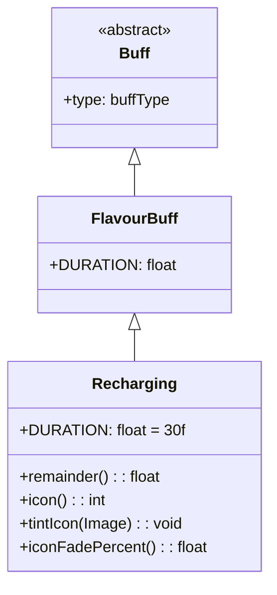

# Recharging 类文档

## 1. 基本信息
| 属性 | 值 |
|------|-----|
| 文件路径 | core/src/main/java/com/shatteredpixel/shatteredpixeldungeon/actors/buffs/Recharging.java |
| 包名 | com.shatteredpixel.shatteredpixeldungeon.actors.buffs |
| 类类型 | class |
| 继承关系 | extends FlavourBuff |
| 代码行数 | 58 |

## 2. 类职责说明
Recharging（充能）是一个正面Buff，使角色的法杖获得充能效果。充能状态下法杖会更快地恢复充能次数。提供了remainder()方法处理部分回合的充能，确保充能效果的一致性。主要用于充能药剂、特定技能效果等场景。

## 4. 继承与协作关系


## 静态常量表
| 常量名 | 类型 | 值 | 说明 |
|--------|------|-----|------|
| DURATION | float | 30f | 默认持续时间（回合数） |

## 实例字段表
| 字段名 | 类型 | 修饰符 | 说明 |
|--------|------|--------|------|
| type | buffType | - | POSITIVE（正面Buff） |

## 7. 方法详解

### remainder()
**签名**: `public float remainder()`
**功能**: 返回当前回合的充能比例（处理部分回合）。
**返回值**: float - 充能比例（0-1）。
**实现逻辑**:
```java
return Math.min(1f, this.cooldown());  // 返回剩余时间，上限为1
```
这个方法用于处理部分回合的充能：
- 如果Buff还剩半回合，应该提供一半的充能效果
- 由于Buff执行顺序随机，不能简单检查Buff是否存在
- 需要直接检查剩余时间并相应处理

### icon()
**签名**: `public int icon()`
**功能**: 返回Buff图标的索引标识符。
**返回值**: int - 返回BuffIndicator.RECHARGING（充能图标）。

### tintIcon(Image icon)
**签名**: `public void tintIcon(Image icon)`
**功能**: 为Buff图标设置颜色色调。
**参数**:
- icon: Image - 需要着色的图标图像
**实现逻辑**:
```java
icon.hardlight(1, 1, 0);  // 设置黄色高光效果
```

### iconFadePercent()
**签名**: `public float iconFadePercent()`
**功能**: 计算Buff图标的淡出百分比。
**返回值**: float - 图标完整度比例。

## 11. 使用示例
```java
// 为英雄添加充能效果，持续30回合
Buff.affect(hero, Recharging.class, Recharging.DURATION);

// 检查是否有充能效果
if (hero.buff(Recharging.class) != null) {
    float charge = hero.buff(Recharging.class).remainder();
    // 使用charge值进行充能计算
}

// 延长充能时间
Buff.prolong(hero, Recharging.class, 15f);
```

## 注意事项
1. 充能效果使法杖充能更快
2. remainder()方法处理部分回合的充能
3. 实际的充能逻辑在法杖类中实现
4. 持续时间中等（30回合）
5. 是正面Buff

## 最佳实践
1. 在法杖充能耗尽后使用
2. 配合法杖使用效果最佳
3. 注意remainder()方法确保充能一致性
4. 可以叠加持续时间