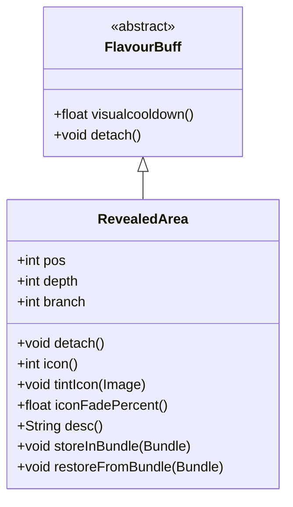

# RevealedArea 类文档

## 1. 基本信息
| 属性 | 值 |
|------|-----|
| 文件路径 | core/src/main/java/com/shatteredpixel/shatteredpixeldungeon/actors/buffs/RevealedArea.java |
| 包名 | com.shatteredpixel.shatteredpixeldungeon.actors.buffs |
| 类类型 | class |
| 继承关系 | extends FlavourBuff |
| 代码行数 | 86 行 |

## 2. 类职责说明
RevealedArea 是一个追踪已揭示区域的 Buff 类。它允许玩家看到特定位置的周围区域，即使不在直接视野范围内。这个效果通常由"预知射击"（Seer Shot）天赋触发，让玩家能够提前看到目标区域的敌人或地形。

## 4. 继承与协作关系


## 静态常量表
| 常量名 | 类型 | 值 | 说明 |
|--------|------|-----|------|
| BRANCH | String | "branch" | Bundle 存储键 - 分支 |
| DEPTH | String | "depth" | Bundle 存储键 - 深度 |
| POS | String | "pos" | Bundle 存储键 - 位置 |

## 实例字段表
| 字段名 | 类型 | 修饰符 | 说明 |
|--------|------|--------|------|
| pos | int | public | 揭示区域的位置（格子坐标） |
| depth | int | public | 揭示时的地牢深度 |
| branch | int | public | 揭示时的地牢分支 |

## 7. 方法详解

### detach()
**签名**: `public void detach()`
**功能**: 重写分离方法，在移除 Buff 时更新迷雾
**实现逻辑**:
```
第42行: 更新揭示位置周围的迷雾（半径2格）
第43行: 调用父类的 detach 方法
```

### icon()
**签名**: `public int icon()`
**功能**: 返回 Buff 图标标识符
**返回值**: int - BuffIndicator.MIND_VISION（心灵视觉图标）
**实现逻辑**:
```
第48行: 返回心灵视觉图标，表示看到区域的能力
```

### tintIcon(Image icon)
**签名**: `public void tintIcon(Image icon)`
**功能**: 为图标着色
**参数**:
- icon: Image - 要着色的图标图像
**实现逻辑**:
```
第53行: 将图标着色为青色（0, 1, 1），与心灵视觉区分
```

### iconFadePercent()
**签名**: `public float iconFadePercent()`
**功能**: 计算图标淡入淡出百分比
**返回值**: float - 0到1之间的值，表示剩余时间的比例
**实现逻辑**:
```
第58行: 根据天赋等级计算最大持续时间（每级5回合）
第59行: 根据剩余冷却时间计算百分比
```

### desc()
**签名**: `public String desc()`
**功能**: 返回 Buff 的详细描述文本
**返回值**: String - 格式化的描述文本
**实现逻辑**:
```
第64行: 使用消息模板，传入剩余冷却时间（转换为整数）
```

### storeInBundle(Bundle bundle)
**签名**: `public void storeInBundle(Bundle bundle)`
**功能**: 将 Buff 状态保存到 Bundle 中以支持游戏存档
**参数**:
- bundle: Bundle - 存储容器
**实现逻辑**:
```
第73行: 调用父类存储方法
第74-76行: 保存深度、分支和位置信息
```

### restoreFromBundle(Bundle bundle)
**签名**: `public void restoreFromBundle(Bundle bundle)`
**功能**: 从 Bundle 恢复 Buff 状态
**参数**:
- bundle: Bundle - 存储容器
**实现逻辑**:
```
第81行: 调用父类恢复方法
第82-84行: 恢复深度、分支和位置信息
```

## 11. 使用示例
```java
// 通过预知射击天赋揭示区域
RevealedArea revealed = Buff.affect(hero, RevealedArea.class);
revealed.pos = targetPos;      // 设置要揭示的位置
revealed.depth = Dungeon.depth; // 记录当前深度
revealed.branch = Dungeon.branch; // 记录当前分支

// 玩家现在可以看到该位置周围区域
// 效果持续时间取决于天赋等级（每级5回合）

// 当效果结束时，迷雾会更新
```

## 注意事项
1. **天赋关联**: 持续时间与"预知射击"天赋等级相关
2. **跨层处理**: 记录深度和分支，确保只在正确层级生效
3. **迷雾更新**: 效果结束时更新迷雾，可能揭示新区域或隐藏已探索区域
4. **正面效果**: type 设置为 POSITIVE，显示为正面 Buff
5. **位置特定**: 每个实例追踪特定位置的视野

## 最佳实践
1. 使用时确保设置正确的 pos、depth 和 branch
2. 可以同时存在多个 RevealedArea 实例追踪不同位置
3. 配合远程攻击使用，提前发现目标区域的敌人
4. 效果结束时迷雾更新会自动处理视觉变化