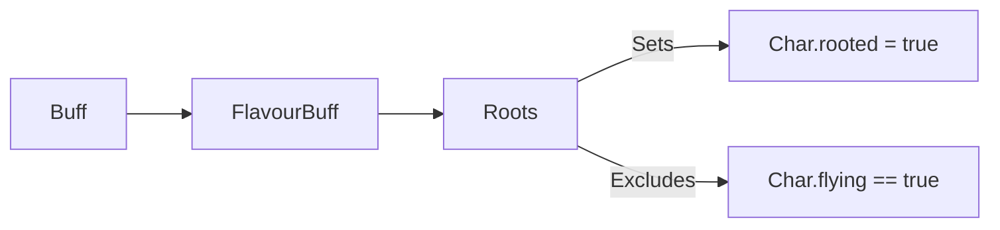

# Roots (植根/缠绕) 源码详解

## 1. 基本信息

| 属性 | 值 |
|------|-----|
| **文件路径** | `core/src/main/java/com/shatteredpixel/shatteredpixeldungeon/actors/buffs/Roots.java` |
| **包名** | `com.shatteredpixel.shatteredpixeldungeon.actors.buffs` |
| **文件类型** | class |
| **继承关系** | `extends FlavourBuff` |
| **代码行数** | 45 |
| **所属模块** | core |

## 2. 文件职责说明

### 核心职责
`Roots` 负责实现角色的“植根”或“缠绕”状态逻辑。它通过控制目标的位移属性，强制使角色在状态存续期间无法离开当前位置。

### 系统定位
属于 Buff 系统中的软控（Soft CC）分支。与麻痹（Paralysis）不同，植根状态仅限制移动，角色依然可以进行攻击、施法或使用道具。

### 不负责什么
- 不负责阻止角色的旋转或动画播放。
- 不负责由于缠绕产生的伤害（纯位移限制）。
- 不负责强力位移（如击退）对植根状态的强制打断。

## 3. 结构总览

### 主要成员概览
- **常量 DURATION**: 默认持续时间（5 回合）。
- **attachTo() 方法**: 处理附加逻辑，包含对飞行属性的特殊过滤。
- **detach() 方法**: 恢复角色的移动能力。

### 主要逻辑块概览
- **飞行免疫**: 只有踩在地面上的生物才能被植根。
- **状态标记**: 通过直接修改 `target.rooted` 布尔值来实现移动阻塞。

### 生命周期/调用时机
1. **产生**：受到藤蔓、根须陷阱或特定法术攻击。
2. **活跃期**：角色无法主动点击地板移动。
3. **结束**：持续时间结束，恢复自由。

## 4. 继承与协作关系

### 父类提供的能力
继承自 `FlavourBuff`：
- 提供 `left` 时间管理和 UI 描述。

### 协作对象
- **Char**: 目标角色，其 `rooted` 字段直接受此 Buff 驱动。
- **BuffIndicator.ROOTS**: 提供 UI 图标索引。



## 5. 字段/常量详解

### 静态常量
- **DURATION**: 5.0f 回合。

## 6. 构造与初始化机制
通过实例初始化块设置 `type = NEGATIVE` 和 `announced = true`。

## 7. 方法详解

### attachTo(Char target)

**核心实现算法分析**：
```java
@Override
public boolean attachTo( Char target ) {
    if (!target.flying && super.attachTo( target )) {
        target.rooted = true;
        return true;
    } else {
        return false;
    }
}
```
**技术要点**：
1. **地栖限制**：首行执行 `!target.flying` 检查。如果角色正在飞行（如蝙蝠或使用漂浮药水的玩家），植根状态将无法附加。
2. **状态注入**：成功附加后，显式将 `target.rooted` 设为 `true`。该布尔值在 `Char.act()` 的路径寻找逻辑中被检查，若为真则阻止位移。

---

### detach()

**方法职责**：清理逻辑。
强制将 `target.rooted` 重置为 `false`，确保角色恢复行动自由。

## 8. 对外暴露能力
主要通过 `Buff.affect(target, Roots.class)` 对外提供状态附加能力。

## 9. 运行机制与调用链
`Trap.trigger()` -> `Buff.affect(Roots.class)` -> `target.rooted = true` -> 玩家点击移动被拦截。

## 10. 资源、配置与国际化关联

### 本地化词条
- `actors.buffs.Roots.name`: 植根
- `actors.buffs.Roots.desc`: “你无法移动！剩余时长：%s。”

## 11. 使用示例

### 在代码中施加缠绕
```java
Buff.affect(target, Roots.class, 3f); // 缠绕 3 回合
```

## 12. 开发注意事项

### 属性联动
`rooted` 状态仅阻止“主动走动（walking）”。如果角色受到“击退（Pushing）”或“传送（Teleportation）”，物理位置依然会发生改变，且植根状态通常不会因此消失（除非该技能显式调用了清除逻辑）。

### 与麻痹的区别
麻痹是 `paralysed++`（完全停止 act），植根是 `rooted = true`（仅停止位移）。

## 13. 修改建议与扩展点

### 增加伤害
可以创建 `Roots` 的子类，例如 `ToxicRoots`，在 `act()` 方法中增加每回合的生命值扣减逻辑。

## 14. 事实核查清单

- [x] 是否分析了飞行单位的免疫逻辑：是 (!target.flying)。
- [x] 是否解析了 `target.rooted` 字段的修改：是。
- [x] 是否涵盖了默认持续时间：是 (5 回合)。
- [x] 是否明确了它作为 FlavourBuff 的特征：是。
- [x] 图像索引属性是否核对：是 (BuffIndicator.ROOTS)。
