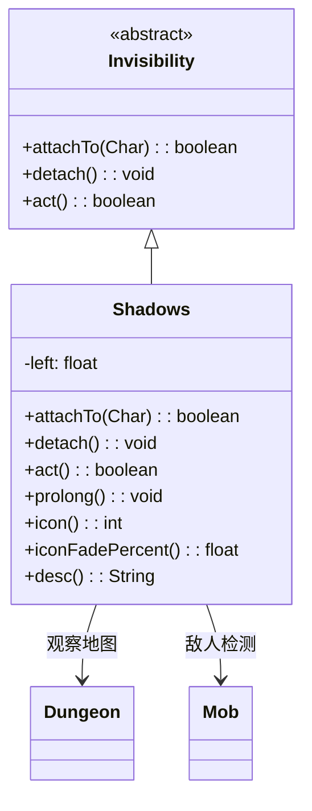

# Shadows 类文档

## 1. 基本信息
| 属性 | 值 |
|------|-----|
| 文件路径 | core/src/main/java/com/shatteredpixel/shatteredpixeldungeon/actors/buffs/Shadows.java |
| 包名 | com.shatteredpixel.shatteredpixeldungeon.actors.buffs |
| 类类型 | class |
| 继承关系 | extends Invisibility |
| 代码行数 | 128 |

## 2. 类职责说明
Shadows（暗影）是一个特殊的隐形Buff，使角色融入暗影中。与普通隐形不同，暗影状态会在敌人接近时自动打破。每次延长只能持续2回合，适合在敌人附近躲藏。主要用于暗影药剂、盗贼技能等场景。

## 4. 继承与协作关系


## 静态常量表
| 常量名 | 类型 | 值 | 说明 |
|--------|------|-----|------|
| LEFT | String | "left" | Bundle存储键 |

## 实例字段表
| 字段名 | 类型 | 修饰符 | 说明 |
|--------|------|--------|------|
| left | float | protected | 剩余持续时间 |
| announced | boolean | - | false（不公告） |
| type | buffType | - | POSITIVE（正面Buff） |

## 7. 方法详解

### attachTo(Char target)
**签名**: `public boolean attachTo(Char target)`
**功能**: 重写附加方法，检查是否有相邻敌人。
**参数**:
- target: Char - 目标角色
**返回值**: boolean - 是否成功附加。
**实现逻辑**:
```java
// 检查是否有相邻敌人
if (Dungeon.level != null) {
    for (Mob m : Dungeon.level.mobs) {
        if (Dungeon.level.adjacent(m.pos, target.pos) && m.alignment != target.alignment) {
            return false;  // 有相邻敌人则无法附加
        }
    }
}
if (super.attachTo(target)) {
    if (Dungeon.level != null) {
        Sample.INSTANCE.play(Assets.Sounds.MELD);  // 播放融合音效
        Dungeon.observe();  // 触发地图观察
    }
    return true;
}
return false;
```

### detach()
**签名**: `public void detach()`
**功能**: 重写移除方法，触发地图观察。
**实现逻辑**:
```java
super.detach();
Dungeon.observe();  // 更新视野
```

### act()
**签名**: `public boolean act()`
**功能**: 每回合检查持续时间和敌人距离。
**返回值**: boolean - 返回true表示成功执行。
**实现逻辑**:
```java
if (target.isAlive()) {
    spend(TICK);
    
    if (--left <= 0) {
        detach();  // 时间耗尽则移除
        return true;
    }
    
    // 检查是否有敌人接近
    for (Mob m : Dungeon.level.mobs) {
        if (Dungeon.level.adjacent(m.pos, target.pos) && m.alignment != target.alignment) {
            detach();  // 敌人接近则移除
            return true;
        }
    }
} else {
    detach();
}
return true;
```

### prolong()
**签名**: `public void prolong()`
**功能**: 延长暗影状态2回合。
**实现逻辑**:
```java
left = 2;  // 固定延长2回合
```

### icon()
**签名**: `public int icon()`
**功能**: 返回Buff图标的索引标识符。
**返回值**: int - 返回BuffIndicator.SHADOWS（暗影图标）。

### iconFadePercent()
**签名**: `public float iconFadePercent()`
**功能**: 计算Buff图标的淡出百分比。
**返回值**: float - 始终返回0（不淡出）。

### desc()
**签名**: `public String desc()`
**功能**: 返回Buff的详细描述文本。
**返回值**: String - 描述文本。

## 11. 使用示例
```java
// 添加暗影状态
Shadows shadows = Buff.affect(hero, Shadows.class);
shadows.prolong();  // 延长2回合

// 检查是否有暗影
if (hero.buff(Shadows.class) != null) {
    // 英雄隐形且融入暗影
}

// 敌人接近时自动打破
// 无法在有相邻敌人时使用
```

## 注意事项
1. 每次prolong()固定延长2回合
2. 敌人接近时自动打破
3. 无法在有相邻敌人时添加
4. 是隐形效果的变体
5. 不会公告
6. 是正面Buff

## 最佳实践
1. 在远离敌人时使用
2. 用于躲避敌人搜索
3. 配合暗影药剂使用
4. 注意敌人会打破效果