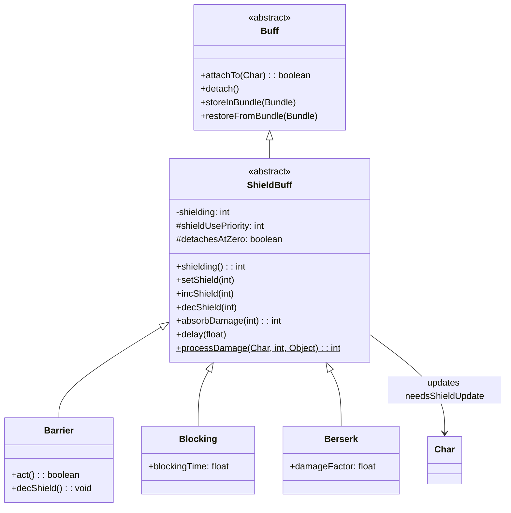

# ShieldBuff 类文档

## 1. 基本信息

| 属性 | 值 |
|------|-----|
| 文件路径 | core/src/main/java/com/shatteredpixel/shatteredpixeldungeon/actors/buffs/ShieldBuff.java |
| 包名 | com.shatteredpixel.shatteredpixeldungeon.actors.buffs |
| 类类型 | abstract class |
| 继承关系 | extends Buff |
| 代码行数 | 153 行 |
| 许可证 | GNU GPL v3 |

## 2. 类职责说明

`ShieldBuff` 是所有护盾类Buff的抽象基类，负责：

1. **护盾值管理** - 存储和更新护盾值
2. **伤害吸收** - 提供伤害吸收机制
3. **优先级系统** - 支持多层护盾的消耗顺序
4. **自动移除** - 护盾耗尽时自动移除

## 4. 继承与协作关系



## 实例字段表

| 字段名 | 类型 | 默认值 | 说明 |
|--------|------|--------|------|
| shielding | int | 0 | 当前护盾值 |
| shieldUsePriority | int | 0 | 护盾使用优先级（高优先） |
| detachesAtZero | boolean | true | 护盾耗尽时是否自动移除 |

### 优先级说明

| 优先级 | 用途 | 示例 |
|--------|------|------|
| 2 | 弱且短期的护盾 | Blocking Buff |
| 1 | 较大但仍短期的护盾 | Cleric飞升形态 |
| 0 | 普通护盾 | Barrier |

## 7. 方法详解

### attachTo(Char target)

**签名**: `@Override public boolean attachTo(Char target)`

**功能**: 附加护盾Buff时标记需要更新护盾。

**实现逻辑**:
```java
// 第45-53行：
if (super.attachTo(target)) {
    target.needsShieldUpdate = true;  // 标记需要护盾更新
    return true;
}
return false;
```

### detach()

**签名**: `@Override public void detach()`

**功能**: 移除护盾Buff时标记需要更新护盾。

**实现逻辑**:
```java
// 第55-59行：
target.needsShieldUpdate = true;
super.detach();
```

### shielding()

**签名**: `public int shielding()`

**功能**: 获取当前护盾值。

**返回值**: `int` - 护盾值

### setShield(int shield)

**签名**: `public void setShield(int shield)`

**功能**: 设置护盾值（只增不减）。

**参数**:
- `shield`: int - 新护盾值

**实现逻辑**:
```java
// 第65-68行：
if (this.shielding <= shield) this.shielding = shield;  // 只能增加
if (target != null) target.needsShieldUpdate = true;
```

### incShield(int amt)

**签名**: `public void incShield(int amt)`

**功能**: 增加护盾值。

**参数**:
- `amt`: int - 增加量

### decShield(int amt)

**签名**: `public void decShield(int amt)`

**功能**: 减少护盾值。

**参数**:
- `amt`: int - 减少量

### delay(float value)

**签名**: `public void delay(float value)`

**功能**: 延迟护盾衰减（不增加护盾值）。

**参数**:
- `value`: float - 延迟时间

### absorbDamage(int dmg)

**签名**: `public int absorbDamage(int dmg)`

**功能**: 吸收伤害。

**参数**:
- `dmg`: int - 原始伤害

**返回值**: `int` - 剩余伤害

**实现逻辑**:
```java
// 第94-107行：
if (shielding >= dmg) {
    shielding -= dmg;
    dmg = 0;  // 完全吸收
} else {
    dmg -= shielding;
    shielding = 0;  // 部分吸收
}
if (shielding <= 0 && detachesAtZero) {
    detach();  // 护盾耗尽，移除Buff
}
if (target != null) target.needsShieldUpdate = true;
return dmg;
```

### processDamage(Char target, int damage, Object src)

**签名**: `public static int processDamage(Char target, int damage, Object src)`

**功能**: 处理角色的伤害吸收（静态方法）。

**参数**:
- `target`: Char - 受伤目标
- `damage`: int - 原始伤害
- `src`: Object - 伤害来源

**返回值**: `int` - 剩余伤害

**实现逻辑**:

```
第109-137行：伤害处理流程
├─ 第111-113行：饥饿伤害跳过护盾
├─ 第115-123行：获取并排序所有护盾Buff
│  └─ 按shieldUsePriority降序排列
├─ 第124-133行：依次吸收伤害
│  ├─ 跳过护盾值为0的Buff
│  ├─ 调用absorbDamage吸收伤害
│  └─ 触发ProvokedAnger天赋
└─ 返回剩余伤害
```

## 11. 使用示例

### 创建自定义护盾Buff

```java
public class MyShield extends ShieldBuff {
    
    {
        shieldUsePriority = 0;     // 普通优先级
        detachesAtZero = true;     // 耗尽时移除
    }
    
    @Override
    public int icon() {
        return BuffIndicator.BARRIER;
    }
    
    @Override
    public String desc() {
        return "护盾: " + shielding + "点";
    }
}
```

### 使用护盾Buff

```java
// 添加50点护盾
ShieldBuff shield = Buff.affect(hero, MyShield.class);
shield.setShield(50);

// 增加护盾
shield.incShield(20);  // 现在是70点

// 延迟衰减
shield.delay(5f);  // 延迟5回合

// 手动减少
shield.decShield(10);
```

### 检查护盾值

```java
// 获取总护盾
int totalShield = 0;
for (ShieldBuff buff : hero.buffs(ShieldBuff.class)) {
    totalShield += buff.shielding();
}

// 检查特定护盾
if (hero.buff(Barrier.class) != null) {
    int barrier = hero.buff(Barrier.class).shielding();
}
```

## 子类列表

| 子类 | 功能 | 优先级 |
|------|------|--------|
| Barrier | 普通护盾 | 0 |
| Blocking | 格挡护盾 | 2 |
| Berserk | 狂战士护盾 | 0 |
| ObeliskShieldNPC | 方尖碑护盾 | 0 |
| ClericAscendedShield | 牧师飞升护盾 | 1 |

## 注意事项

1. **setShield只增不减** - 如果需要减少护盾，使用decShield()
2. **优先级系统** - 多层护盾时，高优先级的先被消耗
3. **自动移除** - detachesAtZero=true时护盾耗尽会自动移除
4. **更新标记** - 任何护盾变化都需要设置needsShieldUpdate

## 相关文件

| 文件 | 说明 |
|------|------|
| Buff.java | 父类 |
| Barrier.java | 普通护盾实现 |
| Blocking.java | 格挡护盾 |
| Berserk.java | 狂战士护盾 |
| Char.java | 角色基类 |
| Talent.java | 天赋系统 |