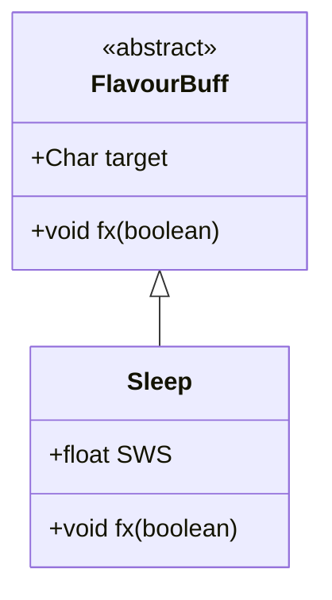

# Sleep 类文档

## 1. 基本信息
| 属性 | 值 |
|------|-----|
| 文件路径 | core/src/main/java/com/shatteredpixel/shatteredpixeldungeon/actors/buffs/Sleep.java |
| 包名 | com.shatteredpixel.shatteredpixeldungeon.actors.buffs |
| 类类型 | class |
| 继承关系 | extends FlavourBuff |
| 代码行数 | 33 行 |

## 2. 类职责说明
Sleep 是一个表示睡眠状态的简单 Buff 类。它主要用于控制角色精灵的视觉表现，当角色睡眠时显示为空闲状态。这个类非常简洁，大部分睡眠相关的逻辑在其他地方处理（如 Mob 的 AI 状态）。

## 4. 继承与协作关系


## 静态常量表
| 常量名 | 类型 | 值 | 说明 |
|--------|------|-----|------|
| SWS | float | 1.5f | 深度睡眠乘数（Super Waiting State） |

## 实例字段表
| 字段名 | 类型 | 修饰符 | 说明 |
|--------|------|--------|------|
| （无额外实例字段，继承自 FlavourBuff） | | | |

## 7. 方法详解

### fx(boolean on)
**签名**: `public void fx(boolean on)`
**功能**: 管理睡眠状态下的视觉表现
**参数**:
- on: boolean - true 表示进入睡眠，false 表示醒来
**实现逻辑**:
```
第28行: 进入睡眠时调用精灵的 idle() 方法
       这会让角色显示为静止/空闲的动画状态
       注意：没有处理 on=false 的情况，因为效果消失时精灵会自动恢复
```

## 11. 使用示例
```java
// 让怪物进入睡眠状态
Sleep sleep = Buff.affect(mob, Sleep.class);
// 怪物的精灵会显示为空闲状态

// 唤醒怪物
sleep.detach();
// 或者
Buff.detach(mob, Sleep.class);

// SWS 常量用于计算睡眠时的行动延迟
// 例如：mob.spend(Sleep.SWS * TICK);
```

## 注意事项
1. **视觉效果**: 仅控制精灵动画，不影响游戏逻辑
2. **非常简单**: 这个类是最简单的 Buff 之一
3. **SWS 常量**: 深度睡眠乘数用于其他地方的行动计算
4. **无图标**: 这个 Buff 没有重写 icon() 方法，不显示 Buff 图标
5. **AI 分离**: 睡眠的 AI 行为由 Mob 的状态机管理

## 最佳实践
1. 睡眠状态通常与 Mob 的 SLEEPING 状态配合使用
2. 被攻击时会自动醒来（通过其他机制处理）
3. SWS 可用于让睡眠中的角色恢复更慢
4. 这个 Buff 主要用于视觉反馈，不存储额外数据