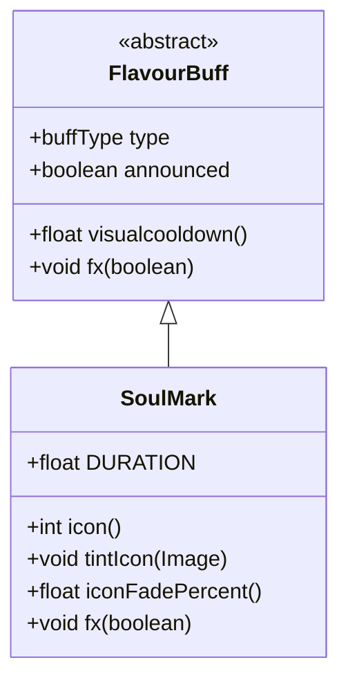

# SoulMark 类文档

## 1. 基本信息
| 属性 | 值 |
|------|-----|
| 文件路径 | core/src/main/java/com/shatteredpixel/shatteredpixeldungeon/actors/buffs/SoulMark.java |
| 包名 | com.shatteredpixel.shatteredpixeldungeon.actors.buffs |
| 类类型 | class |
| 继承关系 | extends FlavourBuff |
| 代码行数 | 57 行 |

## 2. 类职责说明
SoulMark 是一个追踪灵魂标记效果的 Buff 类。当角色被标记灵魂时，术士可以通过攻击该目标来吸取生命值。这是一个负面效果，会在目标身上显示紫色标记，持续 10 回合。灵魂标记是术士职业的核心机制之一。

## 4. 继承与协作关系


## 静态常量表
| 常量名 | 类型 | 值 | 说明 |
|--------|------|-----|------|
| DURATION | float | 10f | 效果持续时间（回合） |

## 实例字段表
| 字段名 | 类型 | 修饰符 | 说明 |
|--------|------|--------|------|
| （无额外实例字段，继承自 FlavourBuff） | | | |

## 7. 方法详解

### icon()
**签名**: `public int icon()`
**功能**: 返回 Buff 图标标识符
**返回值**: int - BuffIndicator.INVERT_MARK（反向标记图标）
**实现逻辑**:
```
第38-40行: 返回反向标记图标，表示被标记的状态
```

### tintIcon(Image icon)
**签名**: `public void tintIcon(Image icon)`
**功能**: 为图标着色
**参数**:
- icon: Image - 要着色的图标图像
**实现逻辑**:
```
第44行: 将图标着色为紫色（0.5f, 0.2f, 1f），表示灵魂/魔法效果
```

### iconFadePercent()
**签名**: `public float iconFadePercent()`
**功能**: 计算图标淡入淡出百分比
**返回值**: float - 0到1之间的值，表示剩余时间的比例
**实现逻辑**:
```
第49行: 根据剩余冷却时间和总持续时间计算淡入淡出比例
```

### fx(boolean on)
**签名**: `public void fx(boolean on)`
**功能**: 应用或移除视觉标记效果
**参数**:
- on: boolean - true 表示启用效果，false 表示禁用
**实现逻辑**:
```
第54行: 启用时为目标精灵添加 MARKED 状态
第55行: 禁用时移除 MARKED 状态
```

## 初始化块详解
```
第32-35行:
  type = buffType.NEGATIVE;  // 设置为负面效果
  announced = true;          // 添加时显示通知
```

## 11. 使用示例
```java
// 术士攻击时可能触发灵魂标记
if (Random.Float() < soulMarkChance) {
    SoulMark mark = Buff.affect(enemy, SoulMark.class);
    // 敌人被标记10回合
}

// 术士攻击被标记的敌人时吸取生命
if (enemy.buff(SoulMark.class) != null) {
    int healing = damage * soulStealPercent;
    hero.HP = Math.min(hero.HT, hero.HP + healing);
}
```

## 注意事项
1. **负面效果**: 类型为 NEGATIVE，会被净化效果移除
2. **视觉标记**: 被标记的角色会显示紫色标记效果
3. **持续时间**: 固定持续 10 回合
4. **通知显示**: 添加时会显示提示消息
5. **术士机制**: 主要用于术士职业的生命吸取能力

## 最佳实践
1. 灵魂标记概率可以通过天赋或装备提升
2. 配合高攻击速度可以最大化生命吸取收益
3. 标记效果可以被敌人免疫或净化
4. 使用紫色作为主题色，与其他标记效果区分