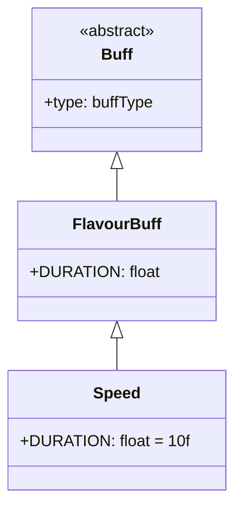

# Speed 类文档

## 1. 基本信息
| 属性 | 值 |
|------|-----|
| 文件路径 | core/src/main/java/com/shatteredpixel/shatteredpixeldungeon/actors/buffs/Speed.java |
| 包名 | com.shatteredpixel.shatteredpixeldungeon.actors.buffs |
| 类类型 | class |
| 继承关系 | extends FlavourBuff |
| 代码行数 | 28 |

## 2. 类职责说明
Speed（速度）是一个正面Buff，使角色的移动速度增加。这是一个基础的加速效果类，实际的加速计算在其他地方实现。主要用于某些特定效果的标记。

## 4. 继承与协作关系


## 静态常量表
| 常量名 | 类型 | 值 | 说明 |
|--------|------|-----|------|
| DURATION | float | 10f | 默认持续时间（回合数） |

## 实例字段表
无特殊实例字段。

## 7. 方法详解
继承自FlavourBuff的所有方法，无重写。

## 11. 使用示例
```java
// 添加速度效果，持续10回合
Buff.affect(hero, Speed.class, Speed.DURATION);

// 检查是否有速度Buff
if (hero.buff(Speed.class) != null) {
    // 角色移动速度增加
}
```

## 注意事项
1. 这是一个基础的标记类Buff
2. 实际加速效果在其他地方实现
3. 持续时间较短（10回合）
4. 是正面Buff

## 最佳实践
1. 作为加速效果的标记使用
2. 配合具体的加速逻辑实现