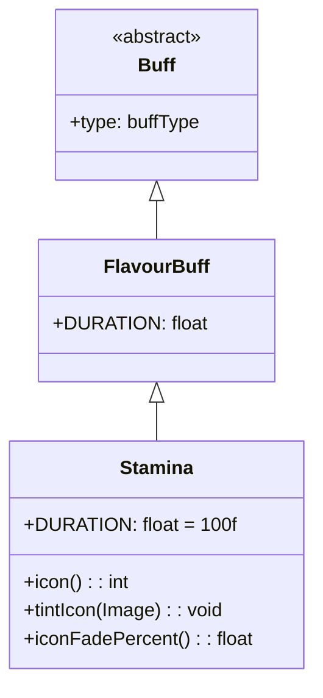

# Stamina 类文档

## 1. 基本信息
| 属性   | 值                                                                                     |
| ---- | ------------------------------------------------------------------------------------- |
| 文件路径 | core/src/main/java/com/shatteredpixel/shatteredpixeldungeon/actors/buffs/Stamina.java |
| 包名   | com.shatteredpixel.shatteredpixeldungeon.actors.buffs                                 |
| 类类型  | class                                                                                 |
| 继承关系 | extends FlavourBuff                                                                   |
| 代码行数 | 50                                                                                    |

## 2. 类职责说明
Stamina（耐力）是一个正面Buff，使角色的行动速度增加。耐力状态下角色可以更快地行动。持续时间很长（100回合），主要用于耐力药剂、某些神器效果等场景。

## 4. 继承与协作关系


## 静态常量表
| 常量名 | 类型 | 值 | 说明 |
|--------|------|-----|------|
| DURATION | float | 100f | 默认持续时间（回合数） |

## 实例字段表
| 字段名 | 类型 | 修饰符 | 说明 |
|--------|------|--------|------|
| type | buffType | - | POSITIVE（正面Buff） |

## 7. 方法详解

### icon()
**签名**: `public int icon()`
**功能**: 返回Buff图标的索引标识符。
**返回值**: int - 返回BuffIndicator.HASTE（急速图标）。

### tintIcon(Image icon)
**签名**: `public void tintIcon(Image icon)`
**功能**: 为Buff图标设置颜色色调。
**参数**:
- icon: Image - 需要着色的图标图像
**实现逻辑**:
```java
icon.hardlight(0.5f, 1f, 0.5f);  // 设置浅绿色高光效果
```

### iconFadePercent()
**签名**: `public float iconFadePercent()`
**功能**: 计算Buff图标的淡出百分比。
**返回值**: float - 图标完整度比例。

## 11. 使用示例
```java
// 添加耐力效果，持续100回合
Buff.affect(hero, Stamina.class, Stamina.DURATION);

// 检查是否有耐力
if (hero.buff(Stamina.class) != null) {
    // 角色行动速度增加
}

// 延长耐力时间
Buff.prolong(hero, Stamina.class, 50f);
```

## 注意事项
1. 耐力效果使行动速度增加
2. 实际的速度计算在其他地方实现
3. 持续时间很长（100回合）
4. 图标与急速相同，但颜色不同
5. 是正面Buff

## 最佳实践
1. 用于长时间的加速需求
2. 配合耐力药剂使用
3. 持续时间长，适合探索时使用