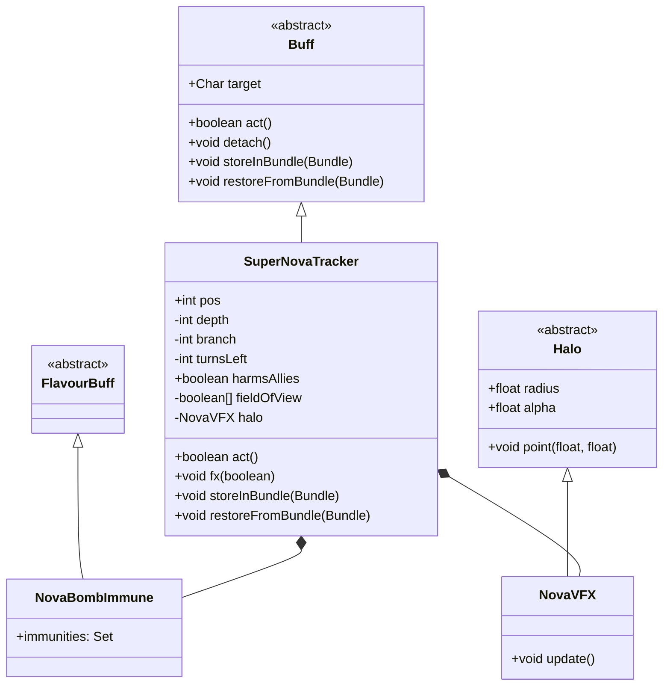

# SuperNovaTracker 类文档

## 1. 基本信息
| 属性 | 值 |
|------|-----|
| 文件路径 | core/src/main/java/com/shatteredpixel/shatteredpixeldungeon/actors/buffs/SuperNovaTracker.java |
| 包名 | com.shatteredpixel.shatteredpixeldungeon.actors.buffs |
| 类类型 | class |
| 继承关系 | extends Buff |
| 代码行数 | 194 行 |

## 2. 类职责说明
SuperNovaTracker 是一个用于追踪和执行"超新星"(Super Nova)爆炸效果的 Buff 类。它管理一个倒计时的区域爆炸，在 10 回合后对所有可视区域内的格子造成毁灭性的炸弹伤害。该类负责爆炸倒计时显示、视觉效果渲染、以及对敌人和盟友的伤害控制。

## 4. 继承与协作关系


## 静态常量表
| 常量名 | 类型 | 值 | 说明 |
|--------|------|-----|------|
| DIST | int | 8 | 爆炸的最大影响距离 |
| POS | String | "pos" | Bundle 存储键 - 位置 |
| DEPTH | String | "depth" | Bundle 存储键 - 深度 |
| BRANCH | String | "branch" | Bundle 存储键 - 分支 |
| LEFT | String | "left" | Bundle 存储键 - 剩余回合 |
| HARMS_ALLIES | String | "harms_allies" | Bundle 存储键 - 是否伤害盟友 |

## 实例字段表
| 字段名 | 类型 | 修饰符 | 说明 |
|--------|------|--------|------|
| pos | int | public | 爆炸中心位置（格子坐标） |
| depth | int | private | 创建时的地牢深度 |
| branch | int | private | 创建时的地牢分支 |
| turnsLeft | int | private | 剩余回合数（初始为10） |
| harmsAllies | boolean | public | 是否伤害盟友（默认true） |
| fieldOfView | boolean[] | private | 视野数组，标记受影响的格子 |
| halo | NovaVFX | private | 爆炸光环视觉效果 |

## 7. 方法详解

### act()
**签名**: `public boolean act()`
**功能**: 每回合执行的核心逻辑，处理倒计时、视觉效果和爆炸
**返回值**: boolean - 始终返回 true
**实现逻辑**:
```
第58-63行: 检查深度和分支是否匹配当前地牢，不匹配则等待一回合
第65-74行: 获取爆炸中心的世界坐标，初始化视野数组和光环视觉效果
第76-82行: 如果还有剩余回合，显示倒计时文字，更新光环半径和透明度
第84-85行: 使用 ShadowCaster 计算视野范围，半径随回合减少而增大
第87-116行: 回合归零时执行爆炸：
  - 第88行: 分离 Buff
  - 第89行: 移除光环效果
  - 第92-98行: 如果不伤害盟友，给所有盟友添加 NovaBombImmune 免疫
  - 第100-103行: 播放爆炸音效和屏幕震动
  - 第104-116行: 遍历所有可见格子，放置炸弹并摧毁地形
第119-125行: 如果还有剩余回合，在视野范围内显示红色目标标记
第127-129行: 减少剩余回合，等待一回合
```

### fx(boolean on)
**签名**: `public void fx(boolean on)`
**功能**: 管理视觉效果的显示和隐藏
**参数**:
- on: boolean - true 表示启用效果，false 表示禁用
**实现逻辑**:
```
第141-143行: 检查条件（启用、深度匹配、分支匹配、光环未创建）
第144-149行: 创建新的光环效果，设置颜色、半径、透明度和位置
第151行: 调用父类方法
```

### storeInBundle(Bundle bundle)
**签名**: `public void storeInBundle(Bundle bundle)`
**功能**: 将 Buff 状态保存到 Bundle 中以支持游戏存档
**参数**:
- bundle: Bundle - 存储容器
**实现逻辑**:
```
第163行: 调用父类存储方法
第164-168行: 保存位置、深度、分支、剩余回合和盟友伤害标志
```

### restoreFromBundle(Bundle bundle)
**签名**: `public void restoreFromBundle(Bundle bundle)`
**功能**: 从 Bundle 恢复 Buff 状态
**参数**:
- bundle: Bundle - 存储容器
**实现逻辑**:
```
第173行: 调用父类恢复方法
第174-178行: 恢复位置、深度、分支、剩余回合和盟友伤害标志
```

## 内部类详解

### NovaBombImmune
**类型**: 静态内部类，继承 FlavourBuff
**功能**: 为角色提供对 ConjuredBomb 的临时免疫
**实现逻辑**:
```
第133-137行: 定义内部类，在初始化块中添加对 Bomb.ConjuredBomb 的免疫
```

### NovaVFX
**类型**: 非静态内部类，继承 Halo
**功能**: 渲染爆炸光环的动态视觉效果
**方法**:
- `update()`: 每帧更新光环的亮度脉动和位置跟随

## 11. 使用示例
```java
// 创建超新星追踪器
SuperNovaTracker tracker = Buff.append(target, SuperNovaTracker.class);
tracker.pos = centerPosition;  // 设置爆炸中心
tracker.harmsAllies = false;   // 设置不伤害盟友（可选）

// 爆炸将在10回合后自动执行
// 每回合会显示倒计时和不断扩大的光环效果
```

## 注意事项
1. **伤害范围**: 爆炸基于视野计算，使用 ShadowCaster 算法
2. **伤害强度**: 每个可见格子放置一个炸弹，造成极高伤害
   - 完全内部: 9倍炸弹伤害
   - 直线边缘: 6倍炸弹伤害
   - 外部边缘: 3倍炸弹伤害
3. **地形破坏**: 爆炸会摧毁受影响区域的地形
4. **深度检查**: 如果玩家离开当前层，追踪器会暂停但不消失
5. **盟友保护**: 通过 harmsAllies 标志控制是否伤害盟友

## 最佳实践
1. 设置 harmsAllies = false 时确保玩家有足够的反应时间离开爆炸区域
2. pos 位置应该是爆炸的视觉中心，通常是玩家或目标的位置
3. 考虑在爆炸前给玩家明显的视觉和听觉警告